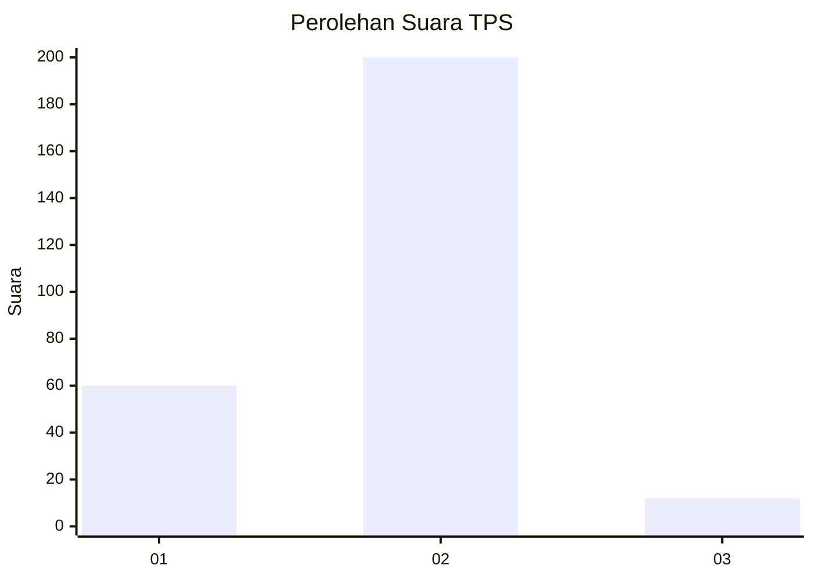
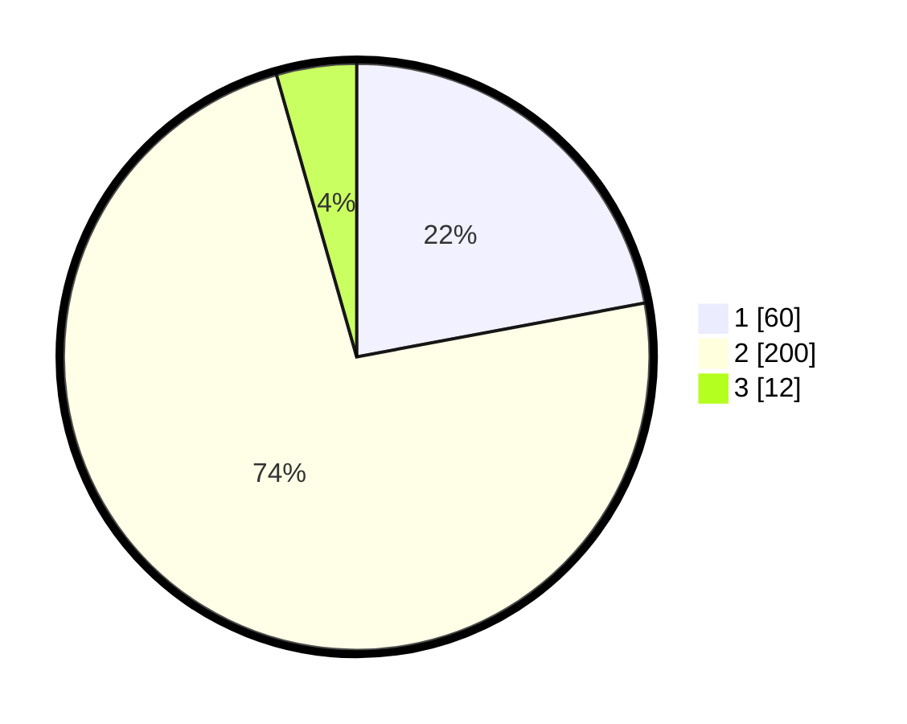

# Hasil

## Grafik

## Tabel

| No. | Nama Paslon    | Suara | Suara (raw) | Persentase |
|:--- |:-------------- | -----:| -----------:| ----------:|
| 1   | ANIES MUHAIMIN | 60    | [60][p-1]   | 22,06      |
| 2   | PRABOWO GIBRAN | 200   | [200][p-2]  | 73,53      |
| 3   | GANJAR MAHFUD  | 12    | [12][p-3]   | 4,41       |

[p-1]: https://github.com/gigit-pemilu/pemilu-2024-32-jawa-barat/blob/main/pilpres/hitung-suara/sub/32-jawa-barat/sub/13-subang/sub/26-kasomalang/sub/2002-pasanggrahan/sub/004-tps/sub/paslon-1.txt
[p-2]: https://github.com/gigit-pemilu/pemilu-2024-32-jawa-barat/blob/main/pilpres/hitung-suara/sub/32-jawa-barat/sub/13-subang/sub/26-kasomalang/sub/2002-pasanggrahan/sub/004-tps/sub/paslon-2.txt
[p-3]: https://github.com/gigit-pemilu/pemilu-2024-32-jawa-barat/blob/main/pilpres/hitung-suara/sub/32-jawa-barat/sub/13-subang/sub/26-kasomalang/sub/2002-pasanggrahan/sub/004-tps/sub/paslon-3.txt

## Foto C Plano

https://sirekap-obj-formc.kpu.go.id/b967/pemilu/ppwp/32/13/26/20/02/3213262002004-20240214-224018--7938bd8f-e0ef-4510-815c-42c55f1d06c1.jpg

https://sirekap-obj-formc.kpu.go.id/b967/pemilu/ppwp/32/13/26/20/02/3213262002004-20240214-224201--4633432f-454a-43c5-9564-e02119b6974b.jpg

https://sirekap-obj-formc.kpu.go.id/b967/pemilu/ppwp/32/13/26/20/02/3213262002004-20240214-224343--6c2c9e7d-af8b-4c1d-a05c-772b607b9902.jpg

## Metadata

| Key        | Value               |
| ---------- | ------------------- |
| Time Stamp | 2024-02-19 18:00:00 |

