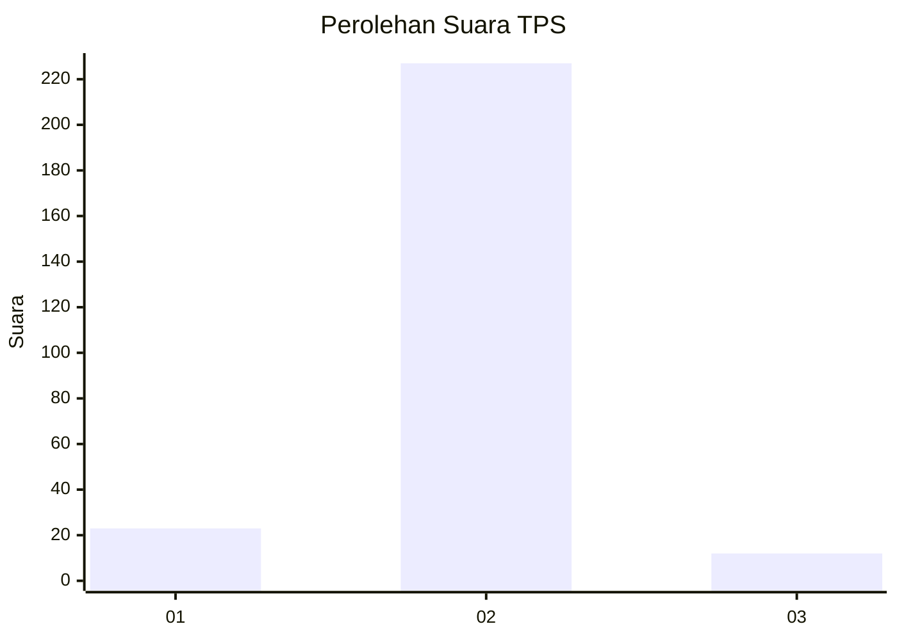
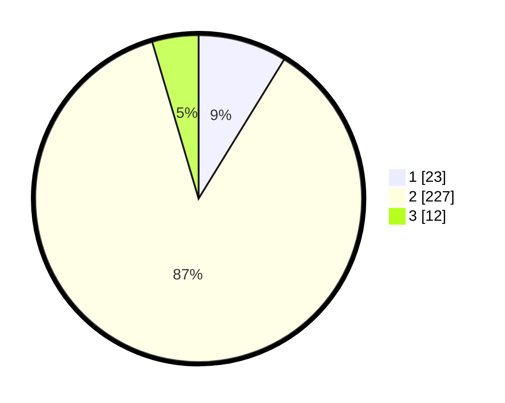

# Hasil

## Grafik

## Tabel

| No. | Nama Paslon    | Suara | Suara (raw) | Persentase |
|:--- |:-------------- | -----:| -----------:| ----------:|
| 1   | ANIES MUHAIMIN | 23    | [23][p-1]   | 8,78       |
| 2   | PRABOWO GIBRAN | 227   | [227][p-2]  | 86,64      |
| 3   | GANJAR MAHFUD  | 12    | [12][p-3]   | 4,58       |

[p-1]: https://github.com/gigit-pemilu/pemilu-2024-32-jawa-barat/blob/main/pilpres/hitung-suara/sub/32-jawa-barat/sub/13-subang/sub/26-kasomalang/sub/2002-pasanggrahan/sub/009-tps/sub/paslon-1.txt
[p-2]: https://github.com/gigit-pemilu/pemilu-2024-32-jawa-barat/blob/main/pilpres/hitung-suara/sub/32-jawa-barat/sub/13-subang/sub/26-kasomalang/sub/2002-pasanggrahan/sub/009-tps/sub/paslon-2.txt
[p-3]: https://github.com/gigit-pemilu/pemilu-2024-32-jawa-barat/blob/main/pilpres/hitung-suara/sub/32-jawa-barat/sub/13-subang/sub/26-kasomalang/sub/2002-pasanggrahan/sub/009-tps/sub/paslon-3.txt

## Foto C Plano

https://sirekap-obj-formc.kpu.go.id/f002/pemilu/ppwp/32/13/26/20/02/3213262002009-20240214-234137--1093f3b1-f1cd-48f3-8ee7-e63afac26d36.jpg

https://sirekap-obj-formc.kpu.go.id/f002/pemilu/ppwp/32/13/26/20/02/3213262002009-20240214-225845--00cd6cdd-af14-43f9-bec7-673ad9a62775.jpg

https://sirekap-obj-formc.kpu.go.id/f002/pemilu/ppwp/32/13/26/20/02/3213262002009-20240214-230036--f6cd76e4-618c-4a40-b5e4-8cec95602828.jpg

## Metadata

| Key        | Value               |
| ---------- | ------------------- |
| Time Stamp | 2024-02-19 16:00:00 |

