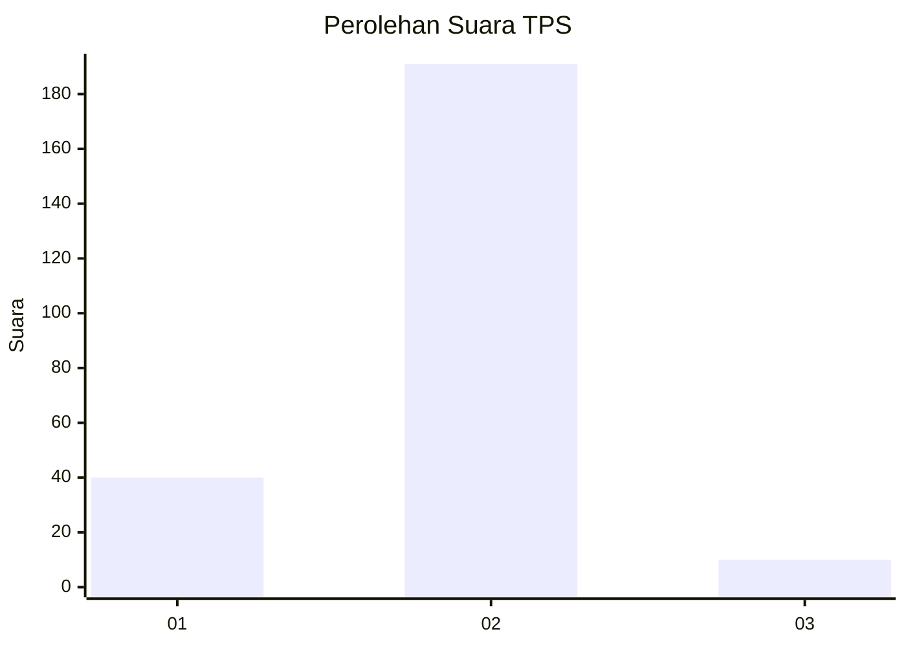
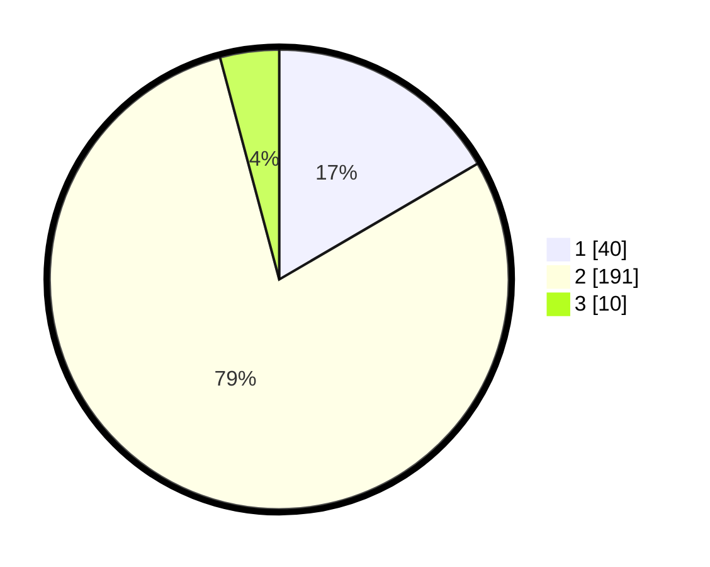

# Hasil

## Grafik

## Tabel

| No. | Nama Paslon    | Suara | Suara (raw) | Persentase |
|:--- |:-------------- | -----:| -----------:| ----------:|
| 1   | ANIES MUHAIMIN | 40    | [40][p-1]   | 16,60      |
| 2   | PRABOWO GIBRAN | 191   | [191][p-2]  | 79,25      |
| 3   | GANJAR MAHFUD  | 10    | [10][p-3]   | 4,15       |

[p-1]: https://github.com/gigit-pemilu/pemilu-2024/blob/main/pilpres/hitung-suara/sub/32-jawa-barat/sub/13-subang/sub/27-dawuan/sub/2001-manyeti/sub/008-tps/sub/paslon-1.txt
[p-2]: https://github.com/gigit-pemilu/pemilu-2024/blob/main/pilpres/hitung-suara/sub/32-jawa-barat/sub/13-subang/sub/27-dawuan/sub/2001-manyeti/sub/008-tps/sub/paslon-2.txt
[p-3]: https://github.com/gigit-pemilu/pemilu-2024/blob/main/pilpres/hitung-suara/sub/32-jawa-barat/sub/13-subang/sub/27-dawuan/sub/2001-manyeti/sub/008-tps/sub/paslon-3.txt

## Foto C Plano

https://sirekap-obj-formc.kpu.go.id/1be2/pemilu/ppwp/32/13/27/20/01/3213272001008-20240215-023145--78cba14c-c2ec-4310-b3cd-7bd310b109da.jpg

https://sirekap-obj-formc.kpu.go.id/1be2/pemilu/ppwp/32/13/27/20/01/3213272001008-20240215-023439--dbc573cd-76c2-4edd-8c0b-cbb43a1897c2.jpg

https://sirekap-obj-formc.kpu.go.id/1be2/pemilu/ppwp/32/13/27/20/01/3213272001008-20240215-023655--ce447a62-0948-4879-8b6a-fbc5501050ca.jpg

## Metadata

| Key        | Value               |
| ---------- | ------------------- |
| Time Stamp | 2024-02-19 18:00:00 |

