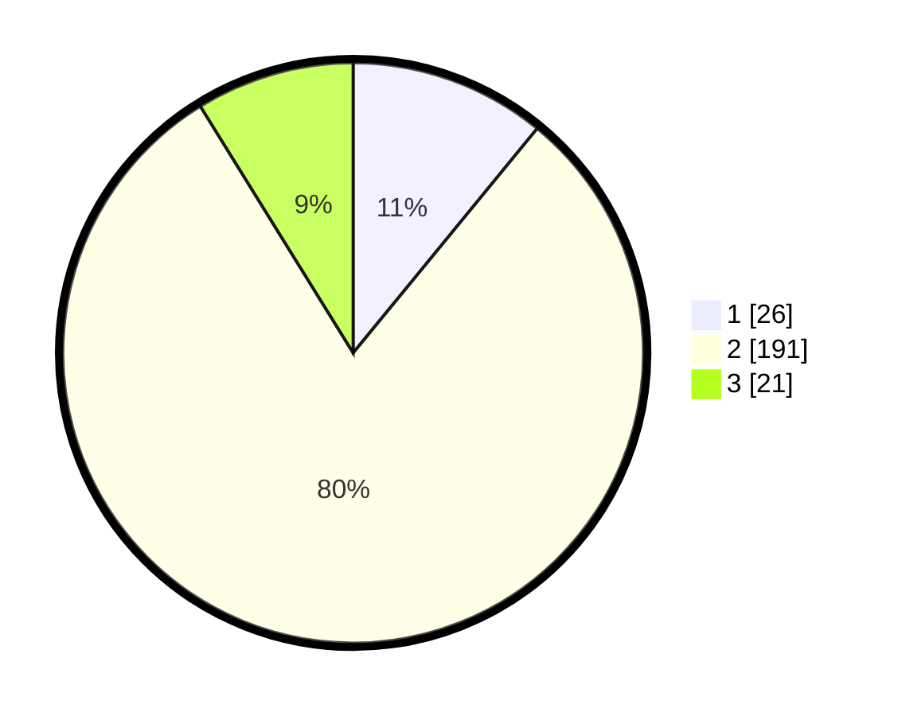

# Hasil

## Grafik

## Tabel

| No. | Nama Paslon    | Suara | Suara (raw) | Persentase |
|:--- |:-------------- | -----:| -----------:| ----------:|
| 1   | ANIES MUHAIMIN | 26    | [26][p-1]   | 10,92      |
| 2   | PRABOWO GIBRAN | 191   | [191][p-2]  | 80,25      |
| 3   | GANJAR MAHFUD  | 21    | [21][p-3]   | 8,82       |

[p-1]: https://github.com/gigit-pemilu/pemilu-2024-32-jawa-barat/blob/main/pilpres/hitung-suara/sub/32-jawa-barat/sub/13-subang/sub/27-dawuan/sub/2001-manyeti/sub/010-tps/sub/paslon-1.txt
[p-2]: https://github.com/gigit-pemilu/pemilu-2024-32-jawa-barat/blob/main/pilpres/hitung-suara/sub/32-jawa-barat/sub/13-subang/sub/27-dawuan/sub/2001-manyeti/sub/010-tps/sub/paslon-2.txt
[p-3]: https://github.com/gigit-pemilu/pemilu-2024-32-jawa-barat/blob/main/pilpres/hitung-suara/sub/32-jawa-barat/sub/13-subang/sub/27-dawuan/sub/2001-manyeti/sub/010-tps/sub/paslon-3.txt

## Foto C Plano

https://sirekap-obj-formc.kpu.go.id/7e9f/pemilu/ppwp/32/13/27/20/01/3213272001010-20240214-185314--a45281c0-a287-4d28-b762-666e7efda05e.jpg

https://sirekap-obj-formc.kpu.go.id/7e9f/pemilu/ppwp/32/13/27/20/01/3213272001010-20240214-160058--995b0721-1fdc-4b19-9a16-fd3e30cfcf47.jpg

https://sirekap-obj-formc.kpu.go.id/7e9f/pemilu/ppwp/32/13/27/20/01/3213272001010-20240214-200646--bb304e2f-d7b3-4cde-ba4d-c2e5cedf98a9.jpg

## Metadata

| Key        | Value               |
| ---------- | ------------------- |
| Time Stamp | 2024-02-19 15:00:00 |

