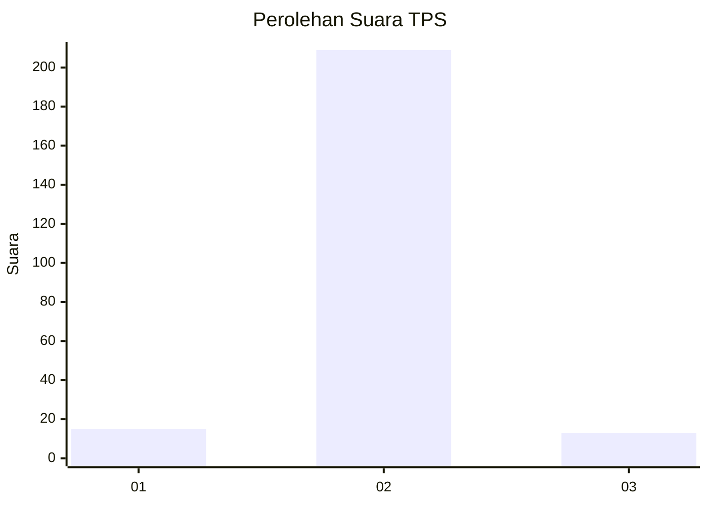
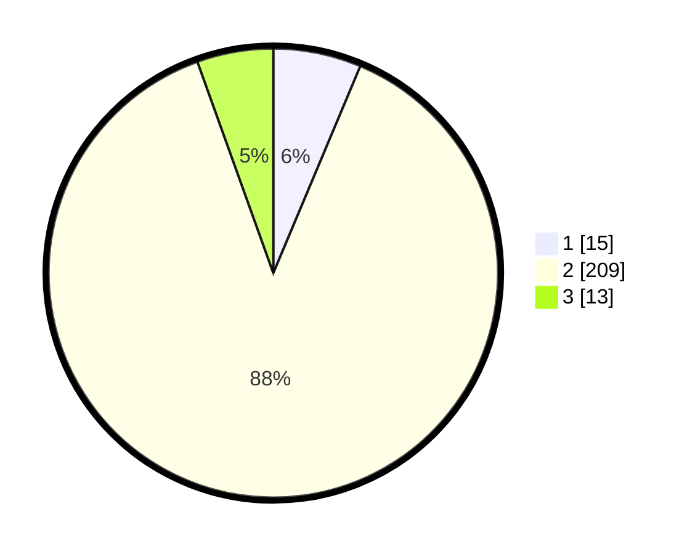

# Hasil

## Grafik

## Tabel

| No. | Nama Paslon    | Suara | Suara (raw) | Persentase |
|:--- |:-------------- | -----:| -----------:| ----------:|
| 1   | ANIES MUHAIMIN | 15    | [15][p-1]   | 6,33       |
| 2   | PRABOWO GIBRAN | 209   | [209][p-2]  | 88,19      |
| 3   | GANJAR MAHFUD  | 13    | [13][p-3]   | 5,49       |

[p-1]: https://github.com/gigit-pemilu/pemilu-2024/blob/main/pilpres/hitung-suara/sub/32-jawa-barat/sub/13-subang/sub/27-dawuan/sub/2001-manyeti/sub/014-tps/sub/paslon-1.txt
[p-2]: https://github.com/gigit-pemilu/pemilu-2024/blob/main/pilpres/hitung-suara/sub/32-jawa-barat/sub/13-subang/sub/27-dawuan/sub/2001-manyeti/sub/014-tps/sub/paslon-2.txt
[p-3]: https://github.com/gigit-pemilu/pemilu-2024/blob/main/pilpres/hitung-suara/sub/32-jawa-barat/sub/13-subang/sub/27-dawuan/sub/2001-manyeti/sub/014-tps/sub/paslon-3.txt

## Foto C Plano

https://sirekap-obj-formc.kpu.go.id/882c/pemilu/ppwp/32/13/27/20/01/3213272001014-20240214-155715--ff6210bf-b9e0-4458-b5b2-fee4c953e08a.jpg

https://sirekap-obj-formc.kpu.go.id/882c/pemilu/ppwp/32/13/27/20/01/3213272001014-20240214-155809--be2927b4-ed63-4e48-afdd-32b1a7ab55a5.jpg

https://sirekap-obj-formc.kpu.go.id/882c/pemilu/ppwp/32/13/27/20/01/3213272001014-20240214-160056--35eae3ef-8520-49dd-8071-19ead3241b06.jpg

## Metadata

| Key        | Value               |
| ---------- | ------------------- |
| Time Stamp | 2024-02-19 15:00:00 |

