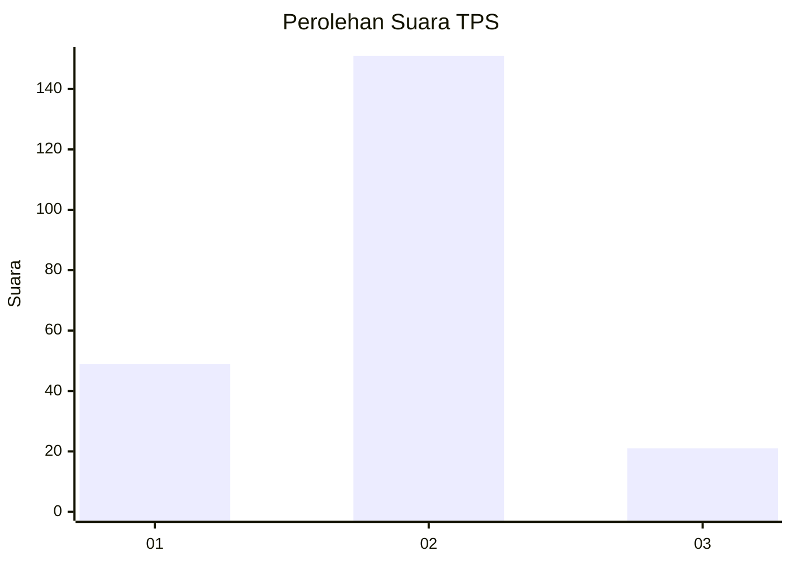

# Hasil

## Grafik

## Tabel

| No. | Nama Paslon    | Suara | Suara (raw) | Persentase |
|:--- |:-------------- | -----:| -----------:| ----------:|
| 1   | ANIES MUHAIMIN | 49    | [49][p-1]   | 22,17      |
| 2   | PRABOWO GIBRAN | 151   | [151][p-2]  | 68,33      |
| 3   | GANJAR MAHFUD  | 21    | [21][p-3]   | 9,50       |

[p-1]: https://github.com/gigit-pemilu/pemilu-2024/blob/main/pilpres/hitung-suara/sub/32-jawa-barat/sub/13-subang/sub/28-pagaden-barat/sub/2001-mekarwangi/sub/001-tps/sub/paslon-1.txt
[p-2]: https://github.com/gigit-pemilu/pemilu-2024/blob/main/pilpres/hitung-suara/sub/32-jawa-barat/sub/13-subang/sub/28-pagaden-barat/sub/2001-mekarwangi/sub/001-tps/sub/paslon-2.txt
[p-3]: https://github.com/gigit-pemilu/pemilu-2024/blob/main/pilpres/hitung-suara/sub/32-jawa-barat/sub/13-subang/sub/28-pagaden-barat/sub/2001-mekarwangi/sub/001-tps/sub/paslon-3.txt

## Foto C Plano

https://sirekap-obj-formc.kpu.go.id/1aaa/pemilu/ppwp/32/13/28/20/01/3213282001001-20240216-181216--fcb4c33b-8931-4716-a565-a05473dd85c9.jpg

https://sirekap-obj-formc.kpu.go.id/1aaa/pemilu/ppwp/32/13/28/20/01/3213282001001-20240216-181507--4f6c7f00-be81-42c3-a638-80927734f206.jpg

https://sirekap-obj-formc.kpu.go.id/1aaa/pemilu/ppwp/32/13/28/20/01/3213282001001-20240216-181707--5d1e899b-7299-4181-94d0-912ff77b5493.jpg

## Metadata

| Key        | Value               |
| ---------- | ------------------- |
| Time Stamp | 2024-02-19 17:00:00 |

