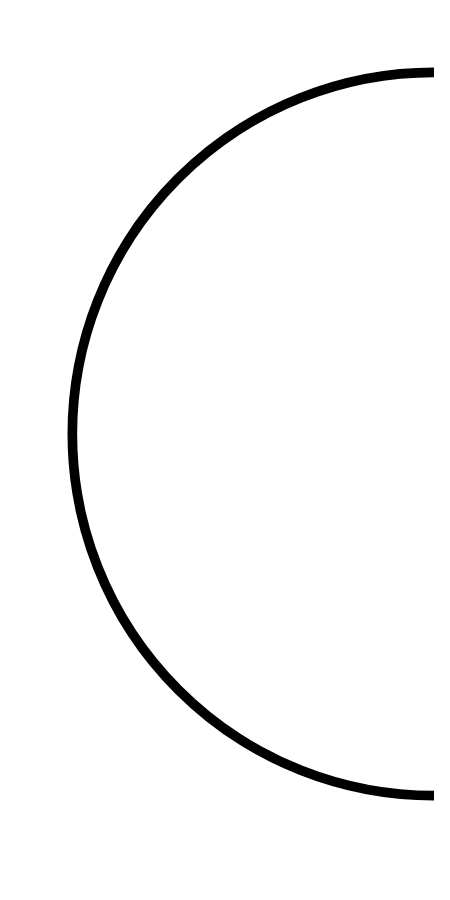

# Hasil

## Grafik

```mermaid
xychart-beta
    title "Perolehan Suara TPS"
    x-axis []
    y-axis "Suara" 0 --> 0
    bar []
```



## Tabel

| No. | Nama Paslon | Suara | Suara (raw) | Persentase |
|:--- |:----------- | -----:| -----------:| ----------:|


[p-1]: https://github.com/gigit-pemilu/pemilu-2024/blob/main/pilpres/hitung-suara/sub/32-jawa-barat/sub/13-subang/sub/29-ciater/sub/2007-sanca/sub/003-tps/sub/paslon-1.txt
[p-2]: https://github.com/gigit-pemilu/pemilu-2024/blob/main/pilpres/hitung-suara/sub/32-jawa-barat/sub/13-subang/sub/29-ciater/sub/2007-sanca/sub/003-tps/sub/paslon-2.txt
[p-3]: https://github.com/gigit-pemilu/pemilu-2024/blob/main/pilpres/hitung-suara/sub/32-jawa-barat/sub/13-subang/sub/29-ciater/sub/2007-sanca/sub/003-tps/sub/paslon-3.txt

## Foto C Plano

https://sirekap-obj-formc.kpu.go.id/f07a/pemilu/ppwp/32/13/29/20/07/3213292007003-20240219-082442--0328f878-d8cd-40e3-be7d-f58536d568c1.jpg

https://sirekap-obj-formc.kpu.go.id/f07a/pemilu/ppwp/32/13/29/20/07/3213292007003-20240219-081938--76def934-44fd-4f7a-9a30-5117830c15b5.jpg

https://sirekap-obj-formc.kpu.go.id/f07a/pemilu/ppwp/32/13/29/20/07/3213292007003-20240215-203141--41a26bbf-170d-45c2-8875-6ccdec10c25e.jpg


## Metadata

| Key        | Value               |
| ---------- | ------------------- |
| Time Stamp | 2024-02-19 09:00:00 |


