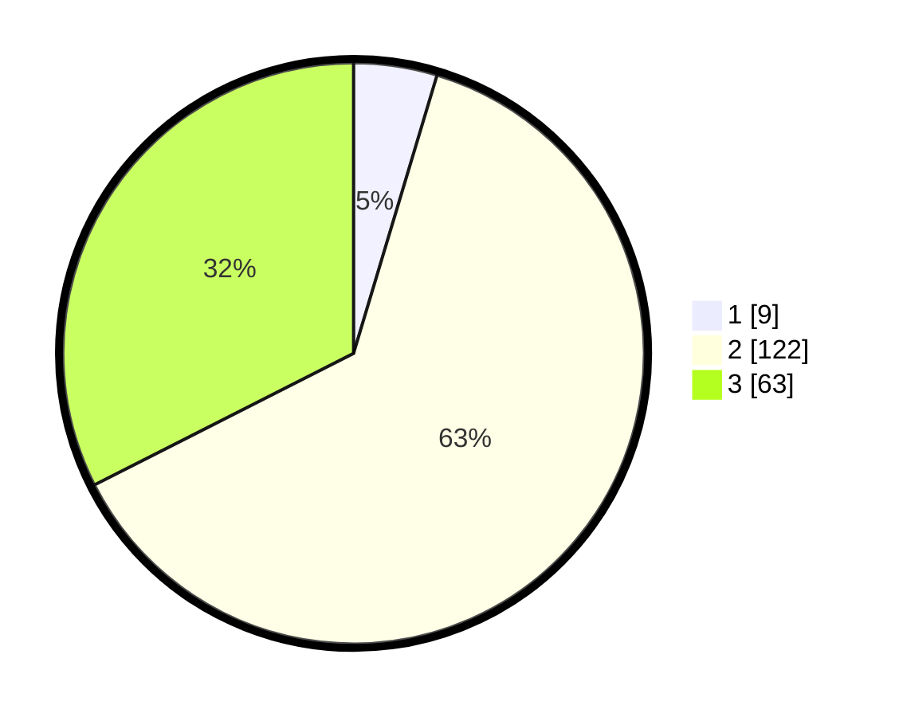

# Hasil

## Grafik

## Tabel

| No. | Nama Paslon    | Suara | Suara (raw) | Persentase |
|:--- |:-------------- | -----:| -----------:| ----------:|
| 1   | ANIES MUHAIMIN | 9     | [9][p-1]    | 4,64       |
| 2   | PRABOWO GIBRAN | 122   | [122][p-2]  | 62,89      |
| 3   | GANJAR MAHFUD  | 63    | [63][p-3]   | 32,47      |

[p-1]: https://github.com/gigit-pemilu/pemilu-2024/blob/main/pilpres/hitung-suara/sub/32-jawa-barat/sub/13-subang/sub/30-pusakajaya/sub/2001-kebondanas/sub/003-tps/sub/paslon-1.txt
[p-2]: https://github.com/gigit-pemilu/pemilu-2024/blob/main/pilpres/hitung-suara/sub/32-jawa-barat/sub/13-subang/sub/30-pusakajaya/sub/2001-kebondanas/sub/003-tps/sub/paslon-2.txt
[p-3]: https://github.com/gigit-pemilu/pemilu-2024/blob/main/pilpres/hitung-suara/sub/32-jawa-barat/sub/13-subang/sub/30-pusakajaya/sub/2001-kebondanas/sub/003-tps/sub/paslon-3.txt

## Foto C Plano

https://sirekap-obj-formc.kpu.go.id/8231/pemilu/ppwp/32/13/30/20/01/3213302001003-20240215-020646--77eabe7e-ae8b-445c-ab1e-219d20d12fc5.jpg

https://sirekap-obj-formc.kpu.go.id/8231/pemilu/ppwp/32/13/30/20/01/3213302001003-20240215-020749--5a07d1b2-d3ac-441c-8a1d-d21cbcc913bf.jpg

https://sirekap-obj-formc.kpu.go.id/8231/pemilu/ppwp/32/13/30/20/01/3213302001003-20240215-021242--1f499b50-8e41-403f-940c-be15b655d3bb.jpg

## Metadata

| Key        | Value               |
| ---------- | ------------------- |
| Time Stamp | 2024-02-19 13:00:00 |

