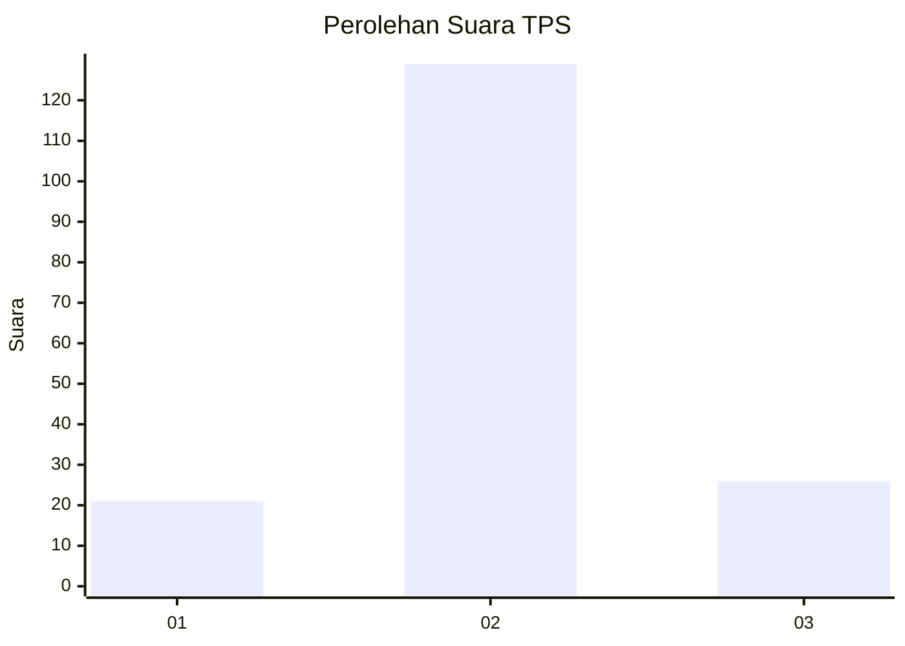
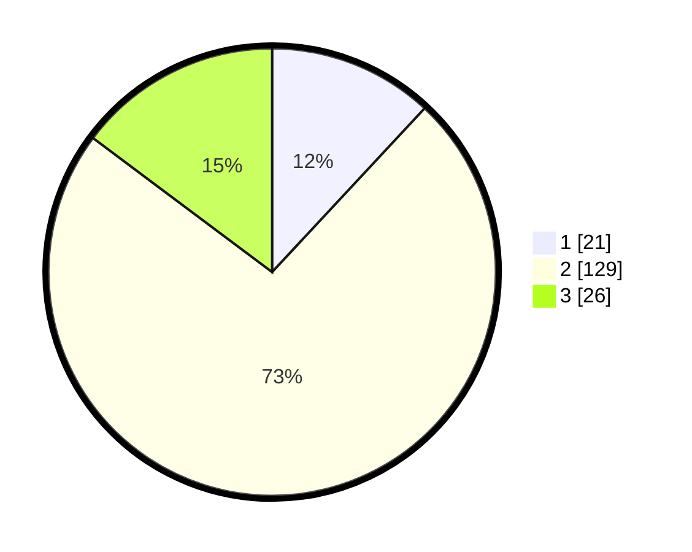

# Hasil

## Grafik

## Tabel

| No. | Nama Paslon    | Suara | Suara (raw) | Persentase |
|:--- |:-------------- | -----:| -----------:| ----------:|
| 1   | ANIES MUHAIMIN | 21    | [21][p-1]   | 11,93      |
| 2   | PRABOWO GIBRAN | 129   | [129][p-2]  | 73,30      |
| 3   | GANJAR MAHFUD  | 26    | [26][p-3]   | 14,77      |

[p-1]: https://github.com/gigit-pemilu/pemilu-2024/blob/main/pilpres/hitung-suara/sub/32-jawa-barat/sub/13-subang/sub/30-pusakajaya/sub/2002-pusakajaya/sub/012-tps/sub/paslon-1.txt
[p-2]: https://github.com/gigit-pemilu/pemilu-2024/blob/main/pilpres/hitung-suara/sub/32-jawa-barat/sub/13-subang/sub/30-pusakajaya/sub/2002-pusakajaya/sub/012-tps/sub/paslon-2.txt
[p-3]: https://github.com/gigit-pemilu/pemilu-2024/blob/main/pilpres/hitung-suara/sub/32-jawa-barat/sub/13-subang/sub/30-pusakajaya/sub/2002-pusakajaya/sub/012-tps/sub/paslon-3.txt

## Foto C Plano

https://sirekap-obj-formc.kpu.go.id/29b9/pemilu/ppwp/32/13/30/20/02/3213302002012-20240215-185542--97ffdf57-f3f3-4d8c-9594-1ae3085d1295.jpg

https://sirekap-obj-formc.kpu.go.id/29b9/pemilu/ppwp/32/13/30/20/02/3213302002012-20240215-185643--15879ec9-cb7c-494e-8623-8d2e0c9cb4df.jpg

https://sirekap-obj-formc.kpu.go.id/29b9/pemilu/ppwp/32/13/30/20/02/3213302002012-20240215-185944--716800db-3c4a-4cb5-8f37-6d72610377f8.jpg

## Metadata

| Key        | Value               |
| ---------- | ------------------- |
| Time Stamp | 2024-02-16 21:01:00 |

## DATA PEMILIH TETAP

Jumlah pemilih dalam DPT: **293**.
 * L: **127**.
 * P: **123**.

## DATA PENGGUNA HAK PILIH

Jumlah pengguna hak pilih dalam DPT: **733**.
 * L: **592**.
 * P: **333**.

Jumlah pengguna hak pilih dalam DPTb: **703**.
 * L: **203**.
 * P: **755**.

Jumlah pengguna hak pilih dalam DPK: **305**.
 * L: **2**.
 * P: **3**.

Jumlah pengguna hak pilih: **339**.
 * L: **33**.
 * P: **36**.

## JUMLAH SUARA SAH DAN TIDAK SAH

JUMLAH SELURUH SUARA SAH: **176**.

JUMLAH SUARA TIDAK SAH: **8**.

JUMLAH SELURUH SUARA SAH DAN SUARA TIDAK SAH: **184**.

