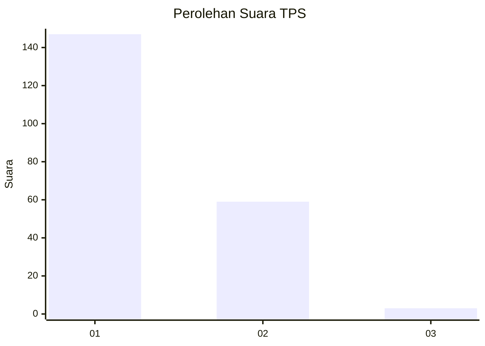
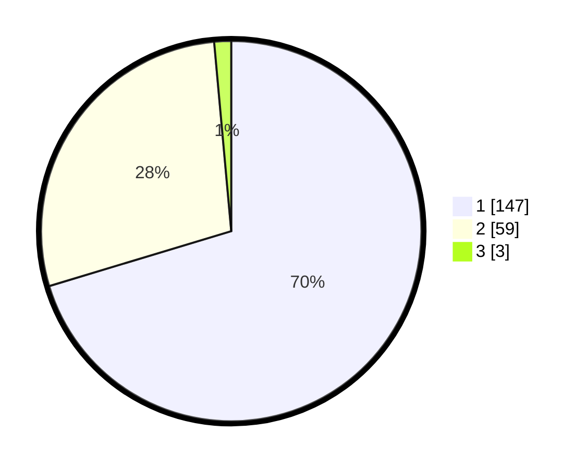

# Hasil

## Grafik

## Tabel

| No. | Nama Paslon    | Suara | Suara (raw) | Persentase |
|:--- |:-------------- | -----:| -----------:| ----------:|
| 1   | ANIES MUHAIMIN | 147   | [147][p-1]  | 70,33      |
| 2   | PRABOWO GIBRAN | 59    | [59][p-2]   | 28,23      |
| 3   | GANJAR MAHFUD  | 3     | [3][p-3]    | 1,44       |

[p-1]: https://github.com/gigit-pemilu/pemilu-2024/blob/main/pilpres/hitung-suara/sub/32-jawa-barat/sub/14-purwakarta/sub/01-purwakarta/sub/1001-nagri-kidul/sub/001-tps/sub/paslon-1.txt
[p-2]: https://github.com/gigit-pemilu/pemilu-2024/blob/main/pilpres/hitung-suara/sub/32-jawa-barat/sub/14-purwakarta/sub/01-purwakarta/sub/1001-nagri-kidul/sub/001-tps/sub/paslon-2.txt
[p-3]: https://github.com/gigit-pemilu/pemilu-2024/blob/main/pilpres/hitung-suara/sub/32-jawa-barat/sub/14-purwakarta/sub/01-purwakarta/sub/1001-nagri-kidul/sub/001-tps/sub/paslon-3.txt

## Foto C Plano

https://sirekap-obj-formc.kpu.go.id/b0ff/pemilu/ppwp/32/14/01/10/01/3214011001001-20240215-035605--1ef1f32f-2cd3-41b6-97af-588c73802a24.jpg

https://sirekap-obj-formc.kpu.go.id/b0ff/pemilu/ppwp/32/14/01/10/01/3214011001001-20240215-035640--e930eef1-b0ba-415a-b040-db09c01eb13a.jpg

https://sirekap-obj-formc.kpu.go.id/b0ff/pemilu/ppwp/32/14/01/10/01/3214011001001-20240215-035708--f9ae93d3-0dd8-4586-8a29-ae0f79e34c89.jpg

## Metadata

| Key        | Value               |
| ---------- | ------------------- |
| Time Stamp | 2024-02-25 13:00:00 |

