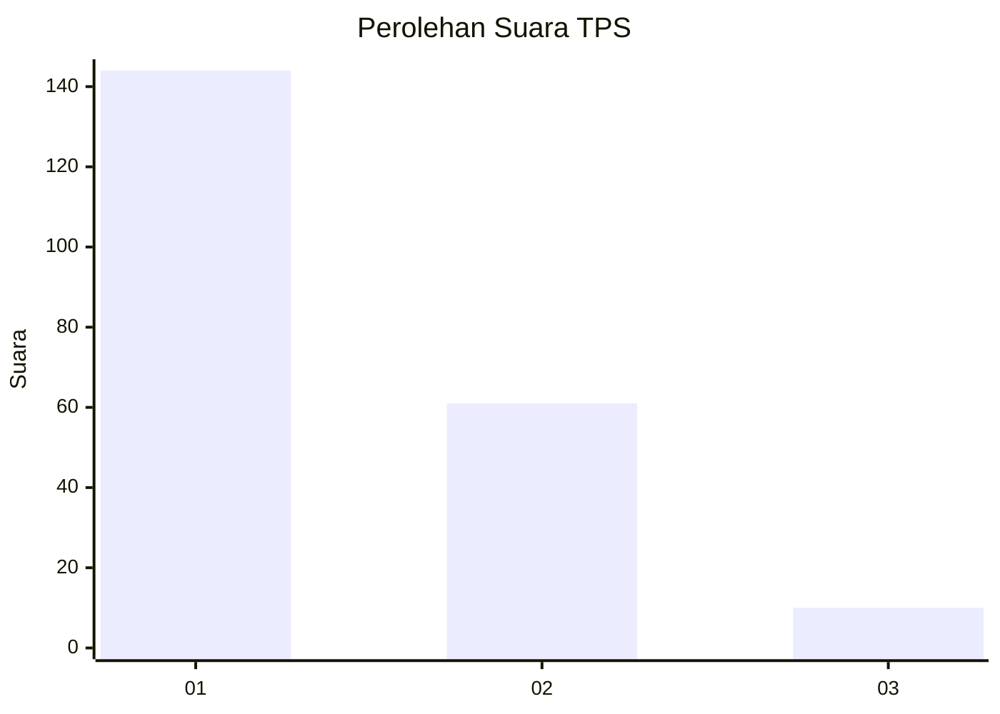
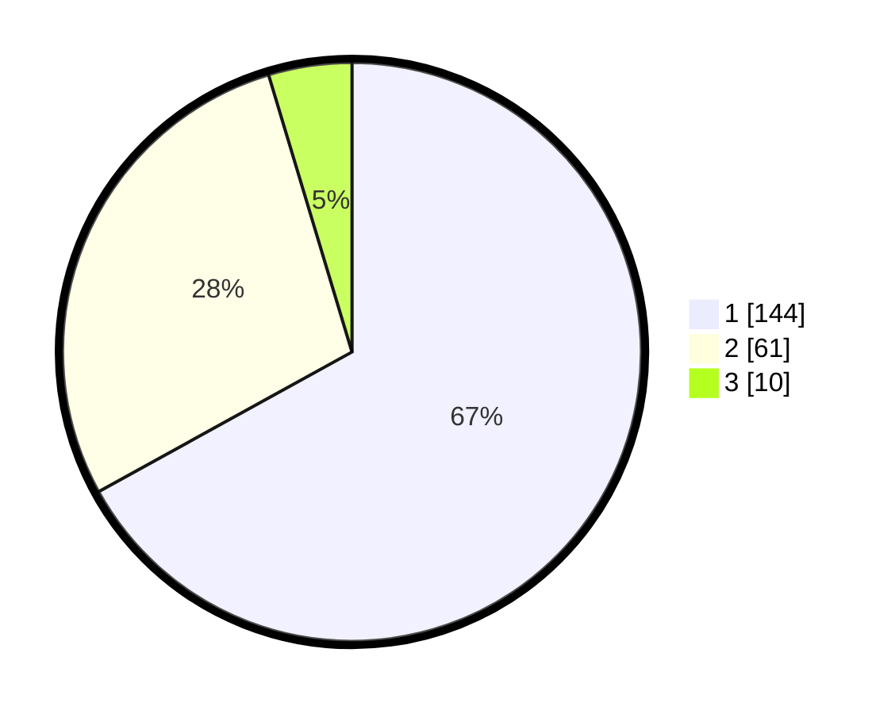

# Hasil

## Grafik

## Tabel

| No. | Nama Paslon    | Suara | Suara (raw) | Persentase |
|:--- |:-------------- | -----:| -----------:| ----------:|
| 1   | ANIES MUHAIMIN | 144   | [144][p-1]  | 66,98      |
| 2   | PRABOWO GIBRAN | 61    | [61][p-2]   | 28,37      |
| 3   | GANJAR MAHFUD  | 10    | [10][p-3]   | 4,65       |

[p-1]: https://github.com/gigit-pemilu/pemilu-2024/blob/main/pilpres/hitung-suara/sub/32-jawa-barat/sub/14-purwakarta/sub/01-purwakarta/sub/1001-nagri-kidul/sub/038-tps/sub/paslon-1.txt
[p-2]: https://github.com/gigit-pemilu/pemilu-2024/blob/main/pilpres/hitung-suara/sub/32-jawa-barat/sub/14-purwakarta/sub/01-purwakarta/sub/1001-nagri-kidul/sub/038-tps/sub/paslon-2.txt
[p-3]: https://github.com/gigit-pemilu/pemilu-2024/blob/main/pilpres/hitung-suara/sub/32-jawa-barat/sub/14-purwakarta/sub/01-purwakarta/sub/1001-nagri-kidul/sub/038-tps/sub/paslon-3.txt

## Foto C Plano

https://sirekap-obj-formc.kpu.go.id/ffca/pemilu/ppwp/32/14/01/10/01/3214011001038-20240215-075154--980b0c34-3f98-44e8-91a7-4eda1bbe307d.jpg

https://sirekap-obj-formc.kpu.go.id/ffca/pemilu/ppwp/32/14/01/10/01/3214011001038-20240215-083723--aaff059a-b886-4e7a-a54e-1553757b9725.jpg

https://sirekap-obj-formc.kpu.go.id/ffca/pemilu/ppwp/32/14/01/10/01/3214011001038-20240215-083852--6e2a5582-ad86-4e51-993c-d344662079cf.jpg

## Metadata

| Key        | Value               |
| ---------- | ------------------- |
| Time Stamp | 2024-02-25 11:00:00 |

