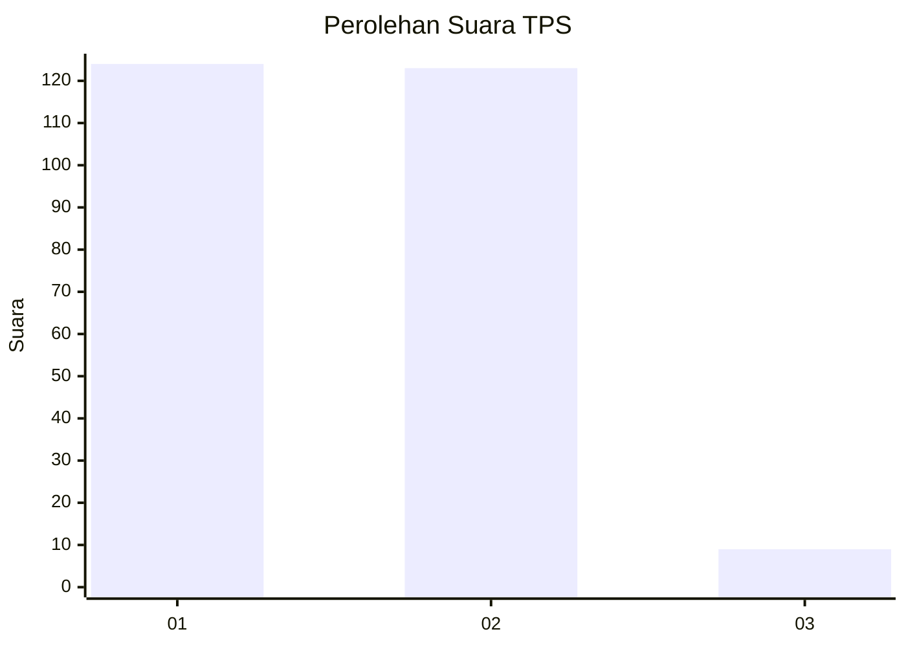
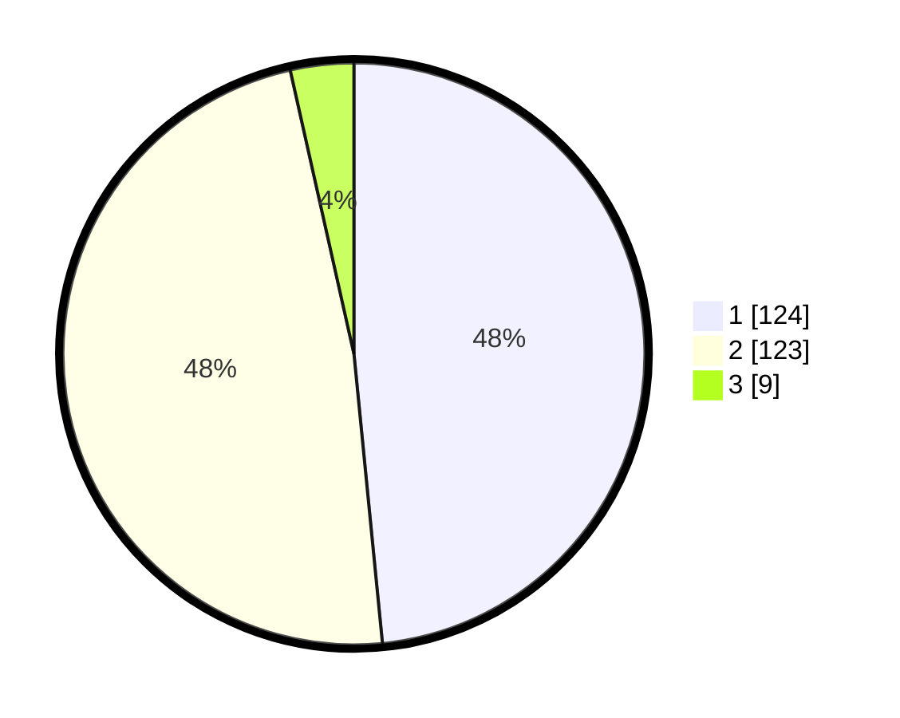

# Hasil

## Grafik

## Tabel

| No. | Nama Paslon    | Suara | Suara (raw) | Persentase |
|:--- |:-------------- | -----:| -----------:| ----------:|
| 1   | ANIES MUHAIMIN | 124   | [124][p-1]  | 48,44      |
| 2   | PRABOWO GIBRAN | 123   | [123][p-2]  | 48,05      |
| 3   | GANJAR MAHFUD  | 9     | [9][p-3]    | 3,52       |

[p-1]: https://github.com/gigit-pemilu/pemilu-2024/blob/main/pilpres/hitung-suara/sub/32-jawa-barat/sub/14-purwakarta/sub/01-purwakarta/sub/1002-nagri-kaler/sub/027-tps/sub/paslon-1.txt
[p-2]: https://github.com/gigit-pemilu/pemilu-2024/blob/main/pilpres/hitung-suara/sub/32-jawa-barat/sub/14-purwakarta/sub/01-purwakarta/sub/1002-nagri-kaler/sub/027-tps/sub/paslon-2.txt
[p-3]: https://github.com/gigit-pemilu/pemilu-2024/blob/main/pilpres/hitung-suara/sub/32-jawa-barat/sub/14-purwakarta/sub/01-purwakarta/sub/1002-nagri-kaler/sub/027-tps/sub/paslon-3.txt

## Foto C Plano

https://sirekap-obj-formc.kpu.go.id/c21a/pemilu/ppwp/32/14/01/10/02/3214011002027-20240215-035002--1d71b38c-2bb4-4031-ab5b-6c3bcc6cd23c.jpg

https://sirekap-obj-formc.kpu.go.id/c21a/pemilu/ppwp/32/14/01/10/02/3214011002027-20240215-035047--d11ee508-c66d-49b2-b66b-fdfa41445ec4.jpg

https://sirekap-obj-formc.kpu.go.id/c21a/pemilu/ppwp/32/14/01/10/02/3214011002027-20240215-035420--db79963b-e45d-45d1-9e52-6d1686c68143.jpg

## Metadata

| Key        | Value               |
| ---------- | ------------------- |
| Time Stamp | 2024-02-19 17:00:00 |

