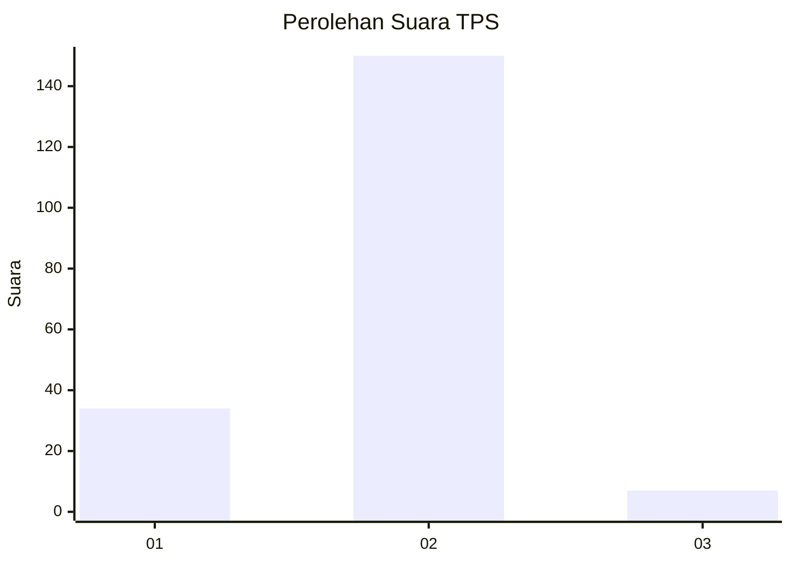
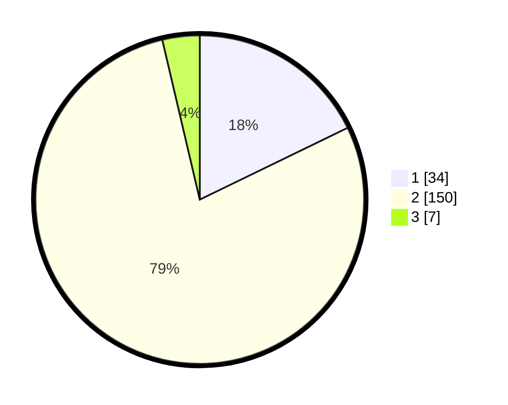

# Hasil

## Grafik

## Tabel

| No. | Nama Paslon    | Suara | Suara (raw) | Persentase |
|:--- |:-------------- | -----:| -----------:| ----------:|
| 1   | ANIES MUHAIMIN | 34    | [34][p-1]   | 17,80      |
| 2   | PRABOWO GIBRAN | 150   | [150][p-2]  | 78,53      |
| 3   | GANJAR MAHFUD  | 7     | [7][p-3]    | 3,66       |

[p-1]: https://github.com/gigit-pemilu/pemilu-2024-32-jawa-barat/blob/main/pilpres/hitung-suara/sub/32-jawa-barat/sub/14-purwakarta/sub/07-maniis/sub/2001-gunungkarung/sub/008-tps/sub/paslon-1.txt
[p-2]: https://github.com/gigit-pemilu/pemilu-2024-32-jawa-barat/blob/main/pilpres/hitung-suara/sub/32-jawa-barat/sub/14-purwakarta/sub/07-maniis/sub/2001-gunungkarung/sub/008-tps/sub/paslon-2.txt
[p-3]: https://github.com/gigit-pemilu/pemilu-2024-32-jawa-barat/blob/main/pilpres/hitung-suara/sub/32-jawa-barat/sub/14-purwakarta/sub/07-maniis/sub/2001-gunungkarung/sub/008-tps/sub/paslon-3.txt

## Foto C Plano

https://sirekap-obj-formc.kpu.go.id/1172/pemilu/ppwp/32/14/07/20/01/3214072001008-20240215-060707--491e2415-992e-4fdb-b50f-b605c0796fc1.jpg

https://sirekap-obj-formc.kpu.go.id/1172/pemilu/ppwp/32/14/07/20/01/3214072001008-20240215-061002--6c698714-7348-4793-85ce-c2643f33f84f.jpg

https://sirekap-obj-formc.kpu.go.id/1172/pemilu/ppwp/32/14/07/20/01/3214072001008-20240215-061135--ff7744d8-dcfd-45f6-ba2c-8d6e9a95d099.jpg

## Metadata

| Key        | Value               |
| ---------- | ------------------- |
| Time Stamp | 2024-02-19 17:00:00 |

