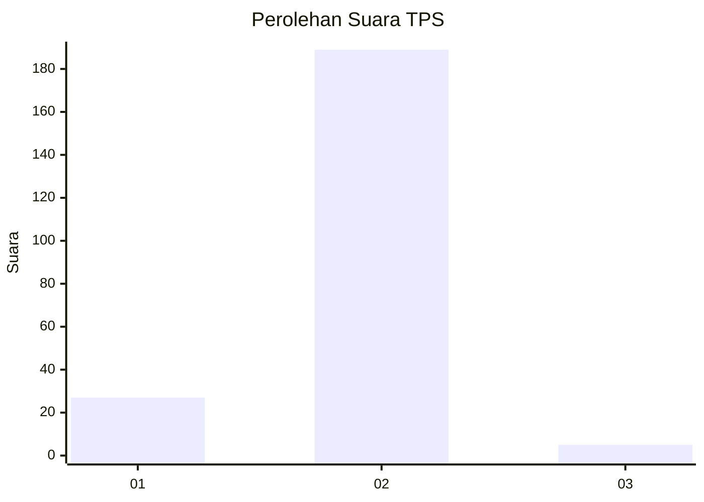
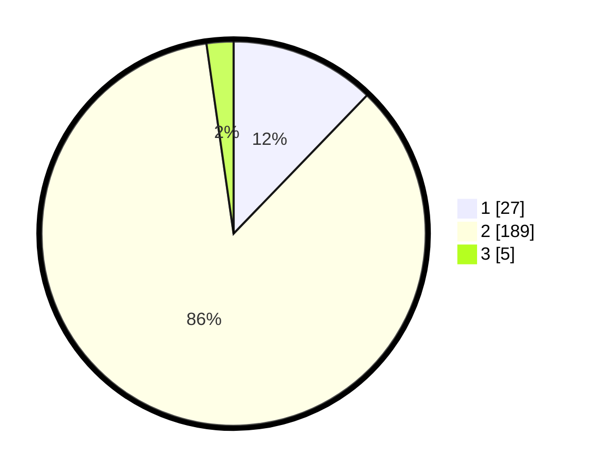

# Hasil

## Grafik

## Tabel

| No. | Nama Paslon    | Suara | Suara (raw) | Persentase |
|:--- |:-------------- | -----:| -----------:| ----------:|
| 1   | ANIES MUHAIMIN | 27    | [27][p-1]   | 12,22      |
| 2   | PRABOWO GIBRAN | 189   | [189][p-2]  | 85,52      |
| 3   | GANJAR MAHFUD  | 5     | [5][p-3]    | 2,26       |

[p-1]: https://github.com/gigit-pemilu/pemilu-2024-32-jawa-barat/blob/main/pilpres/hitung-suara/sub/32-jawa-barat/sub/14-purwakarta/sub/07-maniis/sub/2001-gunungkarung/sub/011-tps/sub/paslon-1.txt
[p-2]: https://github.com/gigit-pemilu/pemilu-2024-32-jawa-barat/blob/main/pilpres/hitung-suara/sub/32-jawa-barat/sub/14-purwakarta/sub/07-maniis/sub/2001-gunungkarung/sub/011-tps/sub/paslon-2.txt
[p-3]: https://github.com/gigit-pemilu/pemilu-2024-32-jawa-barat/blob/main/pilpres/hitung-suara/sub/32-jawa-barat/sub/14-purwakarta/sub/07-maniis/sub/2001-gunungkarung/sub/011-tps/sub/paslon-3.txt

## Foto C Plano

https://sirekap-obj-formc.kpu.go.id/8753/pemilu/ppwp/32/14/07/20/01/3214072001011-20240215-092351--d4254f07-5885-4fa4-aeb8-90ca4daa9b00.jpg

https://sirekap-obj-formc.kpu.go.id/8753/pemilu/ppwp/32/14/07/20/01/3214072001011-20240215-092740--940ed98a-1657-4483-bd84-22dcd0e27202.jpg

https://sirekap-obj-formc.kpu.go.id/8753/pemilu/ppwp/32/14/07/20/01/3214072001011-20240215-093042--b1757ffc-d2f4-4415-814d-4f3e6251b513.jpg

## Metadata

| Key        | Value               |
| ---------- | ------------------- |
| Time Stamp | 2024-02-19 18:00:00 |

