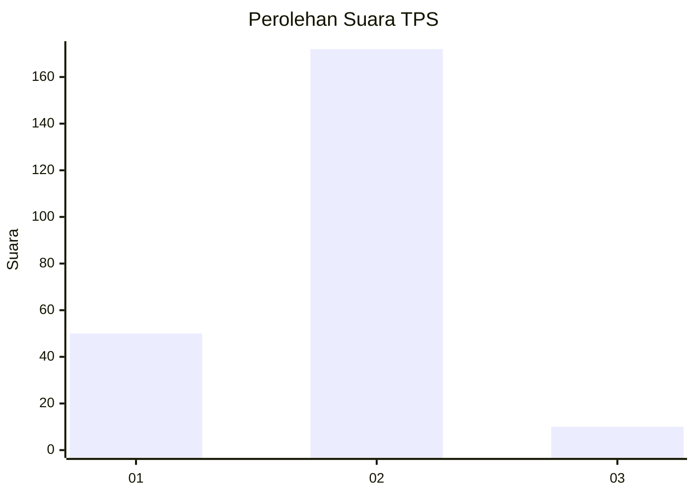
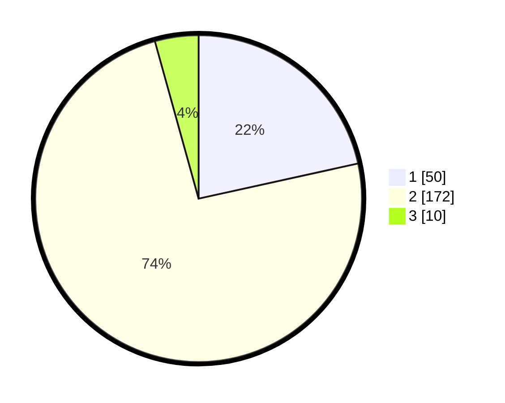

# Hasil

## Grafik

## Tabel

| No. | Nama Paslon    | Suara | Suara (raw) | Persentase |
|:--- |:-------------- | -----:| -----------:| ----------:|
| 1   | ANIES MUHAIMIN | 50    | [50][p-1]   | 21,55      |
| 2   | PRABOWO GIBRAN | 172   | [172][p-2]  | 74,14      |
| 3   | GANJAR MAHFUD  | 10    | [10][p-3]   | 4,31       |

[p-1]: https://github.com/gigit-pemilu/pemilu-2024-32-jawa-barat/blob/main/pilpres/hitung-suara/sub/32-jawa-barat/sub/14-purwakarta/sub/14-cibatu/sub/2001-cibatu/sub/004-tps/sub/paslon-1.txt
[p-2]: https://github.com/gigit-pemilu/pemilu-2024-32-jawa-barat/blob/main/pilpres/hitung-suara/sub/32-jawa-barat/sub/14-purwakarta/sub/14-cibatu/sub/2001-cibatu/sub/004-tps/sub/paslon-2.txt
[p-3]: https://github.com/gigit-pemilu/pemilu-2024-32-jawa-barat/blob/main/pilpres/hitung-suara/sub/32-jawa-barat/sub/14-purwakarta/sub/14-cibatu/sub/2001-cibatu/sub/004-tps/sub/paslon-3.txt

## Foto C Plano

https://sirekap-obj-formc.kpu.go.id/ccc2/pemilu/ppwp/32/14/14/20/01/3214142001004-20240216-152305--362165e5-c89e-4f7c-a936-a19f64ed08a9.jpg

https://sirekap-obj-formc.kpu.go.id/ccc2/pemilu/ppwp/32/14/14/20/01/3214142001004-20240216-152439--a1e3b07d-6f7a-4579-b1cf-bb710ba91b99.jpg

https://sirekap-obj-formc.kpu.go.id/ccc2/pemilu/ppwp/32/14/14/20/01/3214142001004-20240216-151742--6772720b-e820-4203-8d3b-4ff1e446f76f.jpg

## Metadata

| Key        | Value               |
| ---------- | ------------------- |
| Time Stamp | 2024-02-25 10:00:00 |

