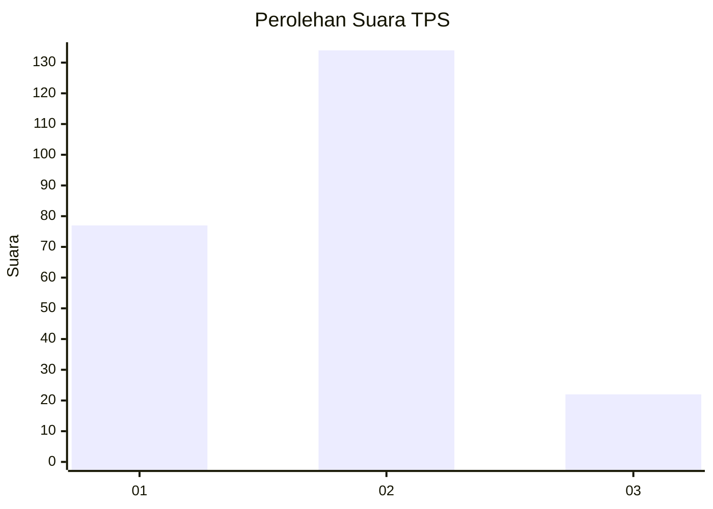
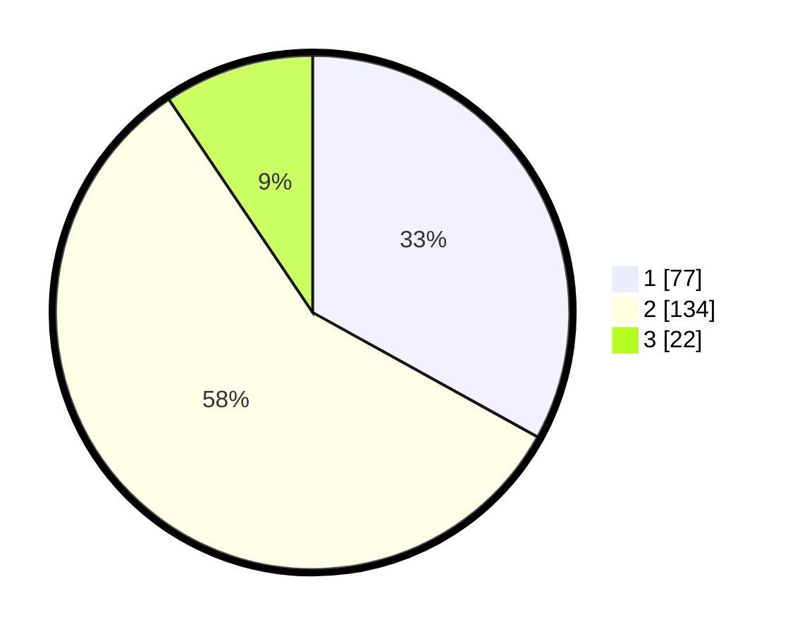

# Hasil

## Grafik

## Tabel

| No. | Nama Paslon    | Suara | Suara (raw) | Persentase |
|:--- |:-------------- | -----:| -----------:| ----------:|
| 1   | ANIES MUHAIMIN | 77    | [77][p-1]   | 33,05      |
| 2   | PRABOWO GIBRAN | 134   | [134][p-2]  | 57,51      |
| 3   | GANJAR MAHFUD  | 22    | [22][p-3]   | 9,44       |

[p-1]: https://github.com/gigit-pemilu/pemilu-2024-32-jawa-barat/blob/main/pilpres/hitung-suara/sub/32-jawa-barat/sub/15-karawang/sub/01-karawang-barat/sub/1001-karawang-kulon/sub/001-tps/sub/paslon-1.txt
[p-2]: https://github.com/gigit-pemilu/pemilu-2024-32-jawa-barat/blob/main/pilpres/hitung-suara/sub/32-jawa-barat/sub/15-karawang/sub/01-karawang-barat/sub/1001-karawang-kulon/sub/001-tps/sub/paslon-2.txt
[p-3]: https://github.com/gigit-pemilu/pemilu-2024-32-jawa-barat/blob/main/pilpres/hitung-suara/sub/32-jawa-barat/sub/15-karawang/sub/01-karawang-barat/sub/1001-karawang-kulon/sub/001-tps/sub/paslon-3.txt

## Foto C Plano

https://sirekap-obj-formc.kpu.go.id/aa4e/pemilu/ppwp/32/15/01/10/01/3215011001001-20240214-234014--3ec752dc-af39-4fe9-9750-5ad19d0e19ed.jpg

https://sirekap-obj-formc.kpu.go.id/aa4e/pemilu/ppwp/32/15/01/10/01/3215011001001-20240214-234321--ea856af3-5ae5-41e1-9f33-5880d9235599.jpg

https://sirekap-obj-formc.kpu.go.id/aa4e/pemilu/ppwp/32/15/01/10/01/3215011001001-20240214-234526--e9921fa6-a278-4452-a426-1bad0dd6992a.jpg

## Metadata

| Key        | Value               |
| ---------- | ------------------- |
| Time Stamp | 2024-02-15 12:00:28 |

