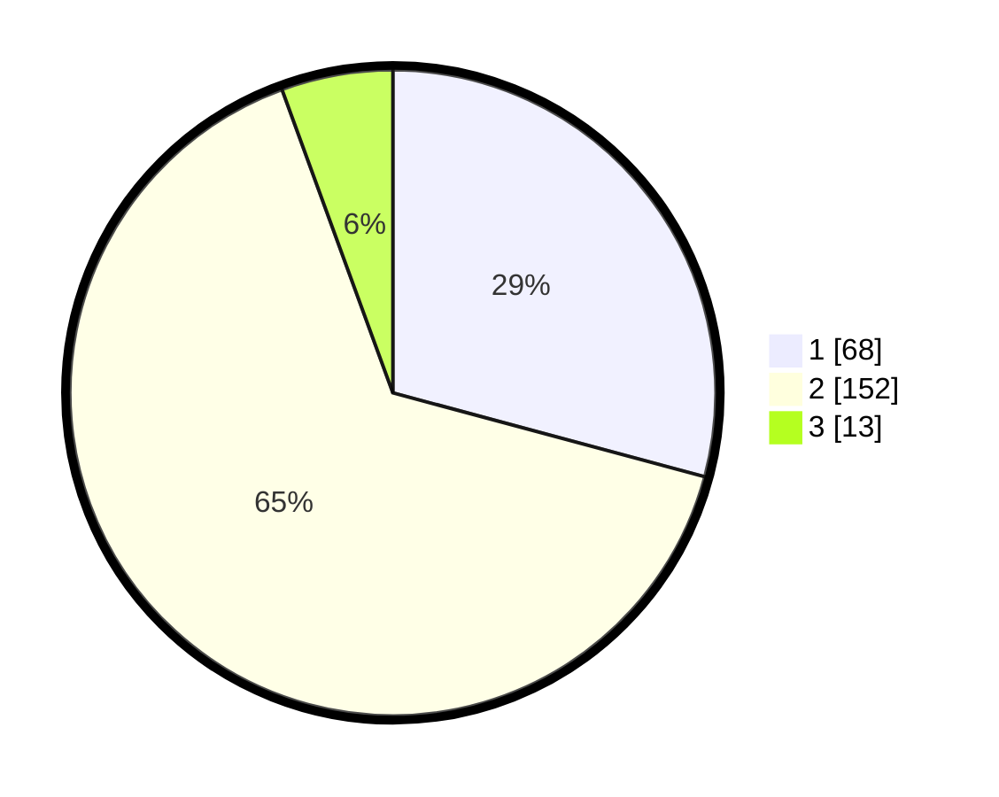

# Hasil

## Grafik

## Tabel

| No. | Nama Paslon    | Suara | Suara (raw) | Persentase |
|:--- |:-------------- | -----:| -----------:| ----------:|
| 1   | ANIES MUHAIMIN | 68    | [68][p-1]   | 29,18      |
| 2   | PRABOWO GIBRAN | 152   | [152][p-2]  | 65,24      |
| 3   | GANJAR MAHFUD  | 13    | [13][p-3]   | 5,58       |

[p-1]: https://github.com/gigit-pemilu/pemilu-2024-32-jawa-barat/blob/main/pilpres/hitung-suara/sub/32-jawa-barat/sub/15-karawang/sub/01-karawang-barat/sub/1001-karawang-kulon/sub/006-tps/sub/paslon-1.txt
[p-2]: https://github.com/gigit-pemilu/pemilu-2024-32-jawa-barat/blob/main/pilpres/hitung-suara/sub/32-jawa-barat/sub/15-karawang/sub/01-karawang-barat/sub/1001-karawang-kulon/sub/006-tps/sub/paslon-2.txt
[p-3]: https://github.com/gigit-pemilu/pemilu-2024-32-jawa-barat/blob/main/pilpres/hitung-suara/sub/32-jawa-barat/sub/15-karawang/sub/01-karawang-barat/sub/1001-karawang-kulon/sub/006-tps/sub/paslon-3.txt

## Foto C Plano

https://sirekap-obj-formc.kpu.go.id/700d/pemilu/ppwp/32/15/01/10/01/3215011001006-20240215-044559--7be821a2-505f-43e0-800f-c38c6e511d65.jpg

https://sirekap-obj-formc.kpu.go.id/700d/pemilu/ppwp/32/15/01/10/01/3215011001006-20240215-044631--cbbce46e-6f14-434b-9fb3-cbe6e5808529.jpg

https://sirekap-obj-formc.kpu.go.id/700d/pemilu/ppwp/32/15/01/10/01/3215011001006-20240215-044503--ca10867d-67b1-4277-9c84-831a1a0a7df2.jpg

## Metadata

| Key        | Value               |
| ---------- | ------------------- |
| Time Stamp | 2024-02-20 13:00:00 |

