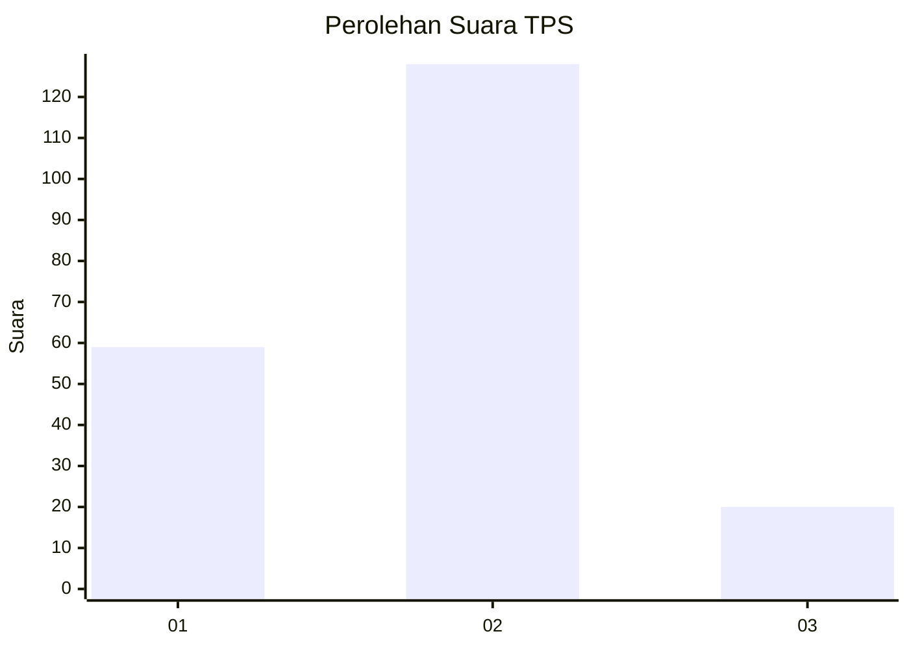
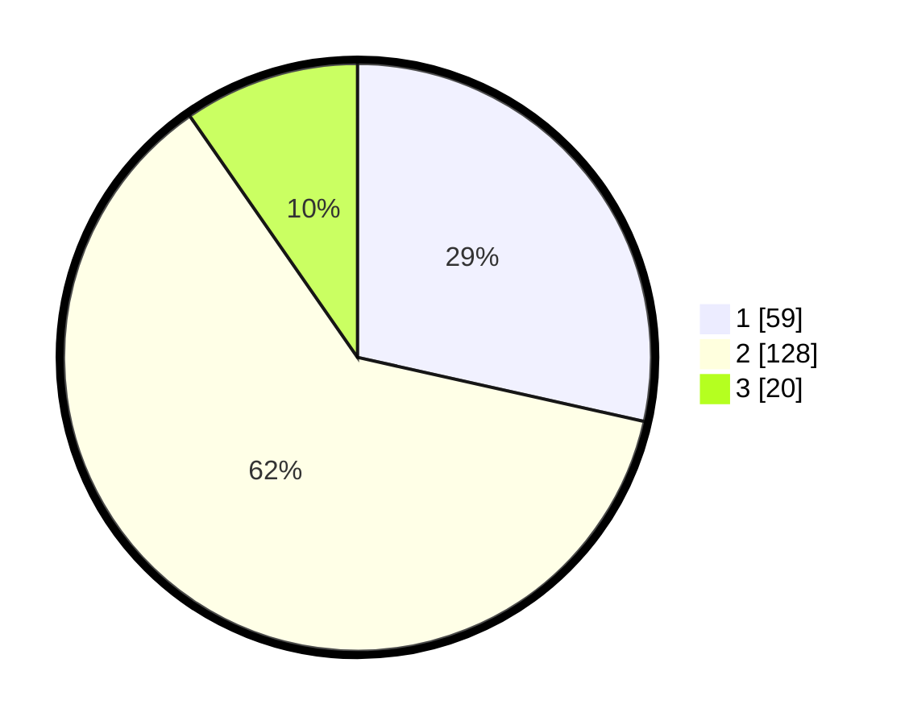

# Hasil

## Grafik

## Tabel

| No. | Nama Paslon    | Suara | Suara (raw) | Persentase |
|:--- |:-------------- | -----:| -----------:| ----------:|
| 1   | ANIES MUHAIMIN | 59    | [59][p-1]   | 28,50      |
| 2   | PRABOWO GIBRAN | 128   | [128][p-2]  | 61,84      |
| 3   | GANJAR MAHFUD  | 20    | [20][p-3]   | 9,66       |

[p-1]: https://github.com/gigit-pemilu/pemilu-2024-32-jawa-barat/blob/main/pilpres/hitung-suara/sub/32-jawa-barat/sub/15-karawang/sub/01-karawang-barat/sub/1001-karawang-kulon/sub/007-tps/sub/paslon-1.txt
[p-2]: https://github.com/gigit-pemilu/pemilu-2024-32-jawa-barat/blob/main/pilpres/hitung-suara/sub/32-jawa-barat/sub/15-karawang/sub/01-karawang-barat/sub/1001-karawang-kulon/sub/007-tps/sub/paslon-2.txt
[p-3]: https://github.com/gigit-pemilu/pemilu-2024-32-jawa-barat/blob/main/pilpres/hitung-suara/sub/32-jawa-barat/sub/15-karawang/sub/01-karawang-barat/sub/1001-karawang-kulon/sub/007-tps/sub/paslon-3.txt

## Foto C Plano

https://sirekap-obj-formc.kpu.go.id/73e4/pemilu/ppwp/32/15/01/10/01/3215011001007-20240215-112420--6a427c27-d5fe-43e6-a7d7-b19dde95cd73.jpg

https://sirekap-obj-formc.kpu.go.id/73e4/pemilu/ppwp/32/15/01/10/01/3215011001007-20240215-000943--97e312c6-e55b-48ca-89e4-e32fc6c586b5.jpg

https://sirekap-obj-formc.kpu.go.id/73e4/pemilu/ppwp/32/15/01/10/01/3215011001007-20240215-002149--9577739f-c82e-42e4-a026-5977e8a32044.jpg

## Metadata

| Key        | Value               |
| ---------- | ------------------- |
| Time Stamp | 2024-02-16 12:51:22 |

