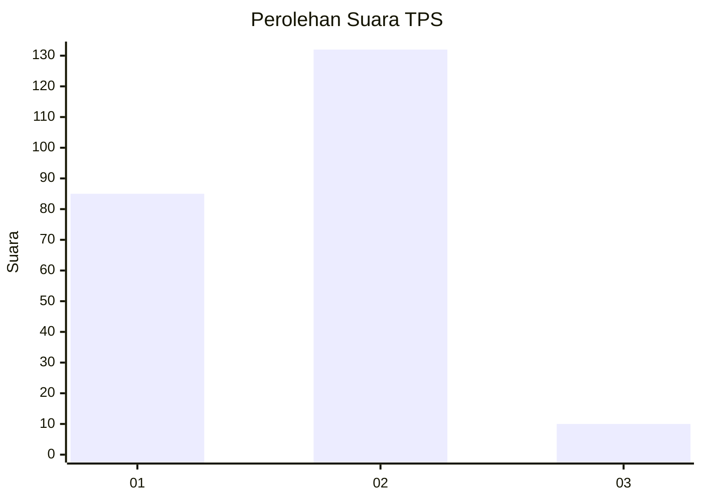
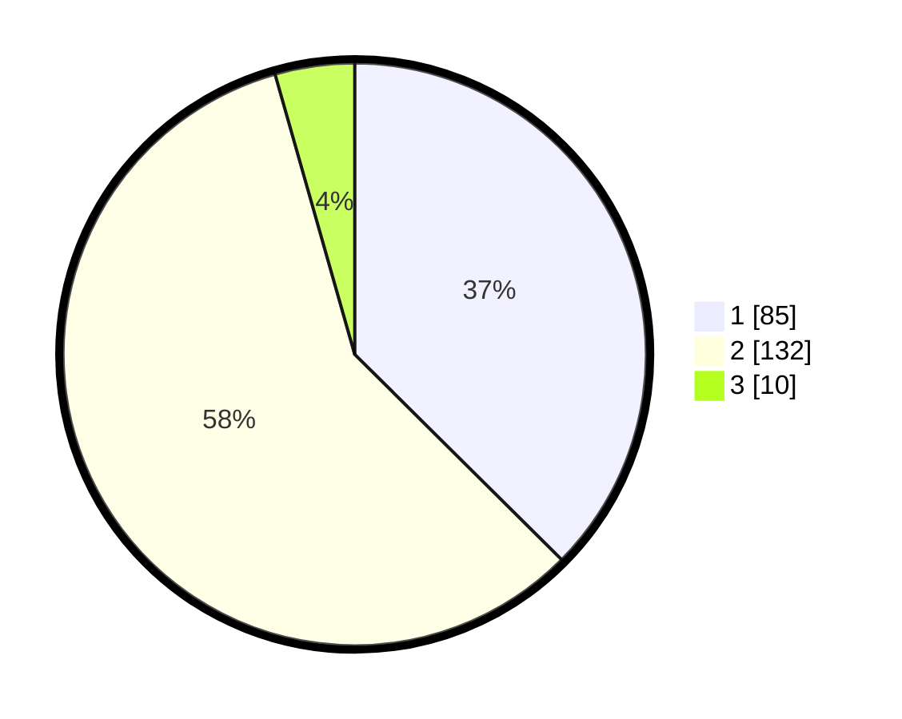

# Hasil

## Grafik

## Tabel

| No. | Nama Paslon    | Suara | Suara (raw) | Persentase |
|:--- |:-------------- | -----:| -----------:| ----------:|
| 1   | ANIES MUHAIMIN | 85    | [85][p-1]   | 37,44      |
| 2   | PRABOWO GIBRAN | 132   | [132][p-2]  | 58,15      |
| 3   | GANJAR MAHFUD  | 10    | [10][p-3]   | 4,41       |

[p-1]: https://github.com/gigit-pemilu/pemilu-2024/blob/main/pilpres/hitung-suara/sub/32-jawa-barat/sub/15-karawang/sub/01-karawang-barat/sub/1007-tunggakjati/sub/002-tps/sub/paslon-1.txt
[p-2]: https://github.com/gigit-pemilu/pemilu-2024/blob/main/pilpres/hitung-suara/sub/32-jawa-barat/sub/15-karawang/sub/01-karawang-barat/sub/1007-tunggakjati/sub/002-tps/sub/paslon-2.txt
[p-3]: https://github.com/gigit-pemilu/pemilu-2024/blob/main/pilpres/hitung-suara/sub/32-jawa-barat/sub/15-karawang/sub/01-karawang-barat/sub/1007-tunggakjati/sub/002-tps/sub/paslon-3.txt

## Foto C Plano

https://sirekap-obj-formc.kpu.go.id/c8fd/pemilu/ppwp/32/15/01/10/07/3215011007002-20240224-102023--af5a7388-a0c9-42dd-8f6f-f982b435ec2d.jpg

https://sirekap-obj-formc.kpu.go.id/c8fd/pemilu/ppwp/32/15/01/10/07/3215011007002-20240224-102131--3f8c6be4-35a0-41fd-ae52-20c46c0b6f8b.jpg

https://sirekap-obj-formc.kpu.go.id/c8fd/pemilu/ppwp/32/15/01/10/07/3215011007002-20240224-102356--c5def378-b8b3-4ec1-a8ab-ec60ce590616.jpg

## Metadata

| Key        | Value               |
| ---------- | ------------------- |
| Time Stamp | 2024-02-25 13:00:00 |

