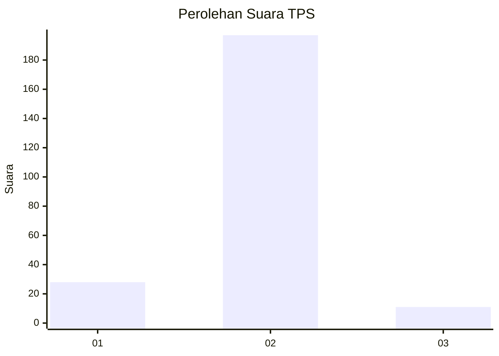
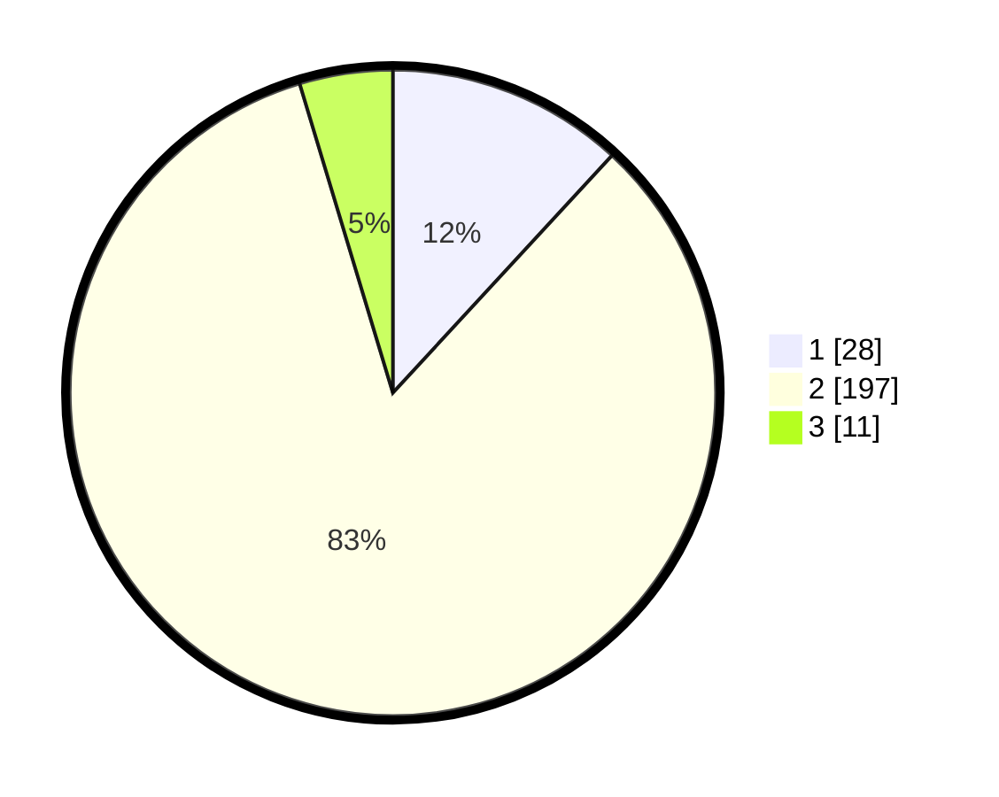

# Hasil

## Grafik

## Tabel

| No. | Nama Paslon    | Suara | Suara (raw) | Persentase |
|:--- |:-------------- | -----:| -----------:| ----------:|
| 1   | ANIES MUHAIMIN | 28    | [28][p-1]   | 11,86      |
| 2   | PRABOWO GIBRAN | 197   | [197][p-2]  | 83,47      |
| 3   | GANJAR MAHFUD  | 11    | [11][p-3]   | 4,66       |

[p-1]: https://github.com/gigit-pemilu/pemilu-2024-32-jawa-barat/blob/main/pilpres/hitung-suara/sub/32-jawa-barat/sub/15-karawang/sub/02-pangkalan/sub/2001-ciptasari/sub/005-tps/sub/paslon-1.txt
[p-2]: https://github.com/gigit-pemilu/pemilu-2024-32-jawa-barat/blob/main/pilpres/hitung-suara/sub/32-jawa-barat/sub/15-karawang/sub/02-pangkalan/sub/2001-ciptasari/sub/005-tps/sub/paslon-2.txt
[p-3]: https://github.com/gigit-pemilu/pemilu-2024-32-jawa-barat/blob/main/pilpres/hitung-suara/sub/32-jawa-barat/sub/15-karawang/sub/02-pangkalan/sub/2001-ciptasari/sub/005-tps/sub/paslon-3.txt

## Foto C Plano

https://sirekap-obj-formc.kpu.go.id/4ba4/pemilu/ppwp/32/15/02/20/01/3215022001005-20240215-102202--6173caea-fda9-4d2e-a9b1-808ff385eeac.jpg

https://sirekap-obj-formc.kpu.go.id/4ba4/pemilu/ppwp/32/15/02/20/01/3215022001005-20240215-102337--cf43c212-a43f-49db-b973-32defadc220d.jpg

https://sirekap-obj-formc.kpu.go.id/4ba4/pemilu/ppwp/32/15/02/20/01/3215022001005-20240215-102547--a443994e-59fd-4cb4-8d5a-01ec50b57211.jpg

## Metadata

| Key        | Value               |
| ---------- | ------------------- |
| Time Stamp | 2024-02-16 13:30:32 |

