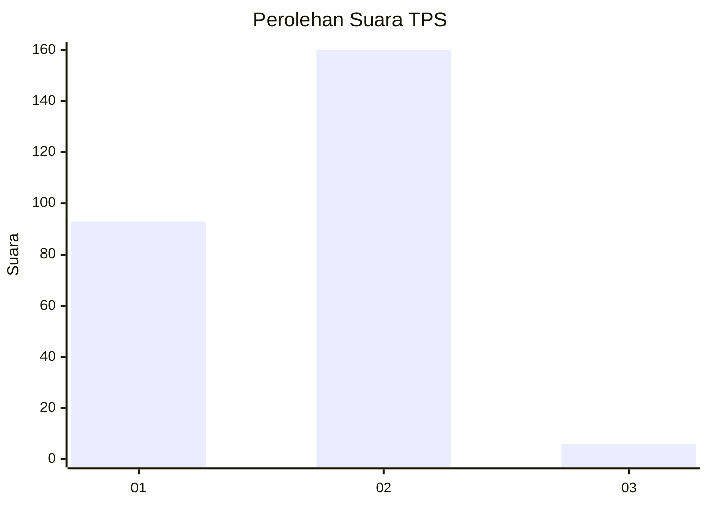
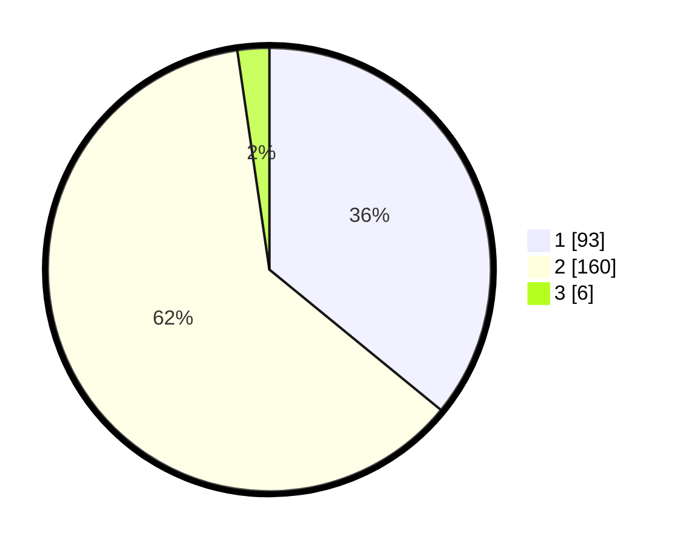

# Hasil

## Grafik

## Tabel

| No. | Nama Paslon    | Suara | Suara (raw) | Persentase |
|:--- |:-------------- | -----:| -----------:| ----------:|
| 1   | ANIES MUHAIMIN | 93    | [93][p-1]   | 35,91      |
| 2   | PRABOWO GIBRAN | 160   | [160][p-2]  | 61,78      |
| 3   | GANJAR MAHFUD  | 6     | [6][p-3]    | 2,32       |

[p-1]: https://github.com/gigit-pemilu/pemilu-2024-32-jawa-barat/blob/main/pilpres/hitung-suara/sub/32-jawa-barat/sub/15-karawang/sub/02-pangkalan/sub/2005-cintaasih/sub/007-tps/sub/paslon-1.txt
[p-2]: https://github.com/gigit-pemilu/pemilu-2024-32-jawa-barat/blob/main/pilpres/hitung-suara/sub/32-jawa-barat/sub/15-karawang/sub/02-pangkalan/sub/2005-cintaasih/sub/007-tps/sub/paslon-2.txt
[p-3]: https://github.com/gigit-pemilu/pemilu-2024-32-jawa-barat/blob/main/pilpres/hitung-suara/sub/32-jawa-barat/sub/15-karawang/sub/02-pangkalan/sub/2005-cintaasih/sub/007-tps/sub/paslon-3.txt

## Foto C Plano

https://sirekap-obj-formc.kpu.go.id/b1fe/pemilu/ppwp/32/15/02/20/05/3215022005007-20240215-132300--1093223a-f454-4d20-b074-35556ba6a0bd.jpg

https://sirekap-obj-formc.kpu.go.id/b1fe/pemilu/ppwp/32/15/02/20/05/3215022005007-20240215-132505--2d7d9a96-3d1b-4a70-9699-2cd85fab0be2.jpg

https://sirekap-obj-formc.kpu.go.id/b1fe/pemilu/ppwp/32/15/02/20/05/3215022005007-20240215-132650--735e565f-2220-4d7e-a4f7-2de56a582ffe.jpg

## Metadata

| Key        | Value               |
| ---------- | ------------------- |
| Time Stamp | 2024-02-17 16:36:25 |

