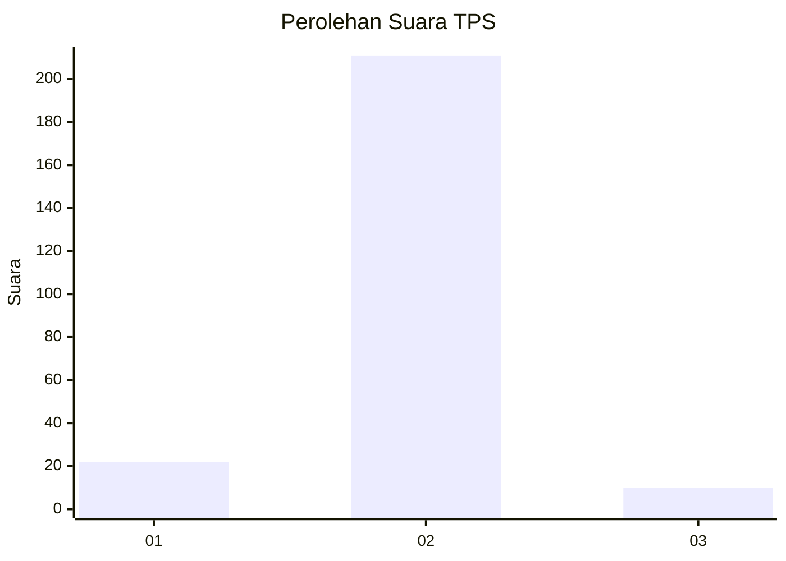
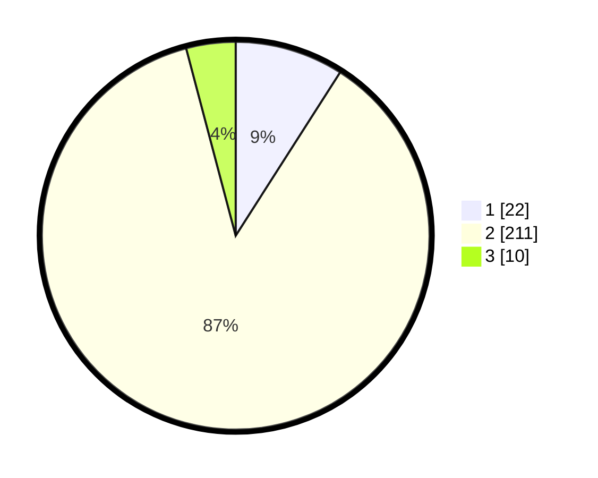

# Hasil

## Grafik

## Tabel

| No. | Nama Paslon    | Suara | Suara (raw) | Persentase |
|:--- |:-------------- | -----:| -----------:| ----------:|
| 1   | ANIES MUHAIMIN | 22    | [22][p-1]   | 9,05       |
| 2   | PRABOWO GIBRAN | 211   | [211][p-2]  | 86,83      |
| 3   | GANJAR MAHFUD  | 10    | [10][p-3]   | 4,12       |

[p-1]: https://github.com/gigit-pemilu/pemilu-2024/blob/main/pilpres/hitung-suara/sub/32-jawa-barat/sub/15-karawang/sub/02-pangkalan/sub/2007-mulangsari/sub/007-tps/sub/paslon-1.txt
[p-2]: https://github.com/gigit-pemilu/pemilu-2024/blob/main/pilpres/hitung-suara/sub/32-jawa-barat/sub/15-karawang/sub/02-pangkalan/sub/2007-mulangsari/sub/007-tps/sub/paslon-2.txt
[p-3]: https://github.com/gigit-pemilu/pemilu-2024/blob/main/pilpres/hitung-suara/sub/32-jawa-barat/sub/15-karawang/sub/02-pangkalan/sub/2007-mulangsari/sub/007-tps/sub/paslon-3.txt

## Foto C Plano

https://sirekap-obj-formc.kpu.go.id/8478/pemilu/ppwp/32/15/02/20/07/3215022007007-20240214-201237--1f5c851e-59b1-47b9-a0eb-955c609a941a.jpg

https://sirekap-obj-formc.kpu.go.id/8478/pemilu/ppwp/32/15/02/20/07/3215022007007-20240214-201526--0f1f2bf6-ddc1-4263-8af9-4781a788f79f.jpg

https://sirekap-obj-formc.kpu.go.id/8478/pemilu/ppwp/32/15/02/20/07/3215022007007-20240214-195633--4e6f76f9-93cc-46d1-8f31-ba69d7a88ad7.jpg

## Metadata

| Key        | Value               |
| ---------- | ------------------- |
| Time Stamp | 2024-02-15 16:00:26 |

