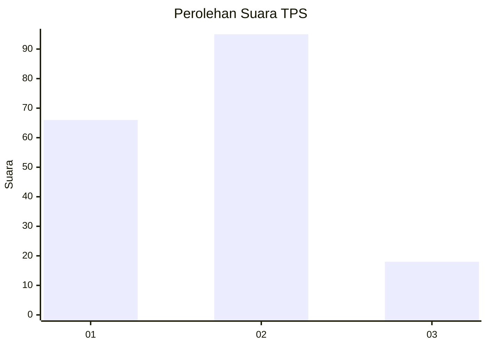
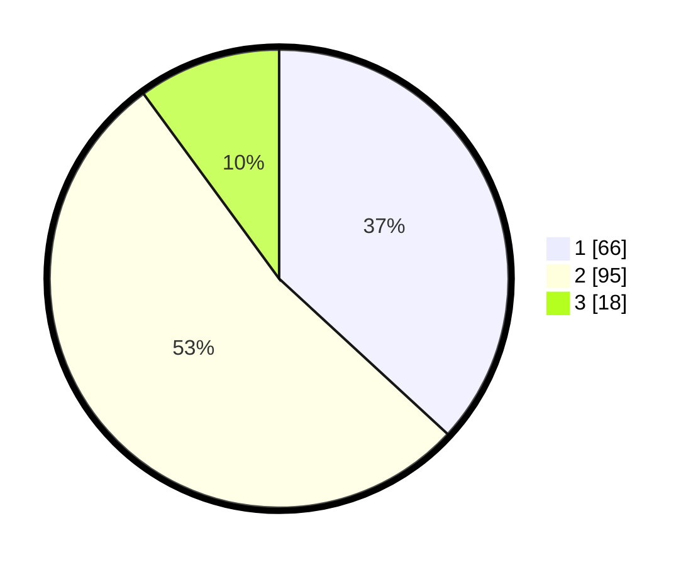

# Hasil

## Grafik

## Tabel

| No. | Nama Paslon    | Suara | Suara (raw) | Persentase |
|:--- |:-------------- | -----:| -----------:| ----------:|
| 1   | ANIES MUHAIMIN | 66    | [66][p-1]   | 36,87      |
| 2   | PRABOWO GIBRAN | 95    | [95][p-2]   | 53,07      |
| 3   | GANJAR MAHFUD  | 18    | [18][p-3]   | 10,06      |

[p-1]: https://github.com/gigit-pemilu/pemilu-2024-32-jawa-barat/blob/main/pilpres/hitung-suara/sub/32-jawa-barat/sub/15-karawang/sub/03-telukjambe-timur/sub/2001-telukjambe/sub/020-tps/sub/paslon-1.txt
[p-2]: https://github.com/gigit-pemilu/pemilu-2024-32-jawa-barat/blob/main/pilpres/hitung-suara/sub/32-jawa-barat/sub/15-karawang/sub/03-telukjambe-timur/sub/2001-telukjambe/sub/020-tps/sub/paslon-2.txt
[p-3]: https://github.com/gigit-pemilu/pemilu-2024-32-jawa-barat/blob/main/pilpres/hitung-suara/sub/32-jawa-barat/sub/15-karawang/sub/03-telukjambe-timur/sub/2001-telukjambe/sub/020-tps/sub/paslon-3.txt

## Foto C Plano

https://sirekap-obj-formc.kpu.go.id/a3af/pemilu/ppwp/32/15/03/20/01/3215032001020-20240214-155746--0554d5b7-52c0-42e6-81f8-2ced218d428b.jpg

https://sirekap-obj-formc.kpu.go.id/a3af/pemilu/ppwp/32/15/03/20/01/3215032001020-20240214-160109--15b41ffc-08b0-4372-8578-3d07ff193945.jpg

https://sirekap-obj-formc.kpu.go.id/a3af/pemilu/ppwp/32/15/03/20/01/3215032001020-20240214-160122--b63953e1-d8da-4068-a993-69026c70d8d5.jpg

## Metadata

| Key        | Value               |
| ---------- | ------------------- |
| Time Stamp | 2024-02-15 15:00:29 |

