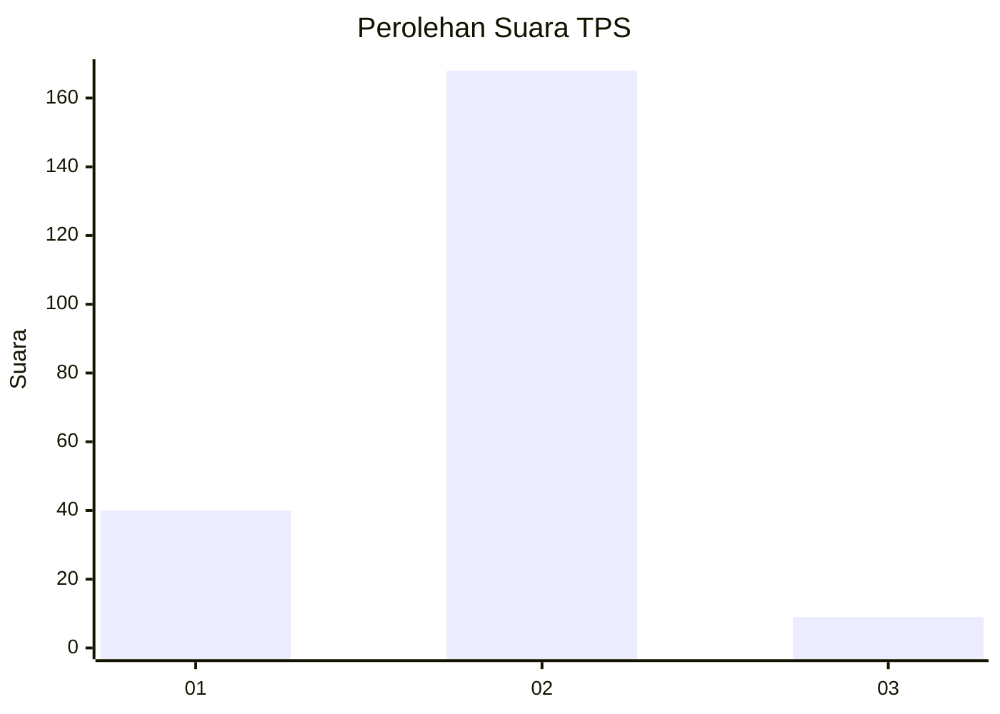
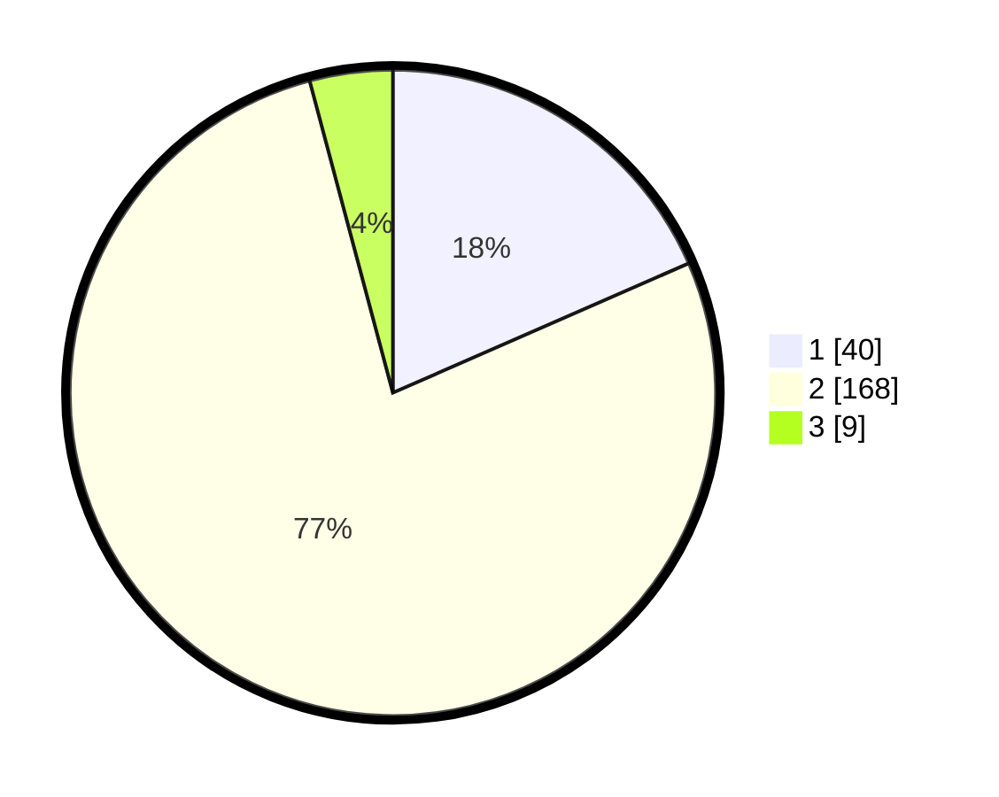

# Hasil

## Grafik

## Tabel

| No. | Nama Paslon    | Suara | Suara (raw) | Persentase |
|:--- |:-------------- | -----:| -----------:| ----------:|
| 1   | ANIES MUHAIMIN | 40    | [40][p-1]   | 18,43      |
| 2   | PRABOWO GIBRAN | 168   | [168][p-2]  | 77,42      |
| 3   | GANJAR MAHFUD  | 9     | [9][p-3]    | 4,15       |

[p-1]: https://github.com/gigit-pemilu/pemilu-2024/blob/main/pilpres/hitung-suara/sub/32-jawa-barat/sub/15-karawang/sub/03-telukjambe-timur/sub/2001-telukjambe/sub/022-tps/sub/paslon-1.txt
[p-2]: https://github.com/gigit-pemilu/pemilu-2024/blob/main/pilpres/hitung-suara/sub/32-jawa-barat/sub/15-karawang/sub/03-telukjambe-timur/sub/2001-telukjambe/sub/022-tps/sub/paslon-2.txt
[p-3]: https://github.com/gigit-pemilu/pemilu-2024/blob/main/pilpres/hitung-suara/sub/32-jawa-barat/sub/15-karawang/sub/03-telukjambe-timur/sub/2001-telukjambe/sub/022-tps/sub/paslon-3.txt

## Foto C Plano

https://sirekap-obj-formc.kpu.go.id/34d0/pemilu/ppwp/32/15/03/20/01/3215032001022-20240214-192747--7dce5fb2-8d75-4210-9873-630839c8fcef.jpg

https://sirekap-obj-formc.kpu.go.id/34d0/pemilu/ppwp/32/15/03/20/01/3215032001022-20240214-192813--e89c3684-18f4-4669-8f01-a442f6678c7b.jpg

https://sirekap-obj-formc.kpu.go.id/34d0/pemilu/ppwp/32/15/03/20/01/3215032001022-20240214-192824--b5ea2a96-76f4-4798-adc4-de2f90f0050e.jpg

## Metadata

| Key        | Value               |
| ---------- | ------------------- |
| Time Stamp | 2024-02-15 15:00:29 |

