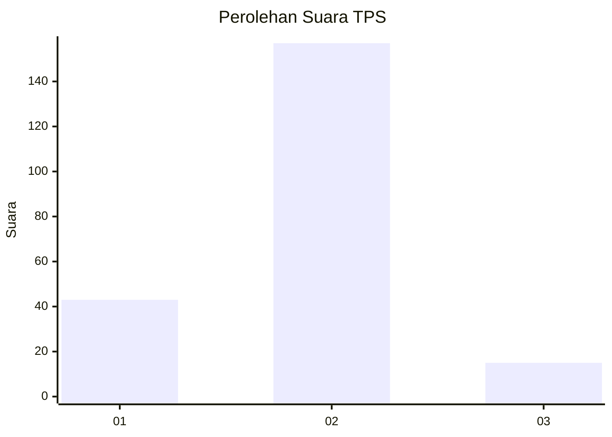
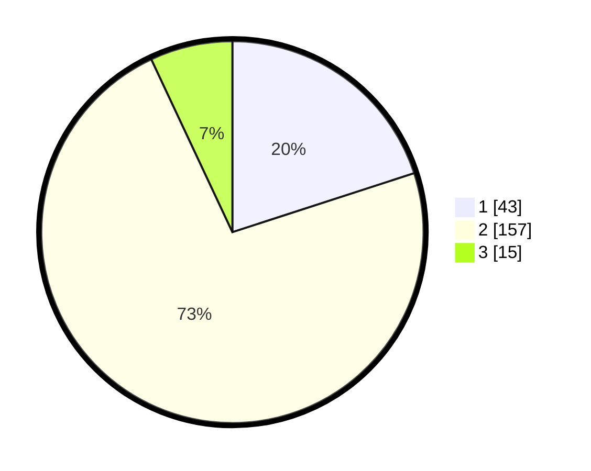

# Hasil

## Grafik

## Tabel

| No. | Nama Paslon    | Suara | Suara (raw) | Persentase |
|:--- |:-------------- | -----:| -----------:| ----------:|
| 1   | ANIES MUHAIMIN | 43    | [43][p-1]   | 20,00      |
| 2   | PRABOWO GIBRAN | 157   | [157][p-2]  | 73,02      |
| 3   | GANJAR MAHFUD  | 15    | [15][p-3]   | 6,98       |

[p-1]: https://github.com/gigit-pemilu/pemilu-2024-32-jawa-barat/blob/main/pilpres/hitung-suara/sub/32-jawa-barat/sub/15-karawang/sub/03-telukjambe-timur/sub/2001-telukjambe/sub/024-tps/sub/paslon-1.txt
[p-2]: https://github.com/gigit-pemilu/pemilu-2024-32-jawa-barat/blob/main/pilpres/hitung-suara/sub/32-jawa-barat/sub/15-karawang/sub/03-telukjambe-timur/sub/2001-telukjambe/sub/024-tps/sub/paslon-2.txt
[p-3]: https://github.com/gigit-pemilu/pemilu-2024-32-jawa-barat/blob/main/pilpres/hitung-suara/sub/32-jawa-barat/sub/15-karawang/sub/03-telukjambe-timur/sub/2001-telukjambe/sub/024-tps/sub/paslon-3.txt

## Foto C Plano

https://sirekap-obj-formc.kpu.go.id/a578/pemilu/ppwp/32/15/03/20/01/3215032001024-20240214-233153--ce33cd31-d6c6-4945-be2b-f428fcd69a34.jpg

https://sirekap-obj-formc.kpu.go.id/a578/pemilu/ppwp/32/15/03/20/01/3215032001024-20240215-043747--d87b94b4-ccc2-4800-89bc-0ec6b3cc15ba.jpg

https://sirekap-obj-formc.kpu.go.id/a578/pemilu/ppwp/32/15/03/20/01/3215032001024-20240215-043728--49278f3f-35b7-41a5-98f2-b40c2f8b3f73.jpg

## Metadata

| Key        | Value               |
| ---------- | ------------------- |
| Time Stamp | 2024-02-16 16:25:10 |

