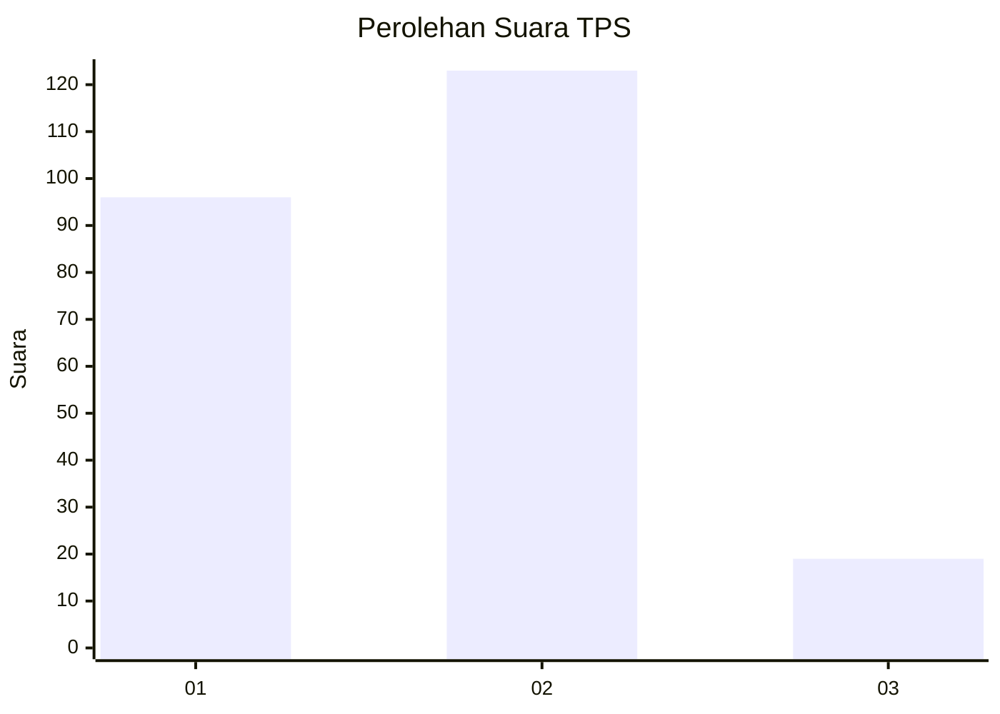
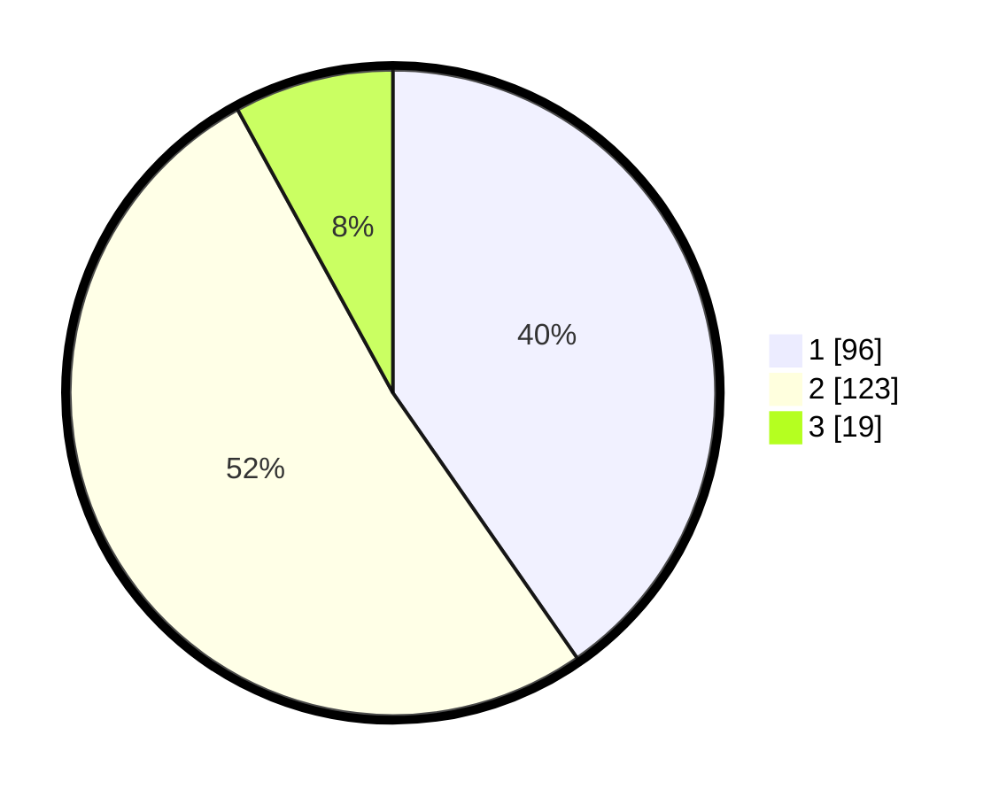

# Hasil

## Grafik

## Tabel

| No. | Nama Paslon    | Suara | Suara (raw) | Persentase |
|:--- |:-------------- | -----:| -----------:| ----------:|
| 1   | ANIES MUHAIMIN | 96    | [96][p-1]   | 40,34      |
| 2   | PRABOWO GIBRAN | 123   | [123][p-2]  | 51,68      |
| 3   | GANJAR MAHFUD  | 19    | [19][p-3]   | 7,98       |

[p-1]: https://github.com/gigit-pemilu/pemilu-2024/blob/main/pilpres/hitung-suara/sub/32-jawa-barat/sub/15-karawang/sub/03-telukjambe-timur/sub/2001-telukjambe/sub/033-tps/sub/paslon-1.txt
[p-2]: https://github.com/gigit-pemilu/pemilu-2024/blob/main/pilpres/hitung-suara/sub/32-jawa-barat/sub/15-karawang/sub/03-telukjambe-timur/sub/2001-telukjambe/sub/033-tps/sub/paslon-2.txt
[p-3]: https://github.com/gigit-pemilu/pemilu-2024/blob/main/pilpres/hitung-suara/sub/32-jawa-barat/sub/15-karawang/sub/03-telukjambe-timur/sub/2001-telukjambe/sub/033-tps/sub/paslon-3.txt

## Foto C Plano

https://sirekap-obj-formc.kpu.go.id/7d38/pemilu/ppwp/32/15/03/20/01/3215032001033-20240214-205046--1c184ad8-ac39-4f03-ab52-33f1cabe4523.jpg

https://sirekap-obj-formc.kpu.go.id/7d38/pemilu/ppwp/32/15/03/20/01/3215032001033-20240214-205333--d8f14525-ee26-4b04-b28b-5b95fb0780ef.jpg

https://sirekap-obj-formc.kpu.go.id/7d38/pemilu/ppwp/32/15/03/20/01/3215032001033-20240214-205508--34730428-4960-40a3-9cd9-1b78d7478703.jpg

## Metadata

| Key        | Value               |
| ---------- | ------------------- |
| Time Stamp | 2024-02-15 15:00:29 |

