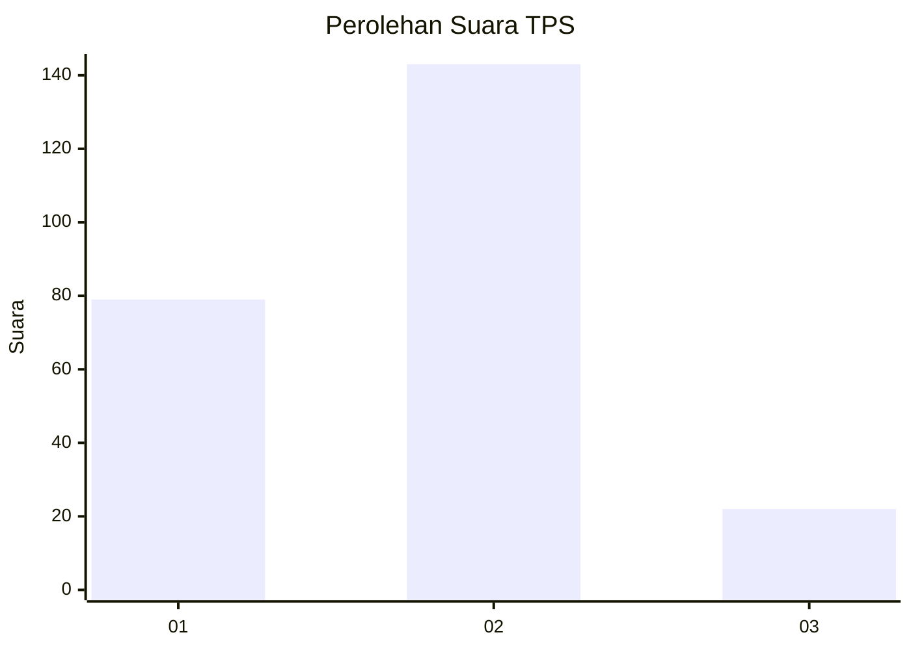
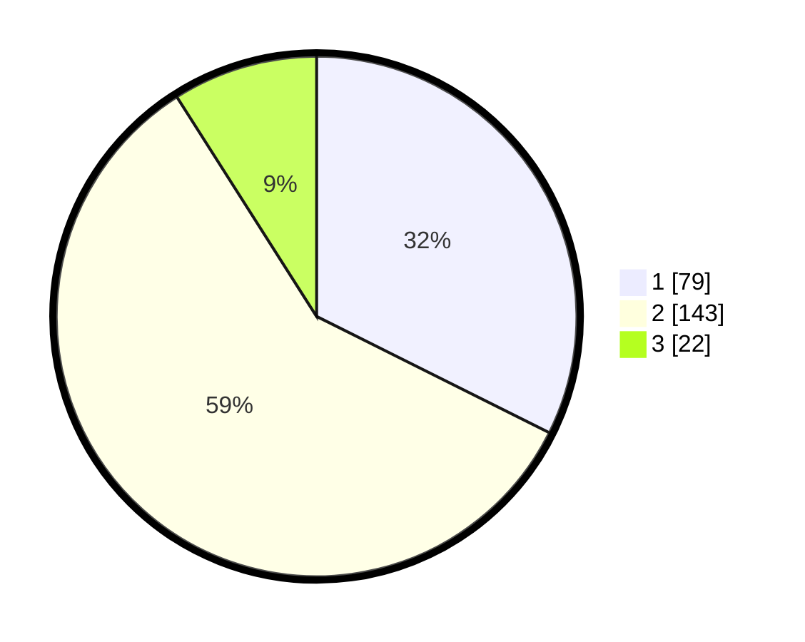

# Hasil

## Grafik

## Tabel

| No. | Nama Paslon    | Suara | Suara (raw) | Persentase |
|:--- |:-------------- | -----:| -----------:| ----------:|
| 1   | ANIES MUHAIMIN | 79    | [79][p-1]   | 32,38      |
| 2   | PRABOWO GIBRAN | 143   | [143][p-2]  | 58,61      |
| 3   | GANJAR MAHFUD  | 22    | [22][p-3]   | 9,02       |

[p-1]: https://github.com/gigit-pemilu/pemilu-2024/blob/main/pilpres/hitung-suara/sub/32-jawa-barat/sub/15-karawang/sub/03-telukjambe-timur/sub/2001-telukjambe/sub/034-tps/sub/paslon-1.txt
[p-2]: https://github.com/gigit-pemilu/pemilu-2024/blob/main/pilpres/hitung-suara/sub/32-jawa-barat/sub/15-karawang/sub/03-telukjambe-timur/sub/2001-telukjambe/sub/034-tps/sub/paslon-2.txt
[p-3]: https://github.com/gigit-pemilu/pemilu-2024/blob/main/pilpres/hitung-suara/sub/32-jawa-barat/sub/15-karawang/sub/03-telukjambe-timur/sub/2001-telukjambe/sub/034-tps/sub/paslon-3.txt

## Foto C Plano

https://sirekap-obj-formc.kpu.go.id/b269/pemilu/ppwp/32/15/03/20/01/3215032001034-20240214-193733--01bb110e-4234-4816-a127-8a04c4b68c78.jpg

https://sirekap-obj-formc.kpu.go.id/b269/pemilu/ppwp/32/15/03/20/01/3215032001034-20240214-193827--de65f33f-15ee-4dd4-af2e-c7f3b96eb4b2.jpg

https://sirekap-obj-formc.kpu.go.id/b269/pemilu/ppwp/32/15/03/20/01/3215032001034-20240214-193929--714b3f14-834b-4a00-9247-532e68b5ceef.jpg

## Metadata

| Key        | Value               |
| ---------- | ------------------- |
| Time Stamp | 2024-02-15 16:30:25 |

