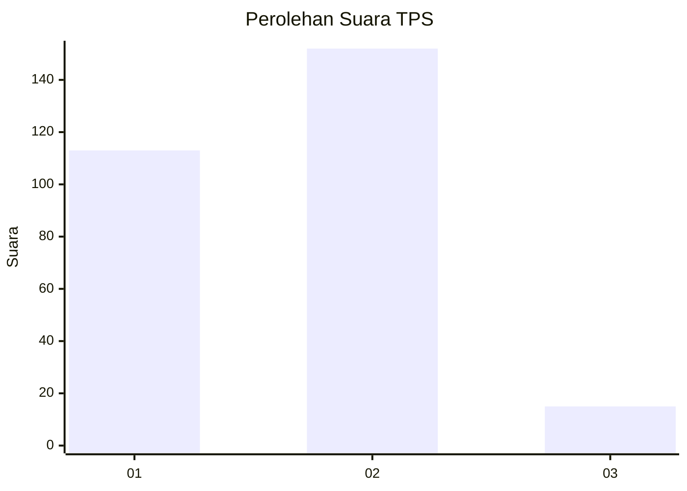
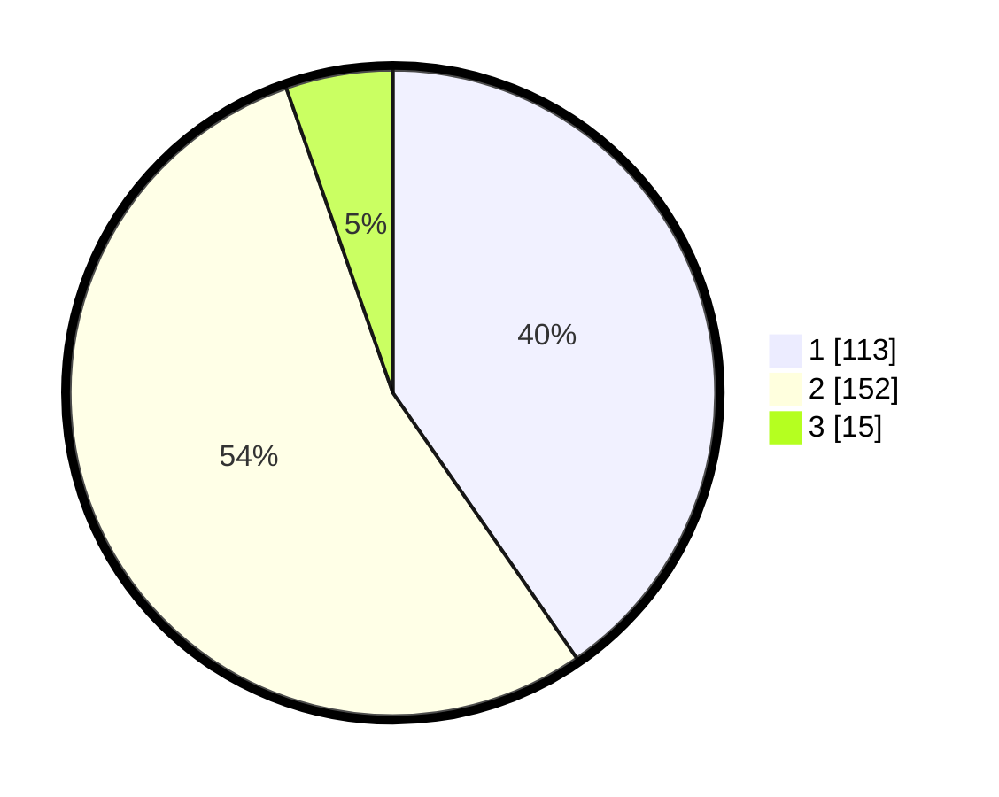

# Hasil

## Grafik

## Tabel

| No. | Nama Paslon    | Suara | Suara (raw) | Persentase |
|:--- |:-------------- | -----:| -----------:| ----------:|
| 1   | ANIES MUHAIMIN | 113   | [113][p-1]  | 40,36      |
| 2   | PRABOWO GIBRAN | 152   | [152][p-2]  | 54,29      |
| 3   | GANJAR MAHFUD  | 15    | [15][p-3]   | 5,36       |

[p-1]: https://github.com/gigit-pemilu/pemilu-2024/blob/main/pilpres/hitung-suara/sub/32-jawa-barat/sub/15-karawang/sub/03-telukjambe-timur/sub/2003-sirnabaya/sub/043-tps/sub/paslon-1.txt
[p-2]: https://github.com/gigit-pemilu/pemilu-2024/blob/main/pilpres/hitung-suara/sub/32-jawa-barat/sub/15-karawang/sub/03-telukjambe-timur/sub/2003-sirnabaya/sub/043-tps/sub/paslon-2.txt
[p-3]: https://github.com/gigit-pemilu/pemilu-2024/blob/main/pilpres/hitung-suara/sub/32-jawa-barat/sub/15-karawang/sub/03-telukjambe-timur/sub/2003-sirnabaya/sub/043-tps/sub/paslon-3.txt

## Foto C Plano

https://sirekap-obj-formc.kpu.go.id/6f7b/pemilu/ppwp/32/15/03/20/03/3215032003043-20240214-222657--6a31aed5-1c51-4c39-843b-661cbeb7d3f9.jpg

https://sirekap-obj-formc.kpu.go.id/6f7b/pemilu/ppwp/32/15/03/20/03/3215032003043-20240214-222723--43000645-6b55-4034-b4d4-dca033db82b7.jpg

https://sirekap-obj-formc.kpu.go.id/6f7b/pemilu/ppwp/32/15/03/20/03/3215032003043-20240214-222756--6fa2bacb-11b9-42bf-ace6-eb8e37739582.jpg

## Metadata

| Key        | Value               |
| ---------- | ------------------- |
| Time Stamp | 2024-02-15 17:00:25 |

