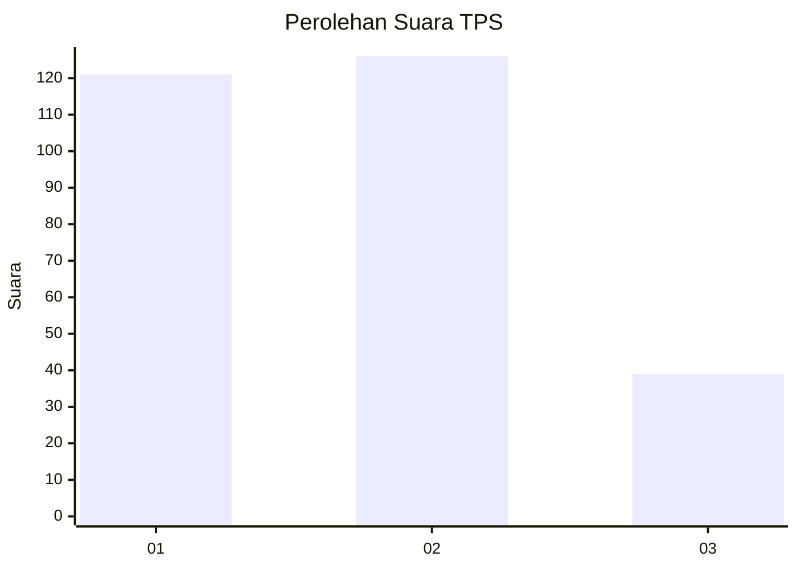
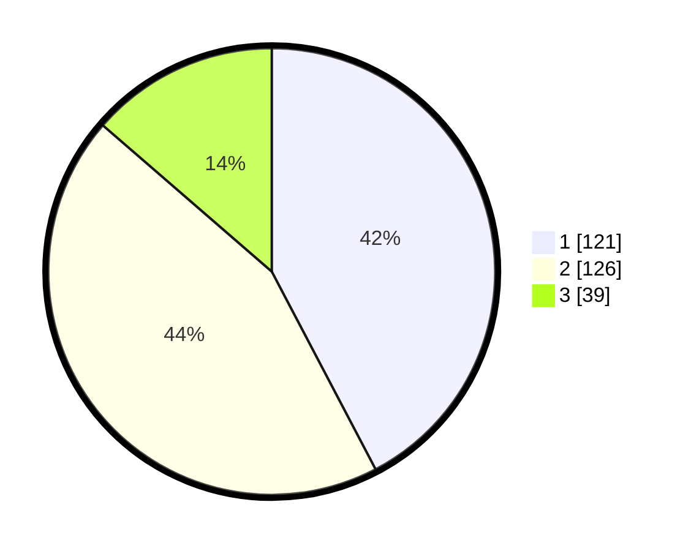

# Hasil

## Grafik

## Tabel

| No. | Nama Paslon    | Suara | Suara (raw) | Persentase |
|:--- |:-------------- | -----:| -----------:| ----------:|
| 1   | ANIES MUHAIMIN | 121   | [121][p-1]  | 42,31      |
| 2   | PRABOWO GIBRAN | 126   | [126][p-2]  | 44,06      |
| 3   | GANJAR MAHFUD  | 39    | [39][p-3]   | 13,64      |

[p-1]: https://github.com/gigit-pemilu/pemilu-2024/blob/main/pilpres/hitung-suara/sub/32-jawa-barat/sub/15-karawang/sub/03-telukjambe-timur/sub/2005-sukaluyu/sub/053-tps/sub/paslon-1.txt
[p-2]: https://github.com/gigit-pemilu/pemilu-2024/blob/main/pilpres/hitung-suara/sub/32-jawa-barat/sub/15-karawang/sub/03-telukjambe-timur/sub/2005-sukaluyu/sub/053-tps/sub/paslon-2.txt
[p-3]: https://github.com/gigit-pemilu/pemilu-2024/blob/main/pilpres/hitung-suara/sub/32-jawa-barat/sub/15-karawang/sub/03-telukjambe-timur/sub/2005-sukaluyu/sub/053-tps/sub/paslon-3.txt

## Foto C Plano

https://sirekap-obj-formc.kpu.go.id/5b12/pemilu/ppwp/32/15/03/20/05/3215032005053-20240214-191658--2785aa8b-1652-4e21-a93b-f699761f31e8.jpg

https://sirekap-obj-formc.kpu.go.id/5b12/pemilu/ppwp/32/15/03/20/05/3215032005053-20240214-191756--6bf3571e-04f4-4d24-b592-c250953c0709.jpg

https://sirekap-obj-formc.kpu.go.id/5b12/pemilu/ppwp/32/15/03/20/05/3215032005053-20240214-191511--037c2e41-e9f5-4ba7-b3a6-9dc46922e703.jpg

## Metadata

| Key        | Value               |
| ---------- | ------------------- |
| Time Stamp | 2024-02-17 11:00:02 |

