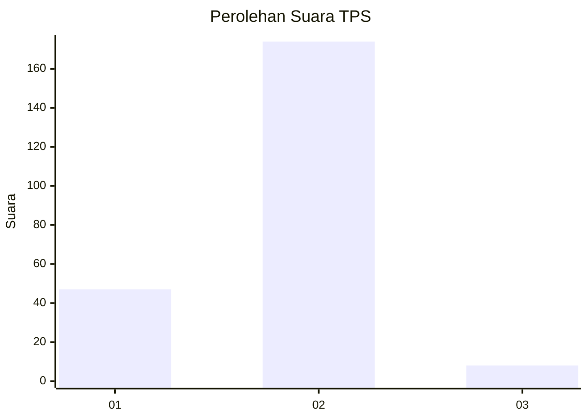

# Hasil

## Grafik

## Tabel

| No. | Nama Paslon    | Suara | Suara (raw) | Persentase |
|:--- |:-------------- | -----:| -----------:| ----------:|
| 1   | ANIES MUHAIMIN | 47    | [47][p-1]   | 20,52      |
| 2   | PRABOWO GIBRAN | 174   | [174][p-2]  | 75,98      |
| 3   | GANJAR MAHFUD  | 8     | [8][p-3]    | 3,49       |

[p-1]: https://github.com/gigit-pemilu/pemilu-2024-32-jawa-barat/blob/main/pilpres/hitung-suara/sub/32-jawa-barat/sub/15-karawang/sub/04-ciampel/sub/2001-kutapohaci/sub/001-tps/sub/paslon-1.txt
[p-2]: https://github.com/gigit-pemilu/pemilu-2024-32-jawa-barat/blob/main/pilpres/hitung-suara/sub/32-jawa-barat/sub/15-karawang/sub/04-ciampel/sub/2001-kutapohaci/sub/001-tps/sub/paslon-2.txt
[p-3]: https://github.com/gigit-pemilu/pemilu-2024-32-jawa-barat/blob/main/pilpres/hitung-suara/sub/32-jawa-barat/sub/15-karawang/sub/04-ciampel/sub/2001-kutapohaci/sub/001-tps/sub/paslon-3.txt

## Foto C Plano

https://sirekap-obj-formc.kpu.go.id/d919/pemilu/ppwp/32/15/04/20/01/3215042001001-20240219-125115--875ec142-c3a6-4ba1-b1c2-2880562253df.jpg

https://sirekap-obj-formc.kpu.go.id/d919/pemilu/ppwp/32/15/04/20/01/3215042001001-20240219-124942--745277e9-a9e7-4699-b9d0-ca946cdc1e0f.jpg

https://sirekap-obj-formc.kpu.go.id/d919/pemilu/ppwp/32/15/04/20/01/3215042001001-20240219-125021--275bdb83-2c1a-4e0f-9b5f-b621d76e088c.jpg

## Metadata

| Key        | Value               |
| ---------- | ------------------- |
| Time Stamp | 2024-02-20 10:00:00 |

