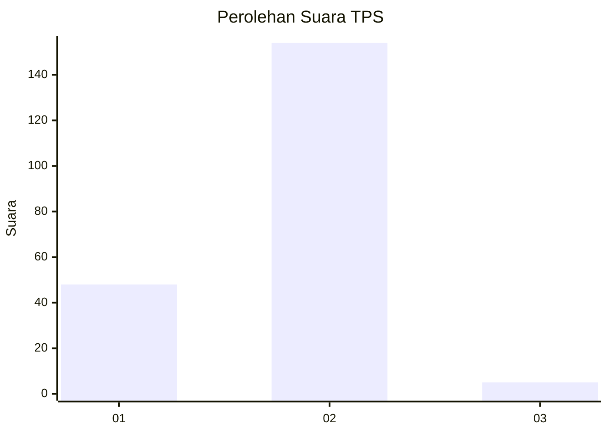
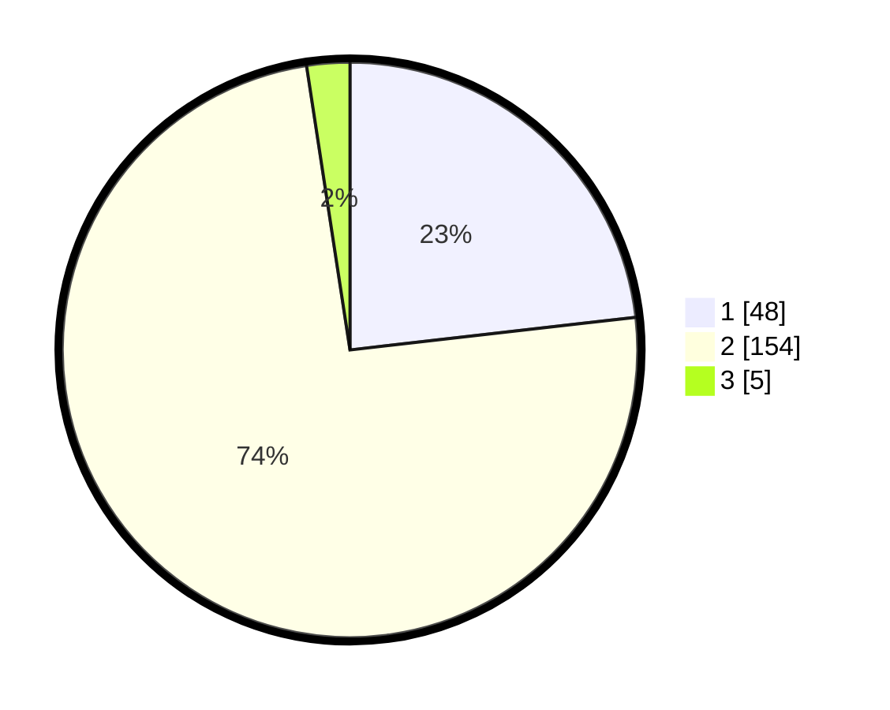

# Hasil

## Grafik

## Tabel

| No. | Nama Paslon    | Suara | Suara (raw) | Persentase |
|:--- |:-------------- | -----:| -----------:| ----------:|
| 1   | ANIES MUHAIMIN | 48    | [48][p-1]   | 23,19      |
| 2   | PRABOWO GIBRAN | 154   | [154][p-2]  | 74,40      |
| 3   | GANJAR MAHFUD  | 5     | [5][p-3]    | 2,42       |

[p-1]: https://github.com/gigit-pemilu/pemilu-2024/blob/main/pilpres/hitung-suara/sub/32-jawa-barat/sub/15-karawang/sub/04-ciampel/sub/2001-kutapohaci/sub/003-tps/sub/paslon-1.txt
[p-2]: https://github.com/gigit-pemilu/pemilu-2024/blob/main/pilpres/hitung-suara/sub/32-jawa-barat/sub/15-karawang/sub/04-ciampel/sub/2001-kutapohaci/sub/003-tps/sub/paslon-2.txt
[p-3]: https://github.com/gigit-pemilu/pemilu-2024/blob/main/pilpres/hitung-suara/sub/32-jawa-barat/sub/15-karawang/sub/04-ciampel/sub/2001-kutapohaci/sub/003-tps/sub/paslon-3.txt

## Foto C Plano

https://sirekap-obj-formc.kpu.go.id/23e6/pemilu/ppwp/32/15/04/20/01/3215042001003-20240219-132111--b6c08501-1d30-47c0-b32a-e154981d41ca.jpg

https://sirekap-obj-formc.kpu.go.id/23e6/pemilu/ppwp/32/15/04/20/01/3215042001003-20240219-132220--aabc4cb3-a170-404c-b76f-f1338fee461c.jpg

https://sirekap-obj-formc.kpu.go.id/23e6/pemilu/ppwp/32/15/04/20/01/3215042001003-20240219-132354--9fa6ab96-ffdb-4300-8403-af794ebf96ab.jpg

## Metadata

| Key        | Value               |
| ---------- | ------------------- |
| Time Stamp | 2024-02-20 11:00:00 |

