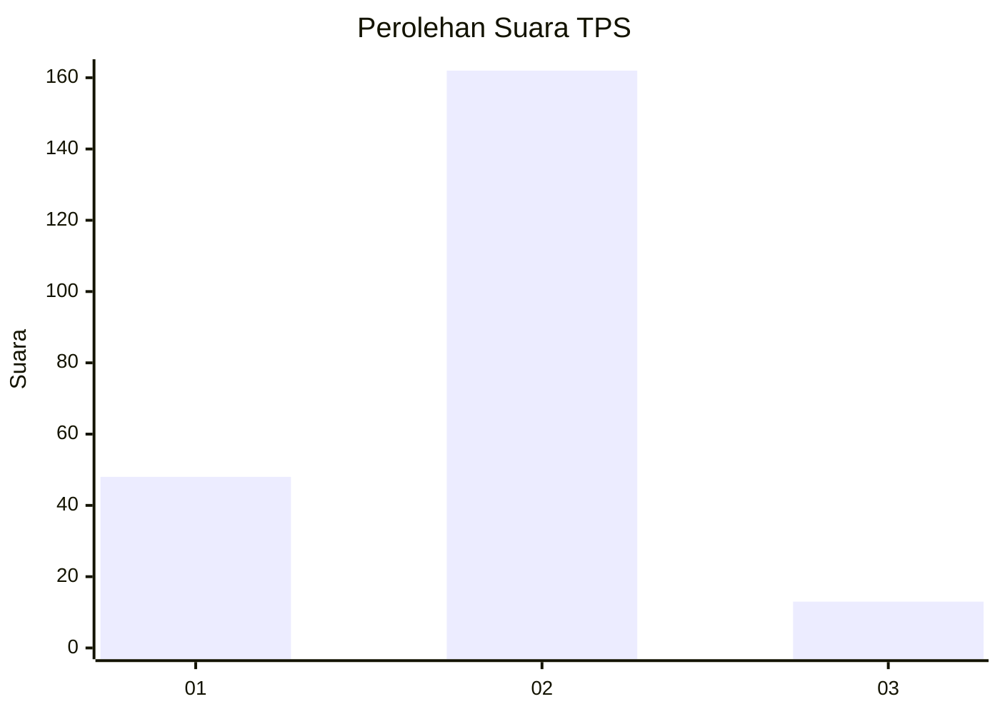

# Hasil

## Grafik

## Tabel

| No. | Nama Paslon    | Suara | Suara (raw) | Persentase |
|:--- |:-------------- | -----:| -----------:| ----------:|
| 1   | ANIES MUHAIMIN | 48    | [48][p-1]   | 21,52      |
| 2   | PRABOWO GIBRAN | 162   | [162][p-2]  | 72,65      |
| 3   | GANJAR MAHFUD  | 13    | [13][p-3]   | 5,83       |

[p-1]: https://github.com/gigit-pemilu/pemilu-2024/blob/main/pilpres/hitung-suara/sub/32-jawa-barat/sub/15-karawang/sub/04-ciampel/sub/2001-kutapohaci/sub/005-tps/sub/paslon-1.txt
[p-2]: https://github.com/gigit-pemilu/pemilu-2024/blob/main/pilpres/hitung-suara/sub/32-jawa-barat/sub/15-karawang/sub/04-ciampel/sub/2001-kutapohaci/sub/005-tps/sub/paslon-2.txt
[p-3]: https://github.com/gigit-pemilu/pemilu-2024/blob/main/pilpres/hitung-suara/sub/32-jawa-barat/sub/15-karawang/sub/04-ciampel/sub/2001-kutapohaci/sub/005-tps/sub/paslon-3.txt

## Foto C Plano

https://sirekap-obj-formc.kpu.go.id/032c/pemilu/ppwp/32/15/04/20/01/3215042001005-20240219-132957--9297249d-bd50-4833-b1f8-a243fe7e9742.jpg

https://sirekap-obj-formc.kpu.go.id/032c/pemilu/ppwp/32/15/04/20/01/3215042001005-20240219-133049--babe52f2-612c-424d-ba09-77571d6e1d2d.jpg

https://sirekap-obj-formc.kpu.go.id/032c/pemilu/ppwp/32/15/04/20/01/3215042001005-20240219-133506--aafc4cbf-7c08-4c01-9ed9-1b045e96fe90.jpg

## Metadata

| Key        | Value               |
| ---------- | ------------------- |
| Time Stamp | 2024-02-20 12:00:00 |

