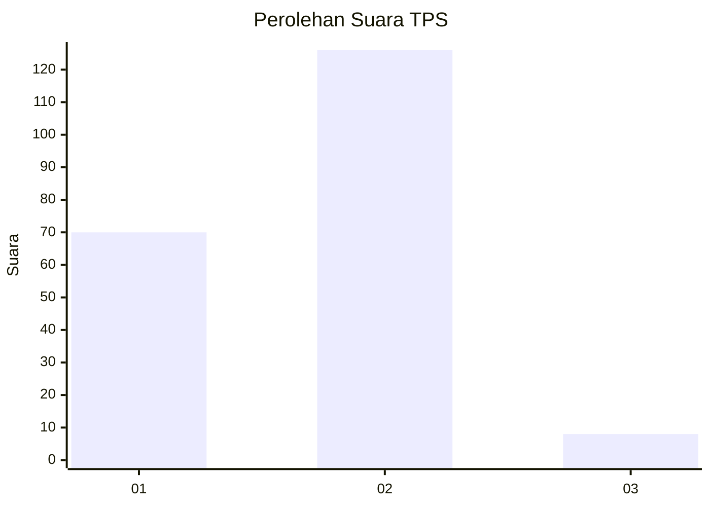
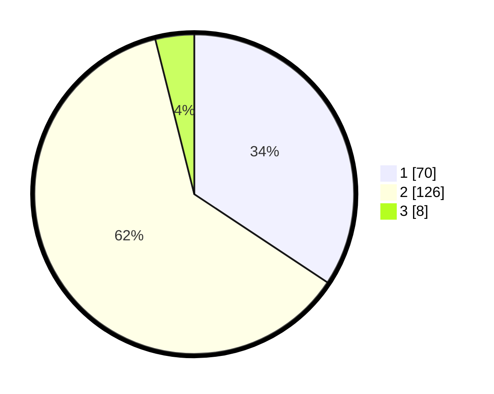

# Hasil

## Grafik

## Tabel

| No. | Nama Paslon    | Suara | Suara (raw) | Persentase |
|:--- |:-------------- | -----:| -----------:| ----------:|
| 1   | ANIES MUHAIMIN | 70    | [70][p-1]   | 34,31      |
| 2   | PRABOWO GIBRAN | 126   | [126][p-2]  | 61,76      |
| 3   | GANJAR MAHFUD  | 8     | [8][p-3]    | 3,92       |

[p-1]: https://github.com/gigit-pemilu/pemilu-2024/blob/main/pilpres/hitung-suara/sub/32-jawa-barat/sub/15-karawang/sub/04-ciampel/sub/2001-kutapohaci/sub/006-tps/sub/paslon-1.txt
[p-2]: https://github.com/gigit-pemilu/pemilu-2024/blob/main/pilpres/hitung-suara/sub/32-jawa-barat/sub/15-karawang/sub/04-ciampel/sub/2001-kutapohaci/sub/006-tps/sub/paslon-2.txt
[p-3]: https://github.com/gigit-pemilu/pemilu-2024/blob/main/pilpres/hitung-suara/sub/32-jawa-barat/sub/15-karawang/sub/04-ciampel/sub/2001-kutapohaci/sub/006-tps/sub/paslon-3.txt

## Foto C Plano

https://sirekap-obj-formc.kpu.go.id/732b/pemilu/ppwp/32/15/04/20/01/3215042001006-20240219-134008--19dfa7a9-beef-4e4e-9f9d-120c9b16eeed.jpg

https://sirekap-obj-formc.kpu.go.id/732b/pemilu/ppwp/32/15/04/20/01/3215042001006-20240219-134536--ab9002ba-3e3d-4358-95a2-df191d336b31.jpg

https://sirekap-obj-formc.kpu.go.id/732b/pemilu/ppwp/32/15/04/20/01/3215042001006-20240214-214508--9bbdbb9d-6696-46d0-9b96-cb9a60315740.jpg

## Metadata

| Key        | Value               |
| ---------- | ------------------- |
| Time Stamp | 2024-02-20 12:00:00 |

