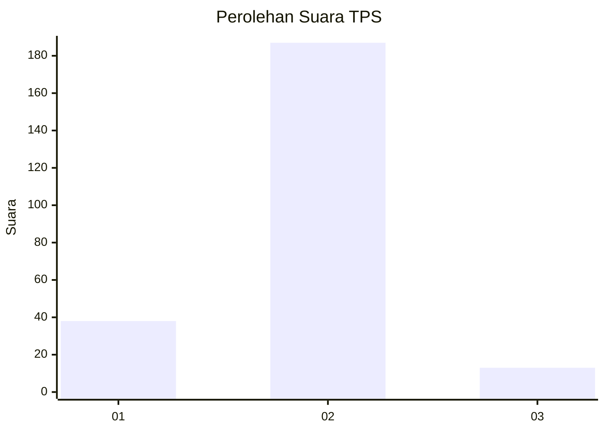
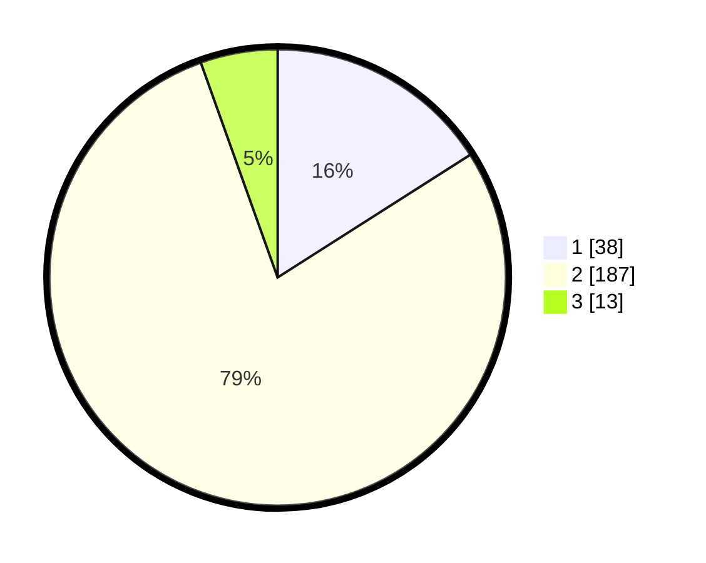

# Hasil

## Grafik

## Tabel

| No. | Nama Paslon    | Suara | Suara (raw) | Persentase |
|:--- |:-------------- | -----:| -----------:| ----------:|
| 1   | ANIES MUHAIMIN | 38    | [38][p-1]   | 15,97      |
| 2   | PRABOWO GIBRAN | 187   | [187][p-2]  | 78,57      |
| 3   | GANJAR MAHFUD  | 13    | [13][p-3]   | 5,46       |

[p-1]: https://github.com/gigit-pemilu/pemilu-2024-32-jawa-barat/blob/main/pilpres/hitung-suara/sub/32-jawa-barat/sub/15-karawang/sub/04-ciampel/sub/2001-kutapohaci/sub/007-tps/sub/paslon-1.txt
[p-2]: https://github.com/gigit-pemilu/pemilu-2024-32-jawa-barat/blob/main/pilpres/hitung-suara/sub/32-jawa-barat/sub/15-karawang/sub/04-ciampel/sub/2001-kutapohaci/sub/007-tps/sub/paslon-2.txt
[p-3]: https://github.com/gigit-pemilu/pemilu-2024-32-jawa-barat/blob/main/pilpres/hitung-suara/sub/32-jawa-barat/sub/15-karawang/sub/04-ciampel/sub/2001-kutapohaci/sub/007-tps/sub/paslon-3.txt

## Foto C Plano

https://sirekap-obj-formc.kpu.go.id/6de1/pemilu/ppwp/32/15/04/20/01/3215042001007-20240219-135000--155ba740-8e0b-46c4-902b-379d5d53d4d4.jpg

https://sirekap-obj-formc.kpu.go.id/6de1/pemilu/ppwp/32/15/04/20/01/3215042001007-20240219-135143--9f731d2c-10cb-4a58-8195-7e0d5c66267e.jpg

https://sirekap-obj-formc.kpu.go.id/6de1/pemilu/ppwp/32/15/04/20/01/3215042001007-20240219-135331--96fca5e0-7590-44d3-9014-c133a82e3af2.jpg

## Metadata

| Key        | Value               |
| ---------- | ------------------- |
| Time Stamp | 2024-02-20 12:00:00 |

