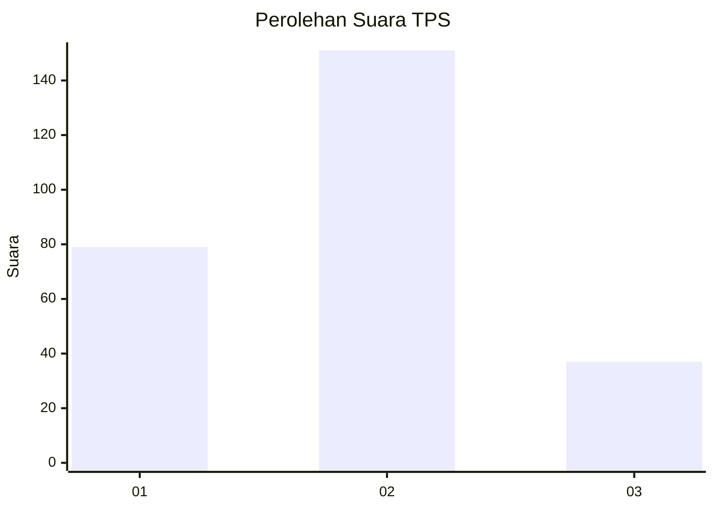
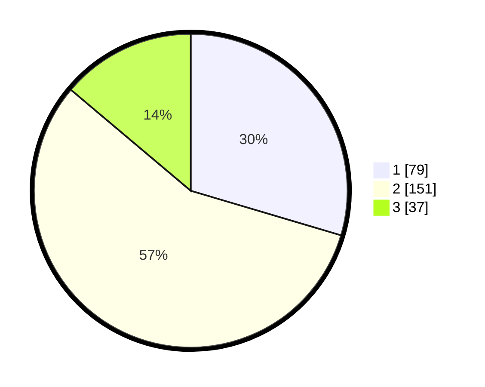

# Hasil

## Grafik

## Tabel

| No. | Nama Paslon    | Suara | Suara (raw) | Persentase |
|:--- |:-------------- | -----:| -----------:| ----------:|
| 1   | ANIES MUHAIMIN | 79    | [79][p-1]   | 29,59      |
| 2   | PRABOWO GIBRAN | 151   | [151][p-2]  | 56,55      |
| 3   | GANJAR MAHFUD  | 37    | [37][p-3]   | 13,86      |

[p-1]: https://github.com/gigit-pemilu/pemilu-2024-32-jawa-barat/blob/main/pilpres/hitung-suara/sub/32-jawa-barat/sub/15-karawang/sub/04-ciampel/sub/2003-parungmulya/sub/014-tps/sub/paslon-1.txt
[p-2]: https://github.com/gigit-pemilu/pemilu-2024-32-jawa-barat/blob/main/pilpres/hitung-suara/sub/32-jawa-barat/sub/15-karawang/sub/04-ciampel/sub/2003-parungmulya/sub/014-tps/sub/paslon-2.txt
[p-3]: https://github.com/gigit-pemilu/pemilu-2024-32-jawa-barat/blob/main/pilpres/hitung-suara/sub/32-jawa-barat/sub/15-karawang/sub/04-ciampel/sub/2003-parungmulya/sub/014-tps/sub/paslon-3.txt

## Foto C Plano

https://sirekap-obj-formc.kpu.go.id/6e28/pemilu/ppwp/32/15/04/20/03/3215042003014-20240215-020736--33c2346d-4a92-473f-961c-d6fda3501b2d.jpg

https://sirekap-obj-formc.kpu.go.id/6e28/pemilu/ppwp/32/15/04/20/03/3215042003014-20240214-222221--3742cce7-497e-4491-96d3-158de5c69e84.jpg

https://sirekap-obj-formc.kpu.go.id/6e28/pemilu/ppwp/32/15/04/20/03/3215042003014-20240214-221924--dbfa6477-4b14-4d4c-bdc3-9eaf3174c20b.jpg

## Metadata

| Key        | Value               |
| ---------- | ------------------- |
| Time Stamp | 2024-02-16 16:25:10 |

