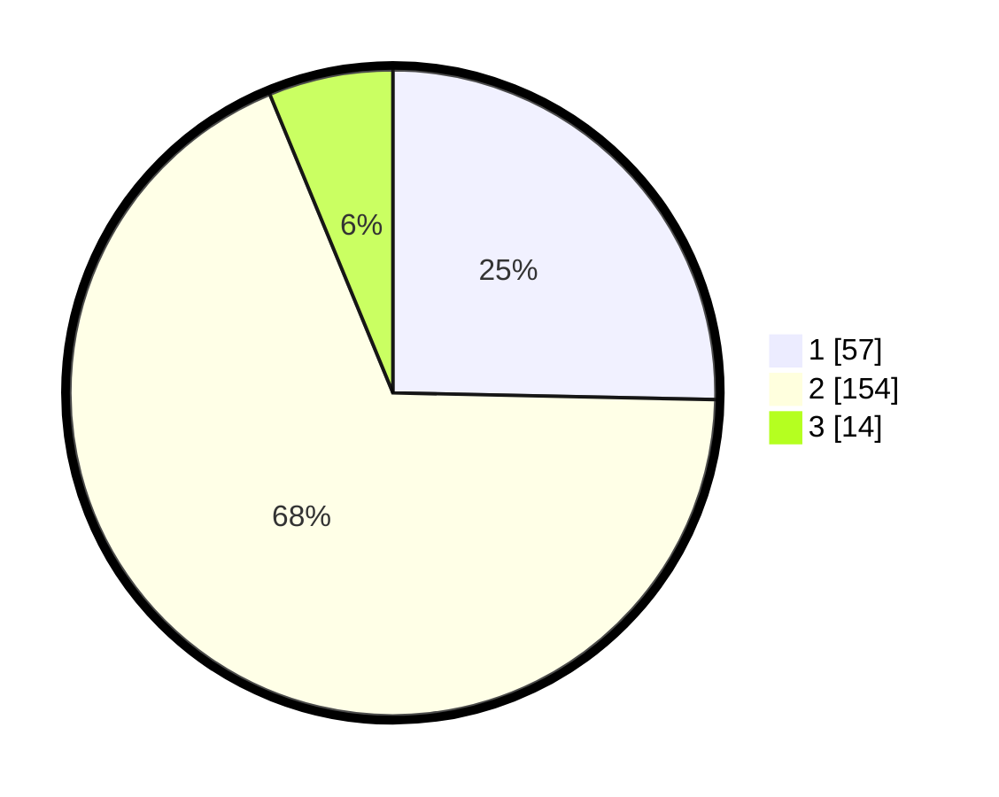

# Hasil

## Grafik

## Tabel

| No. | Nama Paslon    | Suara | Suara (raw) | Persentase |
|:--- |:-------------- | -----:| -----------:| ----------:|
| 1   | ANIES MUHAIMIN | 57    | [57][p-1]   | 25,33      |
| 2   | PRABOWO GIBRAN | 154   | [154][p-2]  | 68,44      |
| 3   | GANJAR MAHFUD  | 14    | [14][p-3]   | 6,22       |

[p-1]: https://github.com/gigit-pemilu/pemilu-2024/blob/main/pilpres/hitung-suara/sub/32-jawa-barat/sub/15-karawang/sub/05-klari/sub/2001-duren/sub/002-tps/sub/paslon-1.txt
[p-2]: https://github.com/gigit-pemilu/pemilu-2024/blob/main/pilpres/hitung-suara/sub/32-jawa-barat/sub/15-karawang/sub/05-klari/sub/2001-duren/sub/002-tps/sub/paslon-2.txt
[p-3]: https://github.com/gigit-pemilu/pemilu-2024/blob/main/pilpres/hitung-suara/sub/32-jawa-barat/sub/15-karawang/sub/05-klari/sub/2001-duren/sub/002-tps/sub/paslon-3.txt

## Foto C Plano

https://sirekap-obj-formc.kpu.go.id/0738/pemilu/ppwp/32/15/05/20/01/3215052001002-20240214-155820--1a285bee-7305-49e5-96f8-6987c25da31c.jpg

https://sirekap-obj-formc.kpu.go.id/0738/pemilu/ppwp/32/15/05/20/01/3215052001002-20240214-155110--f9434f67-0fdc-4b0b-8a09-b9b6abcb35c2.jpg

https://sirekap-obj-formc.kpu.go.id/0738/pemilu/ppwp/32/15/05/20/01/3215052001002-20240214-155637--dfa600e8-a54c-4e65-afbc-b8956467ca96.jpg

## Metadata

| Key        | Value               |
| ---------- | ------------------- |
| Time Stamp | 2024-02-16 12:51:22 |

