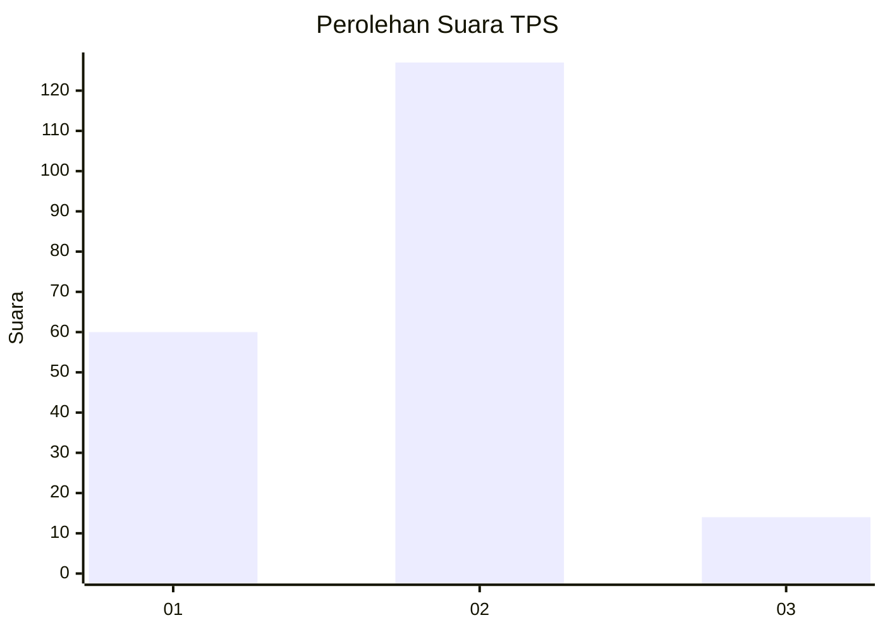
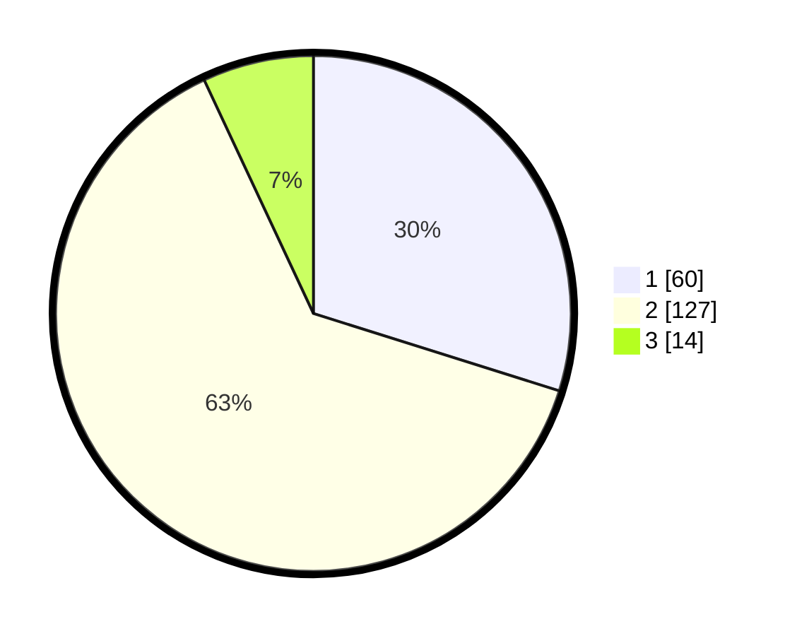

# Hasil

## Grafik

## Tabel

| No. | Nama Paslon    | Suara | Suara (raw) | Persentase |
|:--- |:-------------- | -----:| -----------:| ----------:|
| 1   | ANIES MUHAIMIN | 60    | [60][p-1]   | 29,85      |
| 2   | PRABOWO GIBRAN | 127   | [127][p-2]  | 63,18      |
| 3   | GANJAR MAHFUD  | 14    | [14][p-3]   | 6,97       |

[p-1]: https://github.com/gigit-pemilu/pemilu-2024-32-jawa-barat/blob/main/pilpres/hitung-suara/sub/32-jawa-barat/sub/15-karawang/sub/05-klari/sub/2001-duren/sub/005-tps/sub/paslon-1.txt
[p-2]: https://github.com/gigit-pemilu/pemilu-2024-32-jawa-barat/blob/main/pilpres/hitung-suara/sub/32-jawa-barat/sub/15-karawang/sub/05-klari/sub/2001-duren/sub/005-tps/sub/paslon-2.txt
[p-3]: https://github.com/gigit-pemilu/pemilu-2024-32-jawa-barat/blob/main/pilpres/hitung-suara/sub/32-jawa-barat/sub/15-karawang/sub/05-klari/sub/2001-duren/sub/005-tps/sub/paslon-3.txt

## Foto C Plano

https://sirekap-obj-formc.kpu.go.id/e866/pemilu/ppwp/32/15/05/20/01/3215052001005-20240215-012232--ca295f87-3a40-4952-8cf8-cb5cde8bdf82.jpg

https://sirekap-obj-formc.kpu.go.id/e866/pemilu/ppwp/32/15/05/20/01/3215052001005-20240215-012327--cfcb3b81-7dee-4770-8194-c7dbd691ae7c.jpg

https://sirekap-obj-formc.kpu.go.id/e866/pemilu/ppwp/32/15/05/20/01/3215052001005-20240215-012414--21479713-856d-4f8b-a500-7ec90edc5f3a.jpg

## Metadata

| Key        | Value               |
| ---------- | ------------------- |
| Time Stamp | 2024-02-16 12:51:22 |

