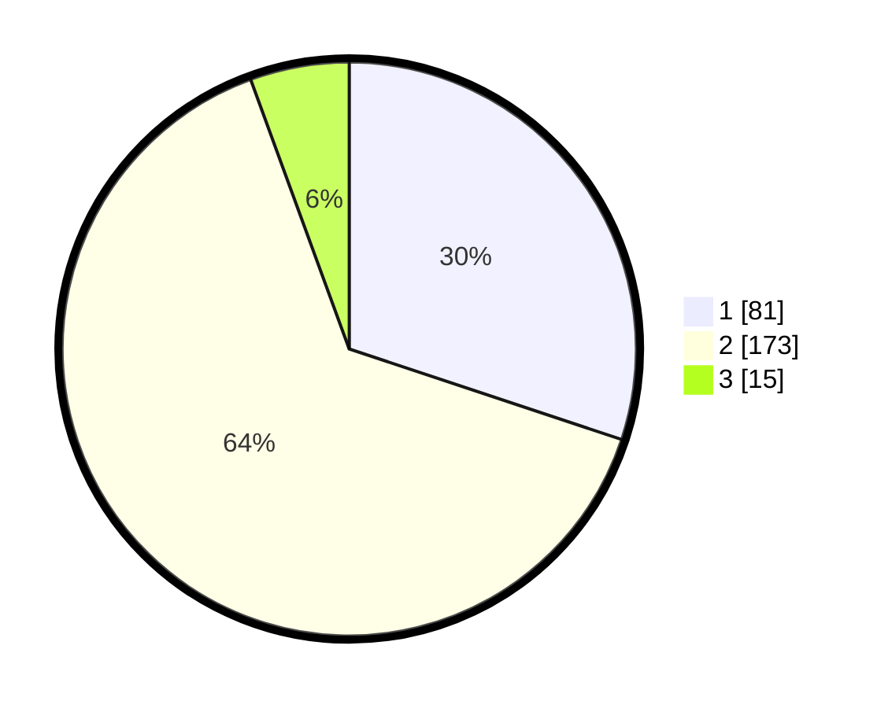

# Hasil

## Grafik

## Tabel

| No. | Nama Paslon    | Suara | Suara (raw) | Persentase |
|:--- |:-------------- | -----:| -----------:| ----------:|
| 1   | ANIES MUHAIMIN | 81    | [81][p-1]   | 30,11      |
| 2   | PRABOWO GIBRAN | 173   | [173][p-2]  | 64,31      |
| 3   | GANJAR MAHFUD  | 15    | [15][p-3]   | 5,58       |

[p-1]: https://github.com/gigit-pemilu/pemilu-2024-32-jawa-barat/blob/main/pilpres/hitung-suara/sub/32-jawa-barat/sub/15-karawang/sub/05-klari/sub/2006-cibalongsari/sub/027-tps/sub/paslon-1.txt
[p-2]: https://github.com/gigit-pemilu/pemilu-2024-32-jawa-barat/blob/main/pilpres/hitung-suara/sub/32-jawa-barat/sub/15-karawang/sub/05-klari/sub/2006-cibalongsari/sub/027-tps/sub/paslon-2.txt
[p-3]: https://github.com/gigit-pemilu/pemilu-2024-32-jawa-barat/blob/main/pilpres/hitung-suara/sub/32-jawa-barat/sub/15-karawang/sub/05-klari/sub/2006-cibalongsari/sub/027-tps/sub/paslon-3.txt

## Foto C Plano

https://sirekap-obj-formc.kpu.go.id/d95f/pemilu/ppwp/32/15/05/20/06/3215052006027-20240214-194750--ad85a082-0eb8-4f3b-acf5-f003438929a6.jpg

https://sirekap-obj-formc.kpu.go.id/d95f/pemilu/ppwp/32/15/05/20/06/3215052006027-20240214-194819--5c58eea5-1bb8-46c7-a7e1-04c7f5ca12dc.jpg

https://sirekap-obj-formc.kpu.go.id/d95f/pemilu/ppwp/32/15/05/20/06/3215052006027-20240214-194844--68e500f9-59d4-4c88-b8a6-d89aec761de9.jpg

## Metadata

| Key        | Value               |
| ---------- | ------------------- |
| Time Stamp | 2024-02-16 17:30:00 |

