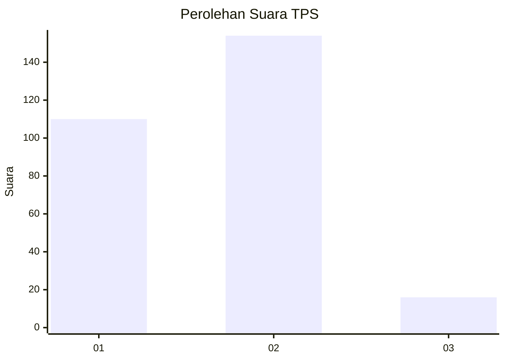
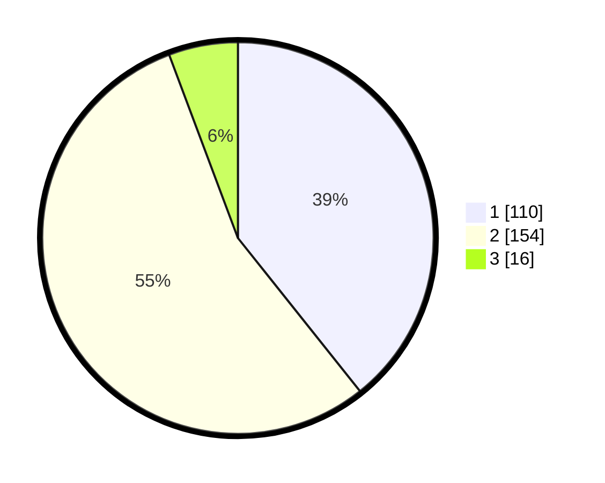

# Hasil

## Grafik

## Tabel

| No. | Nama Paslon    | Suara | Suara (raw) | Persentase |
|:--- |:-------------- | -----:| -----------:| ----------:|
| 1   | ANIES MUHAIMIN | 110   | [110][p-1]  | 39,29      |
| 2   | PRABOWO GIBRAN | 154   | [154][p-2]  | 55,00      |
| 3   | GANJAR MAHFUD  | 16    | [16][p-3]   | 5,71       |

[p-1]: https://github.com/gigit-pemilu/pemilu-2024/blob/main/pilpres/hitung-suara/sub/32-jawa-barat/sub/15-karawang/sub/05-klari/sub/2006-cibalongsari/sub/028-tps/sub/paslon-1.txt
[p-2]: https://github.com/gigit-pemilu/pemilu-2024/blob/main/pilpres/hitung-suara/sub/32-jawa-barat/sub/15-karawang/sub/05-klari/sub/2006-cibalongsari/sub/028-tps/sub/paslon-2.txt
[p-3]: https://github.com/gigit-pemilu/pemilu-2024/blob/main/pilpres/hitung-suara/sub/32-jawa-barat/sub/15-karawang/sub/05-klari/sub/2006-cibalongsari/sub/028-tps/sub/paslon-3.txt

## Foto C Plano

https://sirekap-obj-formc.kpu.go.id/7d8a/pemilu/ppwp/32/15/05/20/06/3215052006028-20240214-221404--4ee2df2a-31b7-4811-857e-4b974df7c42f.jpg

https://sirekap-obj-formc.kpu.go.id/7d8a/pemilu/ppwp/32/15/05/20/06/3215052006028-20240214-221532--4a1eafb0-3a3a-4a5f-bcf6-b973dc3e7027.jpg

https://sirekap-obj-formc.kpu.go.id/7d8a/pemilu/ppwp/32/15/05/20/06/3215052006028-20240214-221645--39d7366d-6cfc-4e26-9777-c26866b37f12.jpg

## Metadata

| Key        | Value               |
| ---------- | ------------------- |
| Time Stamp | 2024-02-17 11:30:03 |

