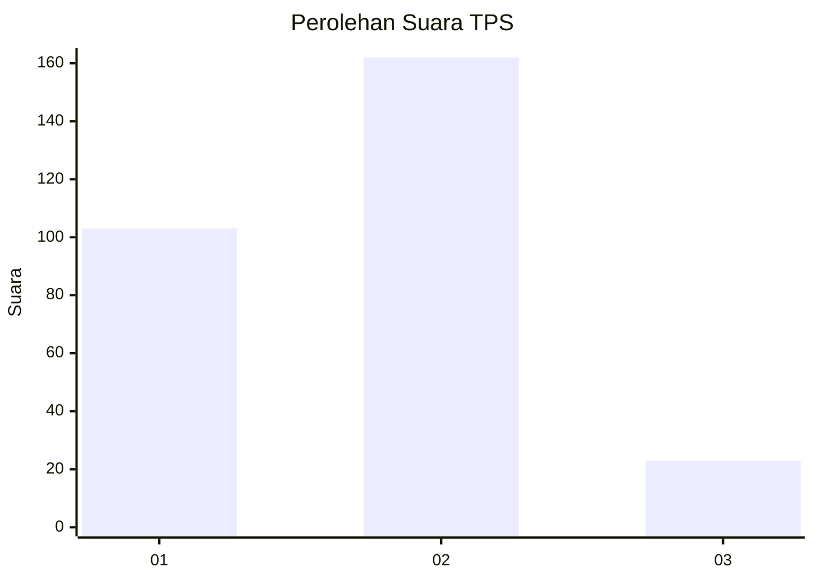

# Hasil

## Grafik

## Tabel

| No. | Nama Paslon    | Suara | Suara (raw) | Persentase |
|:--- |:-------------- | -----:| -----------:| ----------:|
| 1   | ANIES MUHAIMIN | 103   | [103][p-1]  | 35,76      |
| 2   | PRABOWO GIBRAN | 162   | [162][p-2]  | 56,25      |
| 3   | GANJAR MAHFUD  | 23    | [23][p-3]   | 7,99       |

[p-1]: https://github.com/gigit-pemilu/pemilu-2024/blob/main/pilpres/hitung-suara/sub/32-jawa-barat/sub/15-karawang/sub/05-klari/sub/2007-klari/sub/020-tps/sub/paslon-1.txt
[p-2]: https://github.com/gigit-pemilu/pemilu-2024/blob/main/pilpres/hitung-suara/sub/32-jawa-barat/sub/15-karawang/sub/05-klari/sub/2007-klari/sub/020-tps/sub/paslon-2.txt
[p-3]: https://github.com/gigit-pemilu/pemilu-2024/blob/main/pilpres/hitung-suara/sub/32-jawa-barat/sub/15-karawang/sub/05-klari/sub/2007-klari/sub/020-tps/sub/paslon-3.txt

## Foto C Plano

https://sirekap-obj-formc.kpu.go.id/a9da/pemilu/ppwp/32/15/05/20/07/3215052007020-20240215-080359--6191ec2a-045c-4496-baa3-18843856b614.jpg

https://sirekap-obj-formc.kpu.go.id/a9da/pemilu/ppwp/32/15/05/20/07/3215052007020-20240215-080443--8db2a4af-608e-4dbf-90ba-5778c14a984d.jpg

https://sirekap-obj-formc.kpu.go.id/a9da/pemilu/ppwp/32/15/05/20/07/3215052007020-20240215-080520--25ca1fbc-a07e-4e06-806f-a069cc118683.jpg

## Metadata

| Key        | Value               |
| ---------- | ------------------- |
| Time Stamp | 2024-02-16 17:00:00 |

