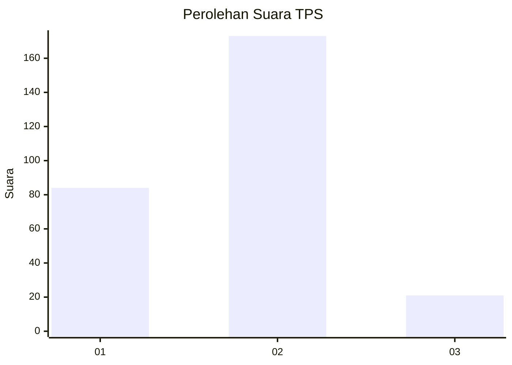
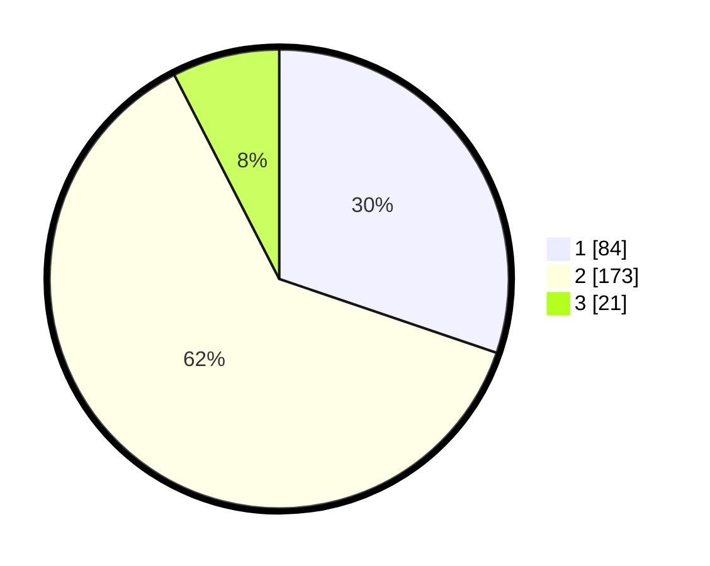

# Hasil

## Grafik

## Tabel

| No. | Nama Paslon    | Suara | Suara (raw) | Persentase |
|:--- |:-------------- | -----:| -----------:| ----------:|
| 1   | ANIES MUHAIMIN | 84    | [84][p-1]   | 30,22      |
| 2   | PRABOWO GIBRAN | 173   | [173][p-2]  | 62,23      |
| 3   | GANJAR MAHFUD  | 21    | [21][p-3]   | 7,55       |

[p-1]: https://github.com/gigit-pemilu/pemilu-2024/blob/main/pilpres/hitung-suara/sub/32-jawa-barat/sub/15-karawang/sub/05-klari/sub/2008-belendung/sub/025-tps/sub/paslon-1.txt
[p-2]: https://github.com/gigit-pemilu/pemilu-2024/blob/main/pilpres/hitung-suara/sub/32-jawa-barat/sub/15-karawang/sub/05-klari/sub/2008-belendung/sub/025-tps/sub/paslon-2.txt
[p-3]: https://github.com/gigit-pemilu/pemilu-2024/blob/main/pilpres/hitung-suara/sub/32-jawa-barat/sub/15-karawang/sub/05-klari/sub/2008-belendung/sub/025-tps/sub/paslon-3.txt

## Foto C Plano

https://sirekap-obj-formc.kpu.go.id/7968/pemilu/ppwp/32/15/05/20/08/3215052008025-20240214-193932--3282b5b8-6c6c-4e5b-b69f-bac02f678a1e.jpg

https://sirekap-obj-formc.kpu.go.id/7968/pemilu/ppwp/32/15/05/20/08/3215052008025-20240214-194026--84581193-b16f-4d11-948d-0ee5bcc8f130.jpg

https://sirekap-obj-formc.kpu.go.id/7968/pemilu/ppwp/32/15/05/20/08/3215052008025-20240214-210213--b33d0e1e-9f26-41aa-ae7f-ad87a56fc61d.jpg

## Metadata

| Key        | Value               |
| ---------- | ------------------- |
| Time Stamp | 2024-02-17 14:45:18 |

