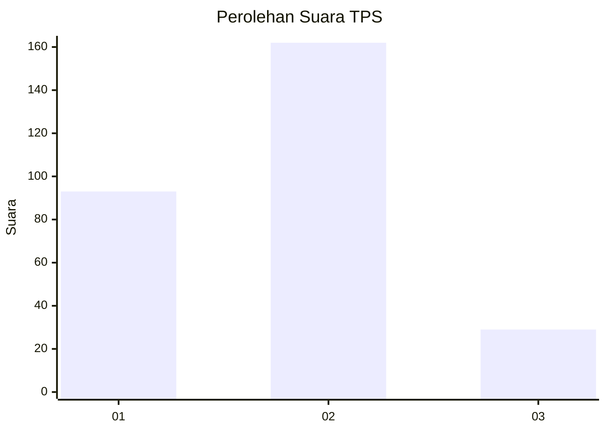
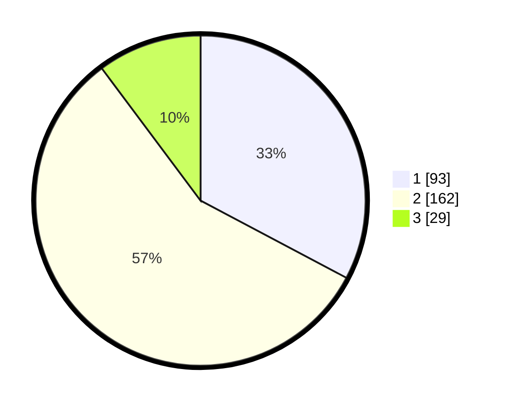

# Hasil

## Grafik

## Tabel

| No. | Nama Paslon    | Suara | Suara (raw) | Persentase |
|:--- |:-------------- | -----:| -----------:| ----------:|
| 1   | ANIES MUHAIMIN | 93    | [93][p-1]   | 32,75      |
| 2   | PRABOWO GIBRAN | 162   | [162][p-2]  | 57,04      |
| 3   | GANJAR MAHFUD  | 29    | [29][p-3]   | 10,21      |

[p-1]: https://github.com/gigit-pemilu/pemilu-2024-32-jawa-barat/blob/main/pilpres/hitung-suara/sub/32-jawa-barat/sub/15-karawang/sub/05-klari/sub/2017-gintungkerta/sub/048-tps/sub/paslon-1.txt
[p-2]: https://github.com/gigit-pemilu/pemilu-2024-32-jawa-barat/blob/main/pilpres/hitung-suara/sub/32-jawa-barat/sub/15-karawang/sub/05-klari/sub/2017-gintungkerta/sub/048-tps/sub/paslon-2.txt
[p-3]: https://github.com/gigit-pemilu/pemilu-2024-32-jawa-barat/blob/main/pilpres/hitung-suara/sub/32-jawa-barat/sub/15-karawang/sub/05-klari/sub/2017-gintungkerta/sub/048-tps/sub/paslon-3.txt

## Foto C Plano

https://sirekap-obj-formc.kpu.go.id/1f10/pemilu/ppwp/32/15/05/20/17/3215052017048-20240214-215710--2fcc15ad-ad95-4fc4-a49d-5dce6723dae8.jpg

https://sirekap-obj-formc.kpu.go.id/1f10/pemilu/ppwp/32/15/05/20/17/3215052017048-20240214-215715--547eaa8f-fc09-4f0b-8daf-3c93c7af5718.jpg

https://sirekap-obj-formc.kpu.go.id/1f10/pemilu/ppwp/32/15/05/20/17/3215052017048-20240214-215720--c6187d9d-b05a-4e54-aa8f-a990bbfc3897.jpg

## Metadata

| Key        | Value               |
| ---------- | ------------------- |
| Time Stamp | 2024-02-17 13:37:34 |

