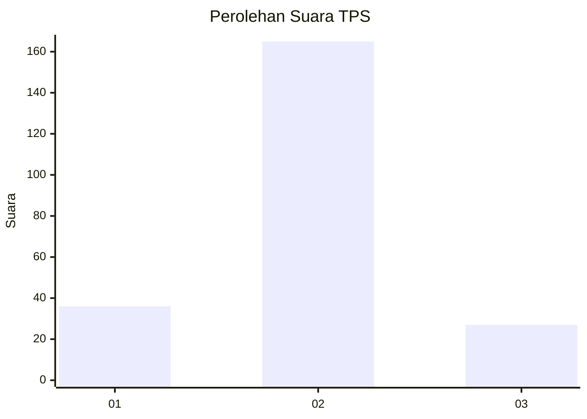
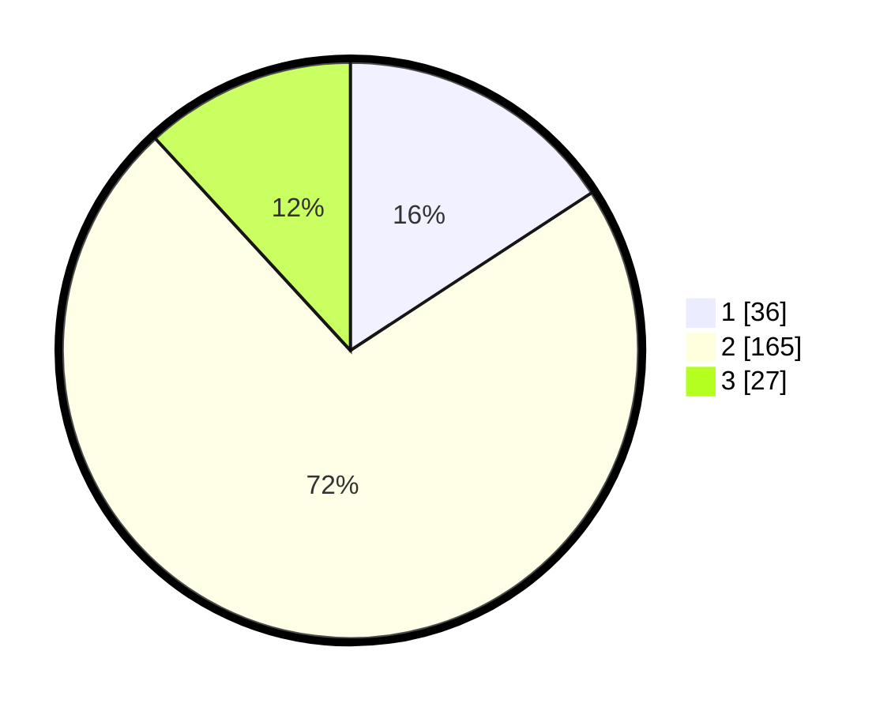

# Hasil

## Grafik

## Tabel

| No. | Nama Paslon    | Suara | Suara (raw) | Persentase |
|:--- |:-------------- | -----:| -----------:| ----------:|
| 1   | ANIES MUHAIMIN | 36    | [36][p-1]   | 15,79      |
| 2   | PRABOWO GIBRAN | 165   | [165][p-2]  | 72,37      |
| 3   | GANJAR MAHFUD  | 27    | [27][p-3]   | 11,84      |

[p-1]: https://github.com/gigit-pemilu/pemilu-2024/blob/main/pilpres/hitung-suara/sub/32-jawa-barat/sub/15-karawang/sub/06-rengasdengklok/sub/2001-rengasdengklok-selatan/sub/001-tps/sub/paslon-1.txt
[p-2]: https://github.com/gigit-pemilu/pemilu-2024/blob/main/pilpres/hitung-suara/sub/32-jawa-barat/sub/15-karawang/sub/06-rengasdengklok/sub/2001-rengasdengklok-selatan/sub/001-tps/sub/paslon-2.txt
[p-3]: https://github.com/gigit-pemilu/pemilu-2024/blob/main/pilpres/hitung-suara/sub/32-jawa-barat/sub/15-karawang/sub/06-rengasdengklok/sub/2001-rengasdengklok-selatan/sub/001-tps/sub/paslon-3.txt

## Foto C Plano

https://sirekap-obj-formc.kpu.go.id/b297/pemilu/ppwp/32/15/06/20/01/3215062001001-20240222-145432--cb8552ef-f9b1-4ca8-b4a2-d55546f72963.jpg

https://sirekap-obj-formc.kpu.go.id/b297/pemilu/ppwp/32/15/06/20/01/3215062001001-20240222-145758--5b9ea68d-88fa-4a72-9c08-c93999eccce7.jpg

https://sirekap-obj-formc.kpu.go.id/b297/pemilu/ppwp/32/15/06/20/01/3215062001001-20240222-145920--f94e1596-160e-4801-85e7-3c73181ee75d.jpg

## Metadata

| Key        | Value               |
| ---------- | ------------------- |
| Time Stamp | 2024-02-25 14:00:00 |

