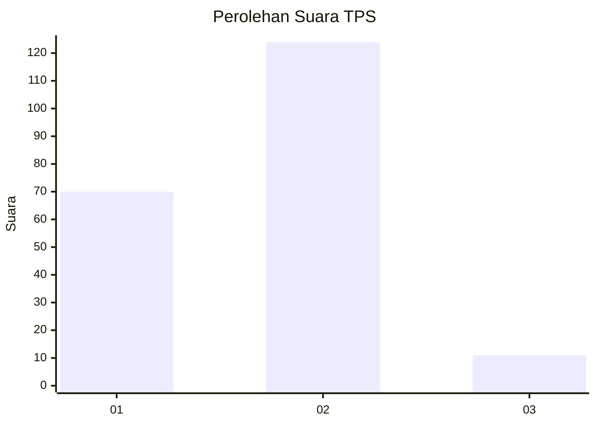
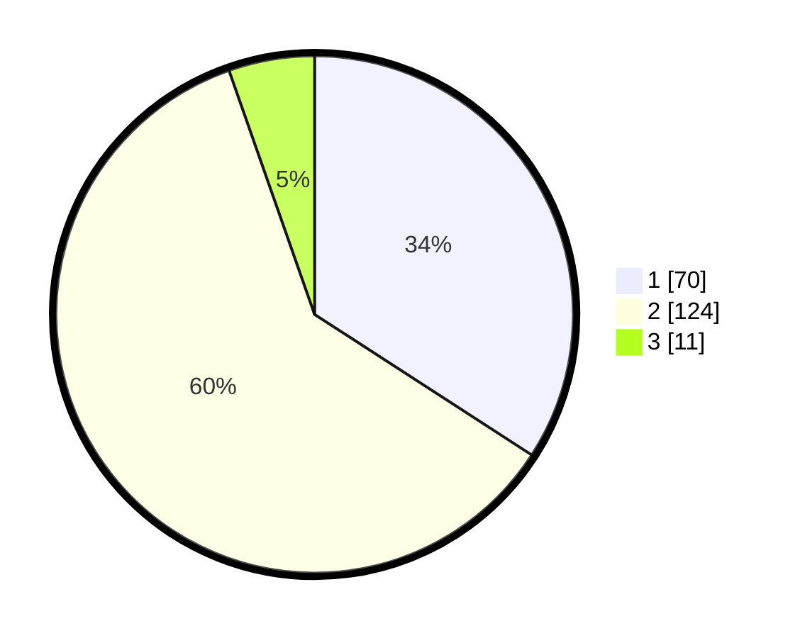

# Hasil

## Grafik

## Tabel

| No. | Nama Paslon    | Suara | Suara (raw) | Persentase |
|:--- |:-------------- | -----:| -----------:| ----------:|
| 1   | ANIES MUHAIMIN | 70    | [70][p-1]   | 34,15      |
| 2   | PRABOWO GIBRAN | 124   | [124][p-2]  | 60,49      |
| 3   | GANJAR MAHFUD  | 11    | [11][p-3]   | 5,37       |

[p-1]: https://github.com/gigit-pemilu/pemilu-2024-32-jawa-barat/blob/main/pilpres/hitung-suara/sub/32-jawa-barat/sub/15-karawang/sub/06-rengasdengklok/sub/2001-rengasdengklok-selatan/sub/002-tps/sub/paslon-1.txt
[p-2]: https://github.com/gigit-pemilu/pemilu-2024-32-jawa-barat/blob/main/pilpres/hitung-suara/sub/32-jawa-barat/sub/15-karawang/sub/06-rengasdengklok/sub/2001-rengasdengklok-selatan/sub/002-tps/sub/paslon-2.txt
[p-3]: https://github.com/gigit-pemilu/pemilu-2024-32-jawa-barat/blob/main/pilpres/hitung-suara/sub/32-jawa-barat/sub/15-karawang/sub/06-rengasdengklok/sub/2001-rengasdengklok-selatan/sub/002-tps/sub/paslon-3.txt

## Foto C Plano

https://sirekap-obj-formc.kpu.go.id/143a/pemilu/ppwp/32/15/06/20/01/3215062001002-20240222-140413--1905c19c-4972-4f9d-aa4b-b160dafa3169.jpg

https://sirekap-obj-formc.kpu.go.id/143a/pemilu/ppwp/32/15/06/20/01/3215062001002-20240222-140559--a9d9dd2b-309e-456b-9879-224617eebebf.jpg

https://sirekap-obj-formc.kpu.go.id/143a/pemilu/ppwp/32/15/06/20/01/3215062001002-20240222-140845--f6f32539-942a-4daf-ba59-403607407f97.jpg

## Metadata

| Key        | Value               |
| ---------- | ------------------- |
| Time Stamp | 2024-02-24 22:31:28 |

