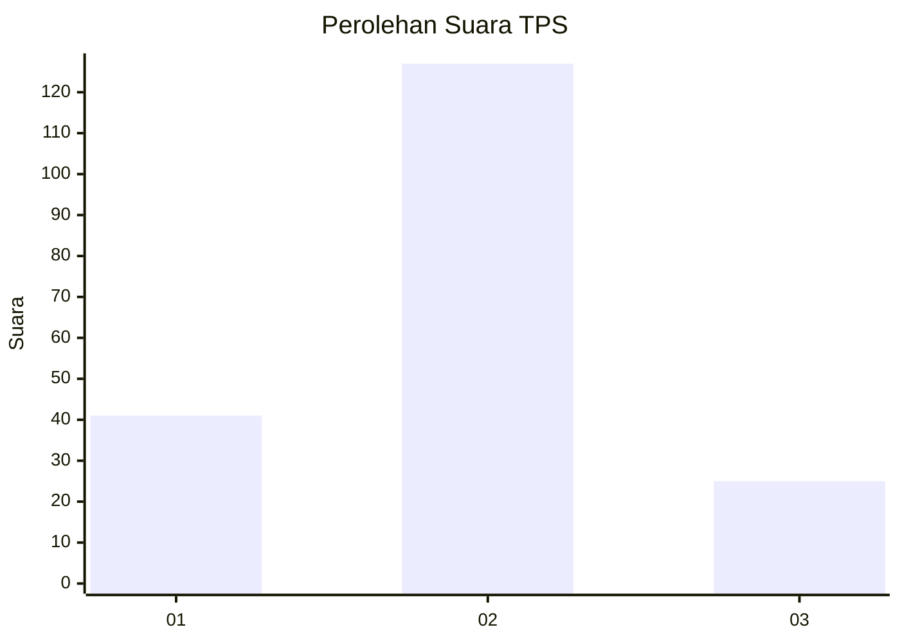
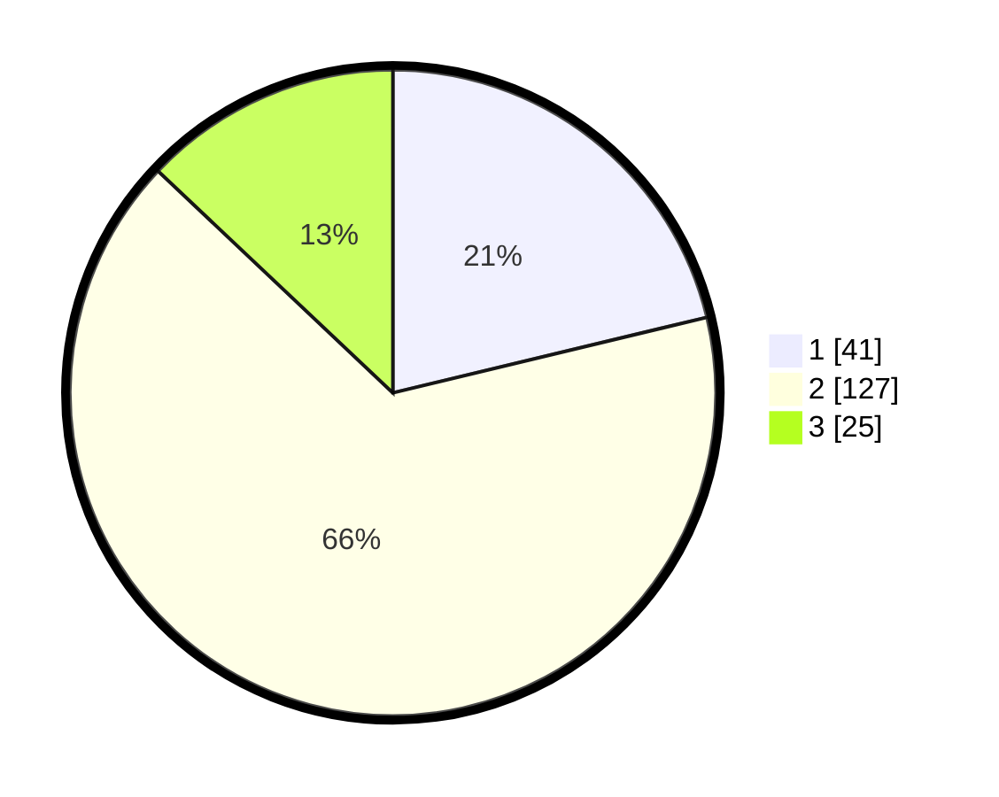

# Hasil

## Grafik

## Tabel

| No. | Nama Paslon    | Suara | Suara (raw) | Persentase |
|:--- |:-------------- | -----:| -----------:| ----------:|
| 1   | ANIES MUHAIMIN | 41    | [41][p-1]   | 21,24      |
| 2   | PRABOWO GIBRAN | 127   | [127][p-2]  | 65,80      |
| 3   | GANJAR MAHFUD  | 25    | [25][p-3]   | 12,95      |

[p-1]: https://github.com/gigit-pemilu/pemilu-2024/blob/main/pilpres/hitung-suara/sub/32-jawa-barat/sub/15-karawang/sub/06-rengasdengklok/sub/2001-rengasdengklok-selatan/sub/003-tps/sub/paslon-1.txt
[p-2]: https://github.com/gigit-pemilu/pemilu-2024/blob/main/pilpres/hitung-suara/sub/32-jawa-barat/sub/15-karawang/sub/06-rengasdengklok/sub/2001-rengasdengklok-selatan/sub/003-tps/sub/paslon-2.txt
[p-3]: https://github.com/gigit-pemilu/pemilu-2024/blob/main/pilpres/hitung-suara/sub/32-jawa-barat/sub/15-karawang/sub/06-rengasdengklok/sub/2001-rengasdengklok-selatan/sub/003-tps/sub/paslon-3.txt

## Foto C Plano

https://sirekap-obj-formc.kpu.go.id/08f5/pemilu/ppwp/32/15/06/20/01/3215062001003-20240222-151459--49e1b162-74e3-4a35-9cf7-b80ece51a2f3.jpg

https://sirekap-obj-formc.kpu.go.id/08f5/pemilu/ppwp/32/15/06/20/01/3215062001003-20240222-151730--b35b7a2a-eba8-4800-ad6c-d02dc735ae87.jpg

https://sirekap-obj-formc.kpu.go.id/08f5/pemilu/ppwp/32/15/06/20/01/3215062001003-20240222-151829--bff1e85d-5343-4419-98d3-8e1ce559161f.jpg

## Metadata

| Key        | Value               |
| ---------- | ------------------- |
| Time Stamp | 2024-02-25 15:00:00 |

