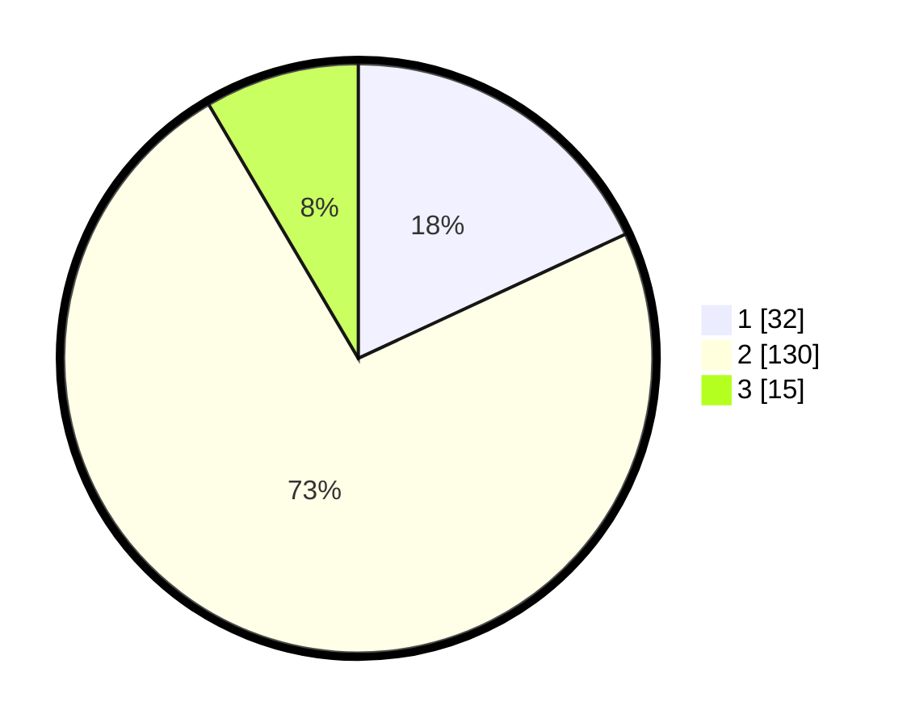

# Hasil

## Grafik

## Tabel

| No. | Nama Paslon    | Suara | Suara (raw) | Persentase |
|:--- |:-------------- | -----:| -----------:| ----------:|
| 1   | ANIES MUHAIMIN | 32    | [32][p-1]   | 18,08      |
| 2   | PRABOWO GIBRAN | 130   | [130][p-2]  | 73,45      |
| 3   | GANJAR MAHFUD  | 15    | [15][p-3]   | 8,47       |

[p-1]: https://github.com/gigit-pemilu/pemilu-2024/blob/main/pilpres/hitung-suara/sub/32-jawa-barat/sub/15-karawang/sub/06-rengasdengklok/sub/2001-rengasdengklok-selatan/sub/004-tps/sub/paslon-1.txt
[p-2]: https://github.com/gigit-pemilu/pemilu-2024/blob/main/pilpres/hitung-suara/sub/32-jawa-barat/sub/15-karawang/sub/06-rengasdengklok/sub/2001-rengasdengklok-selatan/sub/004-tps/sub/paslon-2.txt
[p-3]: https://github.com/gigit-pemilu/pemilu-2024/blob/main/pilpres/hitung-suara/sub/32-jawa-barat/sub/15-karawang/sub/06-rengasdengklok/sub/2001-rengasdengklok-selatan/sub/004-tps/sub/paslon-3.txt

## Foto C Plano

https://sirekap-obj-formc.kpu.go.id/c67c/pemilu/ppwp/32/15/06/20/01/3215062001004-20240222-165928--47310cbe-960a-4611-b29e-53e8a457a4a3.jpg

https://sirekap-obj-formc.kpu.go.id/c67c/pemilu/ppwp/32/15/06/20/01/3215062001004-20240222-170611--7da3c8c3-7237-4dc2-8eb9-8607983dfa30.jpg

https://sirekap-obj-formc.kpu.go.id/c67c/pemilu/ppwp/32/15/06/20/01/3215062001004-20240222-170915--ce2523bc-69e1-4acd-99b0-e9237a75db48.jpg

## Metadata

| Key        | Value               |
| ---------- | ------------------- |
| Time Stamp | 2024-02-25 21:00:00 |

