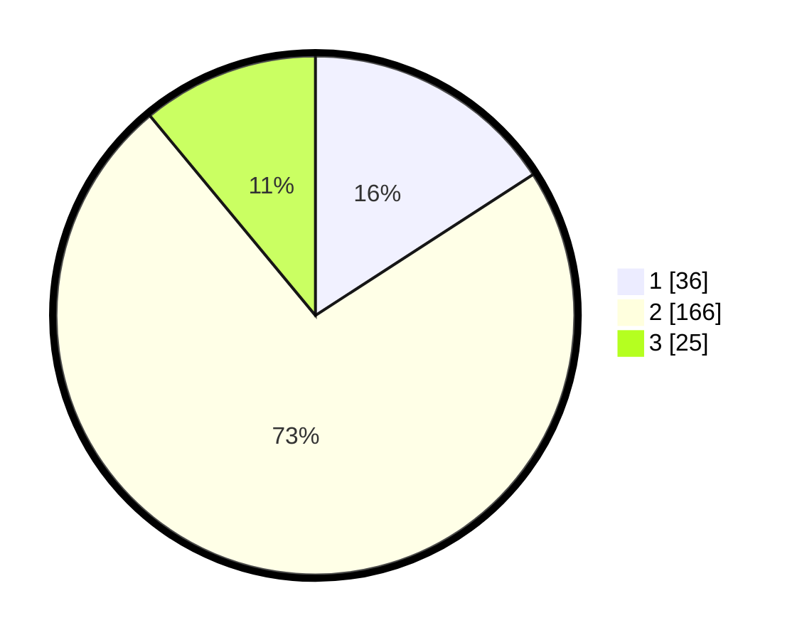

# Hasil

## Grafik

## Tabel

| No. | Nama Paslon    | Suara | Suara (raw) | Persentase |
|:--- |:-------------- | -----:| -----------:| ----------:|
| 1   | ANIES MUHAIMIN | 36    | [36][p-1]   | 15,86      |
| 2   | PRABOWO GIBRAN | 166   | [166][p-2]  | 73,13      |
| 3   | GANJAR MAHFUD  | 25    | [25][p-3]   | 11,01      |

[p-1]: https://github.com/gigit-pemilu/pemilu-2024-32-jawa-barat/blob/main/pilpres/hitung-suara/sub/32-jawa-barat/sub/15-karawang/sub/06-rengasdengklok/sub/2001-rengasdengklok-selatan/sub/005-tps/sub/paslon-1.txt
[p-2]: https://github.com/gigit-pemilu/pemilu-2024-32-jawa-barat/blob/main/pilpres/hitung-suara/sub/32-jawa-barat/sub/15-karawang/sub/06-rengasdengklok/sub/2001-rengasdengklok-selatan/sub/005-tps/sub/paslon-2.txt
[p-3]: https://github.com/gigit-pemilu/pemilu-2024-32-jawa-barat/blob/main/pilpres/hitung-suara/sub/32-jawa-barat/sub/15-karawang/sub/06-rengasdengklok/sub/2001-rengasdengklok-selatan/sub/005-tps/sub/paslon-3.txt

## Foto C Plano

https://sirekap-obj-formc.kpu.go.id/86e7/pemilu/ppwp/32/15/06/20/01/3215062001005-20240222-212039--a0ec408f-a727-4ffd-960b-118ec37eced9.jpg

https://sirekap-obj-formc.kpu.go.id/86e7/pemilu/ppwp/32/15/06/20/01/3215062001005-20240222-212416--32c85db5-993b-4537-86c8-7b9f40ecb009.jpg

https://sirekap-obj-formc.kpu.go.id/86e7/pemilu/ppwp/32/15/06/20/01/3215062001005-20240222-213422--d7426b45-4fb0-40e1-a847-cc6da9fe4a77.jpg

## Metadata

| Key        | Value               |
| ---------- | ------------------- |
| Time Stamp | 2024-02-26 13:00:00 |

