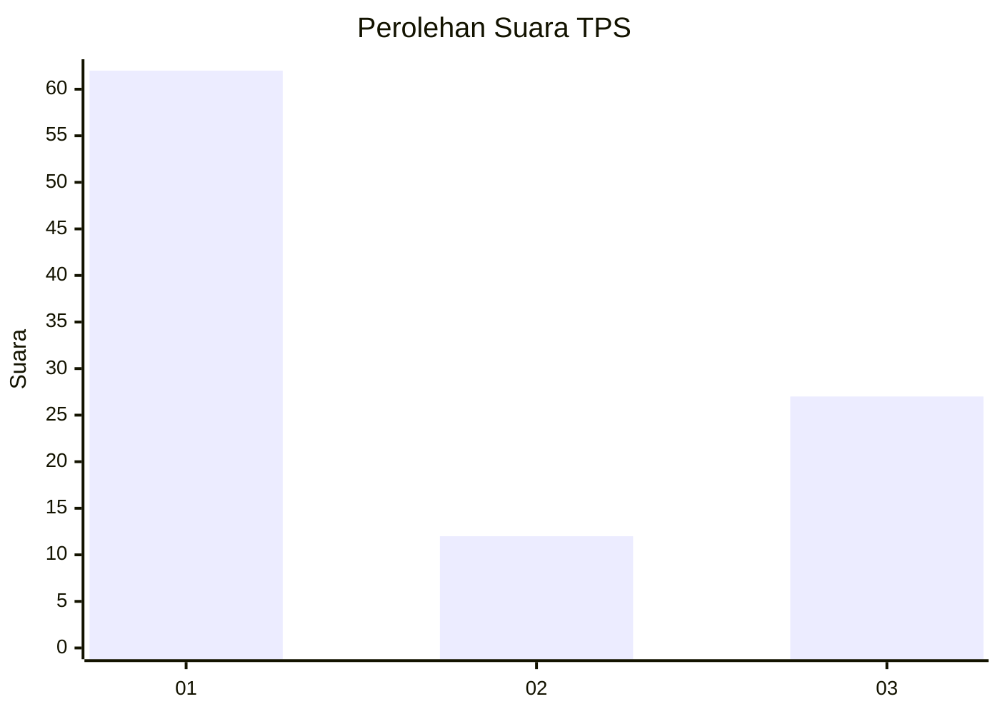
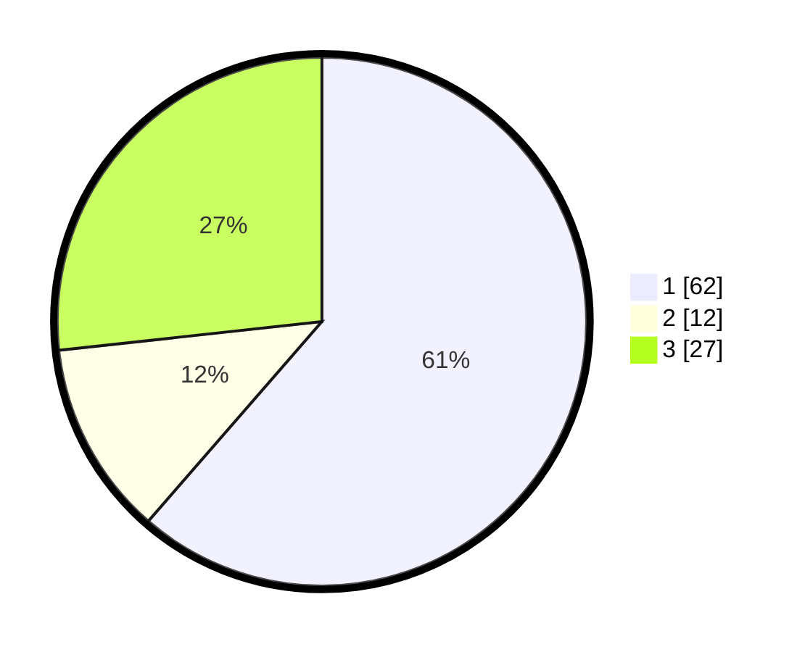

# Hasil

## Grafik

## Tabel

| No. | Nama Paslon    | Suara | Suara (raw) | Persentase |
|:--- |:-------------- | -----:| -----------:| ----------:|
| 1   | ANIES MUHAIMIN | 62    | [62][p-1]   | 61,39      |
| 2   | PRABOWO GIBRAN | 12    | [12][p-2]   | 11,88      |
| 3   | GANJAR MAHFUD  | 27    | [27][p-3]   | 26,73      |

[p-1]: https://github.com/gigit-pemilu/pemilu-2024-32-jawa-barat/blob/main/pilpres/hitung-suara/sub/32-jawa-barat/sub/15-karawang/sub/06-rengasdengklok/sub/2002-rengasdengklok-utara/sub/029-tps/sub/paslon-1.txt
[p-2]: https://github.com/gigit-pemilu/pemilu-2024-32-jawa-barat/blob/main/pilpres/hitung-suara/sub/32-jawa-barat/sub/15-karawang/sub/06-rengasdengklok/sub/2002-rengasdengklok-utara/sub/029-tps/sub/paslon-2.txt
[p-3]: https://github.com/gigit-pemilu/pemilu-2024-32-jawa-barat/blob/main/pilpres/hitung-suara/sub/32-jawa-barat/sub/15-karawang/sub/06-rengasdengklok/sub/2002-rengasdengklok-utara/sub/029-tps/sub/paslon-3.txt

## Foto C Plano

https://sirekap-obj-formc.kpu.go.id/781c/pemilu/ppwp/32/15/06/20/02/3215062002029-20240224-182911--9ba75824-12cd-4bdf-a951-7537b355e56a.jpg

https://sirekap-obj-formc.kpu.go.id/781c/pemilu/ppwp/32/15/06/20/02/3215062002029-20240224-182947--abe281d7-529c-41a7-8d26-34269208671e.jpg

https://sirekap-obj-formc.kpu.go.id/781c/pemilu/ppwp/32/15/06/20/02/3215062002029-20240224-183023--6d4238df-f3c0-4cb9-9a79-8cf103d9c832.jpg

## Metadata

| Key        | Value               |
| ---------- | ------------------- |
| Time Stamp | 2024-02-28 20:00:00 |

