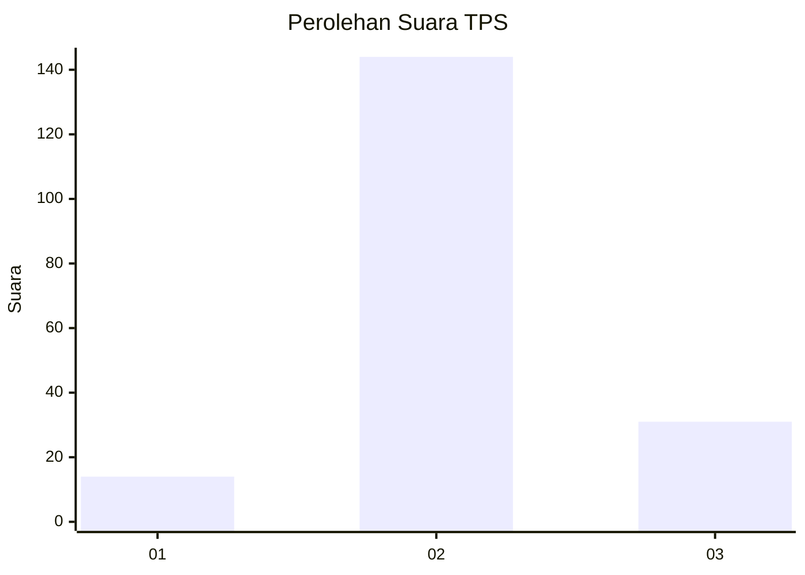
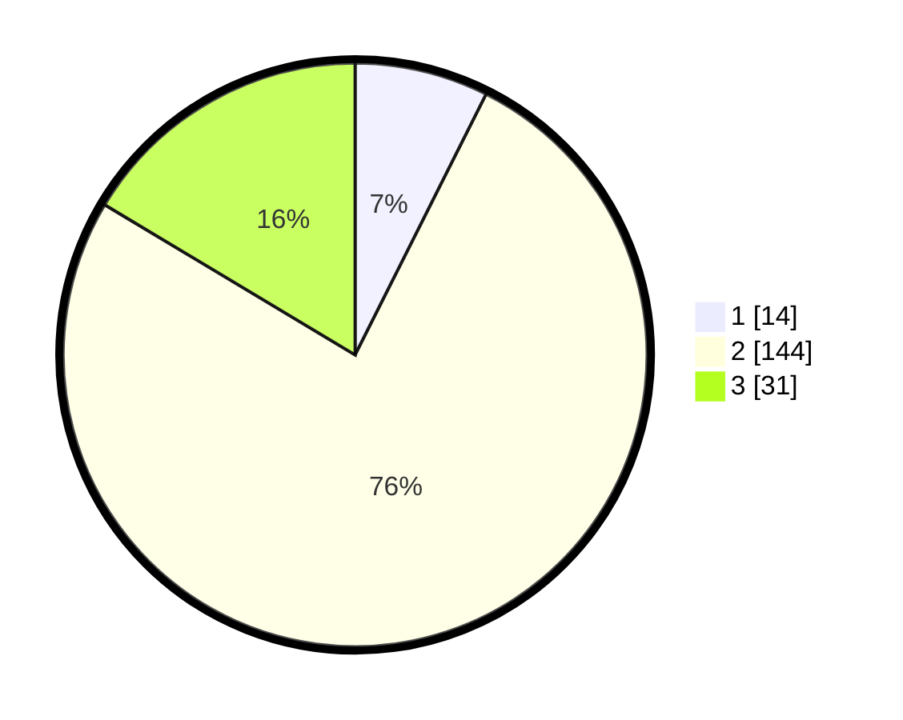

# Hasil

## Grafik

## Tabel

| No. | Nama Paslon    | Suara | Suara (raw) | Persentase |
|:--- |:-------------- | -----:| -----------:| ----------:|
| 1   | ANIES MUHAIMIN | 14    | [14][p-1]   | 7,41       |
| 2   | PRABOWO GIBRAN | 144   | [144][p-2]  | 76,19      |
| 3   | GANJAR MAHFUD  | 31    | [31][p-3]   | 16,40      |

[p-1]: https://github.com/gigit-pemilu/pemilu-2024/blob/main/pilpres/hitung-suara/sub/32-jawa-barat/sub/15-karawang/sub/07-kutawaluya/sub/2001-waluya/sub/007-tps/sub/paslon-1.txt
[p-2]: https://github.com/gigit-pemilu/pemilu-2024/blob/main/pilpres/hitung-suara/sub/32-jawa-barat/sub/15-karawang/sub/07-kutawaluya/sub/2001-waluya/sub/007-tps/sub/paslon-2.txt
[p-3]: https://github.com/gigit-pemilu/pemilu-2024/blob/main/pilpres/hitung-suara/sub/32-jawa-barat/sub/15-karawang/sub/07-kutawaluya/sub/2001-waluya/sub/007-tps/sub/paslon-3.txt

## Foto C Plano

https://sirekap-obj-formc.kpu.go.id/1529/pemilu/ppwp/32/15/07/20/01/3215072001007-20240214-221209--2efcdd79-a273-4c8c-b0a3-69d4724c9f30.jpg

https://sirekap-obj-formc.kpu.go.id/1529/pemilu/ppwp/32/15/07/20/01/3215072001007-20240214-221406--9c10010b-8b16-4b79-9b66-7e23afbf5060.jpg

https://sirekap-obj-formc.kpu.go.id/1529/pemilu/ppwp/32/15/07/20/01/3215072001007-20240214-221455--ffcfc155-5985-40c4-b5dd-d091ba358488.jpg

## Metadata

| Key        | Value               |
| ---------- | ------------------- |
| Time Stamp | 2024-02-16 16:25:10 |

