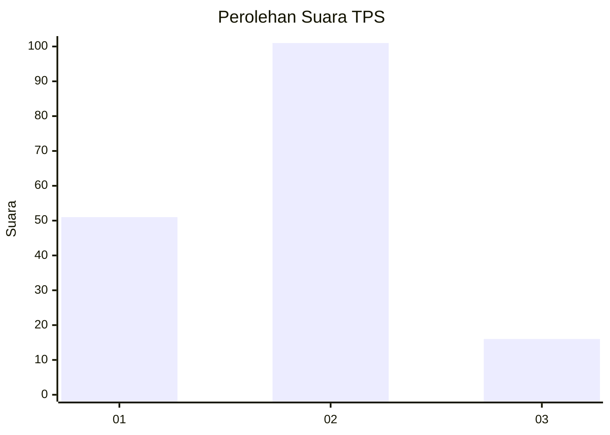
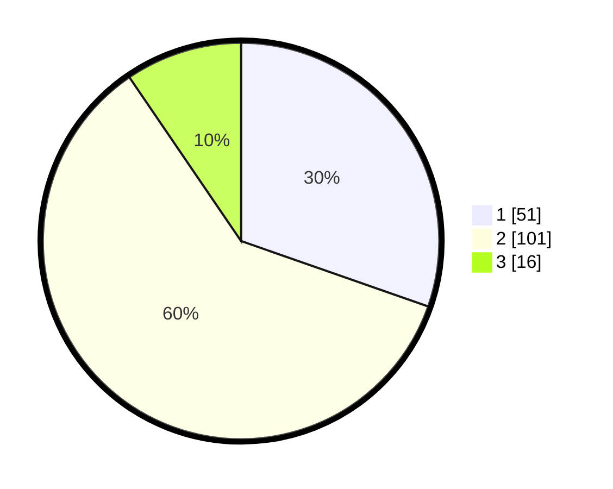

# Hasil

## Grafik

## Tabel

| No. | Nama Paslon    | Suara | Suara (raw) | Persentase |
|:--- |:-------------- | -----:| -----------:| ----------:|
| 1   | ANIES MUHAIMIN | 51    | [51][p-1]   | 30,36      |
| 2   | PRABOWO GIBRAN | 101   | [101][p-2]  | 60,12      |
| 3   | GANJAR MAHFUD  | 16    | [16][p-3]   | 9,52       |

[p-1]: https://github.com/gigit-pemilu/pemilu-2024-32-jawa-barat/blob/main/pilpres/hitung-suara/sub/32-jawa-barat/sub/15-karawang/sub/08-batujaya/sub/2001-batujaya/sub/001-tps/sub/paslon-1.txt
[p-2]: https://github.com/gigit-pemilu/pemilu-2024-32-jawa-barat/blob/main/pilpres/hitung-suara/sub/32-jawa-barat/sub/15-karawang/sub/08-batujaya/sub/2001-batujaya/sub/001-tps/sub/paslon-2.txt
[p-3]: https://github.com/gigit-pemilu/pemilu-2024-32-jawa-barat/blob/main/pilpres/hitung-suara/sub/32-jawa-barat/sub/15-karawang/sub/08-batujaya/sub/2001-batujaya/sub/001-tps/sub/paslon-3.txt

## Foto C Plano

https://sirekap-obj-formc.kpu.go.id/ecaf/pemilu/ppwp/32/15/08/20/01/3215082001001-20240222-091512--d35ecebe-f3ca-43d9-8bb7-1fc0a0cb0d47.jpg

https://sirekap-obj-formc.kpu.go.id/ecaf/pemilu/ppwp/32/15/08/20/01/3215082001001-20240222-091347--d03a3d78-0caf-4fbb-af58-477b12b33b96.jpg

https://sirekap-obj-formc.kpu.go.id/ecaf/pemilu/ppwp/32/15/08/20/01/3215082001001-20240222-091423--4fcace80-d594-485b-b8f5-2bdbcee98454.jpg

## Metadata

| Key        | Value               |
| ---------- | ------------------- |
| Time Stamp | 2024-02-22 10:00:00 |

